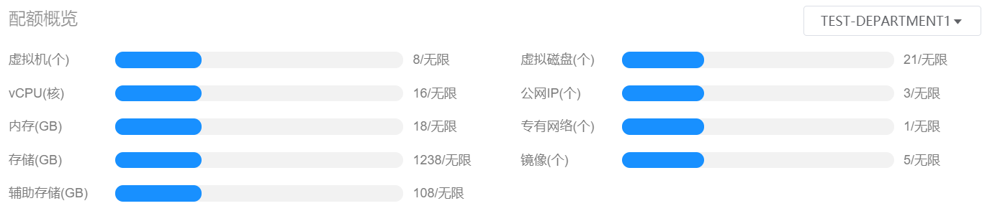

# 3.3.部门管理员总览界面

部门管理员点击“总览”导航菜单，即可进入主页总览主页，如下图所示：

主页主要对所有区域的数据中心资源实时状态进行直观的展示。

主页界面主要分为“用户、部门、成本开销导览”、“资源概览”、“配额概览”、“组织资源消耗TOP5”、“CPU使用率最低的虚拟机“、“内存使用率最低的虚拟机”、”费用TOP5”和“费用走势”八个部分。

## 用户、部门、成本开销导览

实时显示部门内用户的数量，以及部门本月、上月、今年累计和历史累计的成本开销量。

> [!NOTE]
>
> - 当用户点击“用户”右侧显示数值时，将会跳转到企业管理的用户子菜单；
> - 当用户点击“部门”右侧显示数值时，将会跳转到企业管理的组织管理子菜单下的部门管理页面。

## 资源概览

实时显示本部门虚拟机、虚拟磁盘、快照等8大资源的概览情况，默认显示所有区域资源的统计数据，可以在右侧选择需要查看的区域，选择后显示该区域的资源统计数据。

- 虚拟机：左侧显示本部门中的虚拟机总数，右侧分别显示运行中、关闭和待销毁状态的虚拟机数量；
- 虚拟磁盘：左侧显示本部门中的虚拟磁盘总数，右侧分别显示已挂载和未挂载状态的虚拟磁盘数量；
- 快照：左侧显示本部门中的快照总数；
- 备份：左侧显示本部门中的备份总数；
- 基础网络：左侧显示本部门中的基础网络总数；
- 专有网络（VPC）：左侧显示本部门中的专有网络（VPC）总数；
- 公网IP：左侧显示本部门中的公网IP总数；
- 私有镜像：左侧显示本部门中的私有镜像总数。

## 配额概览

实时显示本部门虚拟机、vCPU、内存等资源的使用量和本部门的资源总量配额概览。

其中可用量用灰色显示，使用量根据使用情况用绿色、橙色、红色显示：

- 绿色：配额用量占比在0%-60%的状态下使用量显示为绿色；
- 橙色：配额用量占比在60.01%-80%的状态下使用量显示为橙色；
- 红色：配额用量占比在80.01%-100%的状态下使用量显示为红色。

## 组织资源消耗TOP5

实时显示部门中各个用户资源消耗的TOP5，默认统计资源的是虚拟机的数量，也可选择查看本部门CPU、内存、存储消耗的TOP5排名。

## CPU使用率最低的虚拟机

实时显示所选区域中CPU使用率最低虚拟机的名称、vCPU、内存等信息，可以在右侧选择需要查看的区域。

## 内存使用率最低的虚拟机

实时显示所选区域中内存使用率最低虚拟机的名称、vCPU、内存等信息，可以在右侧选择需要查看的区域。

## 费用TOP5

显示本部门中用户上个月成本费用消耗的TOP5。

## 费用走势

实时显示本部门近一年的费用走势图。

> [!NOTE]
>
> - 总成本费用即为计算、存储、模板、备份、快照、服务和公网IP费用开销的总和;
> - 当鼠标悬浮在某一节点上，则会显示当前节点的总成本费用量。