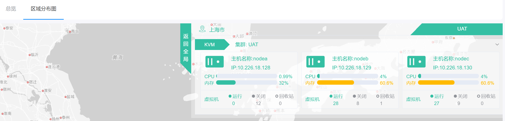
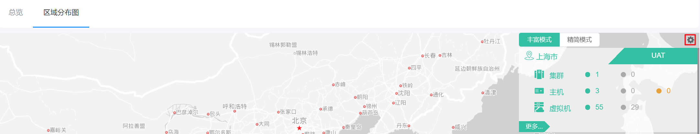
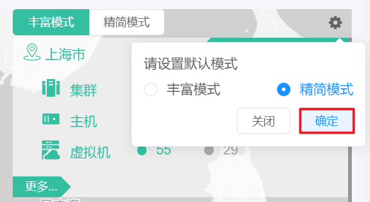
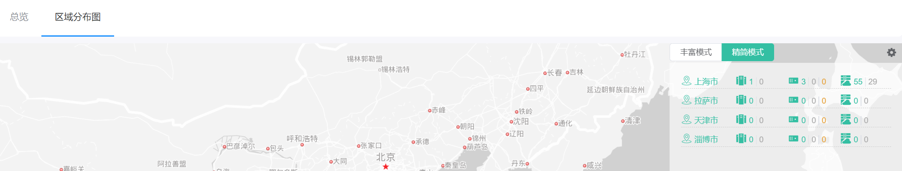

# 3.1.2.区域分布图页面

区域分布图呈现了当前云平台中各个区域真实的地理位置分布情况，以及各个区域的集群、主机、虚拟机的状态和数量。

超级管理员点击“总览”导航菜单下的“区域分布图”子菜单，即可进入区域分布图页面，如下图所示：

## 相关操作

HYPERX云管理平台支持用户对查看当前平台的区域资源分布情况，支持的功能如下：

- 查看丰富模式分布：以丰富美观的视图查看各个区域集群、主机、虚拟机的状态和情况；
- 查看精简模式分布：以较为精简的视图查看各个区域集群、主机、虚拟机的状态和情况；
- 设置模式偏好：设置用户进入此页面默认查看的视图模式。

操作入口如下：

- 总览→区域分布图

## 操作说明

### 查看丰富模式分布

在区域分布图的界面中，默认展示的是丰富模式的区域分布情况；

实时显示各个区域集群、主机、虚拟机的状态和数量：

- 集群：绿色的代表正常运行的集群，灰色的代表故障的集群；
- 主机：绿色的代表运行的主机，灰色的代表关闭的主机，橙色的代表禁用、维护或故障的主机；
- 虚拟机：绿色的代表运行的虚拟机，灰色的代表关闭的虚拟机。

此时点击“更多”按钮，可以查看选定区域的详细情况，包括各个主机的虚拟机化情况，CPU、内存信息，及虚拟机相关信息：

### 查看精简模式分布

点击“精简模式”选项卡，即可查看精简模式下各个区域的分布情况：

实时显示各个区域集群、主机、虚拟机的状态和数量：

- 集群：绿色的代表正常运行的集群，灰色的代表故障的集群；
- 主机：绿色的代表运行的主机，灰色的代表关闭的主机，橙色的代表禁用、维护或故障的主机；
- 虚拟机：绿色的代表运行的虚拟机，灰色的代表关闭的虚拟机。

### 设置模式偏好

① 点击模式选项卡右侧的“配置”按钮：

② 将会弹出设置默认模式的提示框，选择默认模式后，点击“确定”按钮，即可设置模式偏好：

③ 离开此页面后，再次进入“区域分布图”，看到的是设置了偏好的模式：

