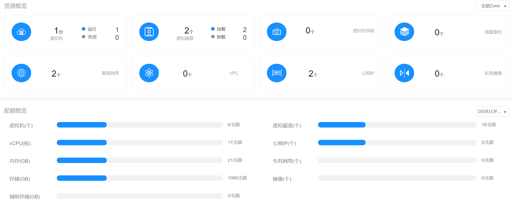
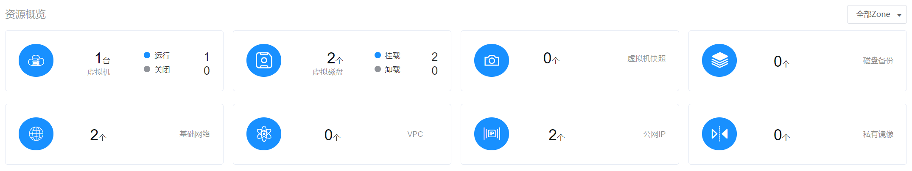
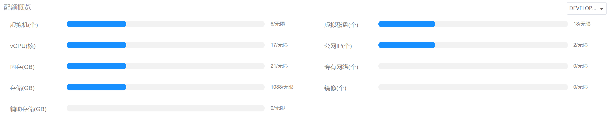

# 3.4.普通用户总览界面

普通用户点击“总览”导航菜单，即可进入总览主页，如下图所示：

主页主要对所有区域的数据中心资源实时状态进行直观的展示。

主页界面主要分为“资源概览”和“配额概览”这两个部分：

## 资源概览

实时显示当前普通用户创建/拥有的虚拟机、虚拟磁盘、快照等8大资源的概览情况，默认显示所有区域资源的统计数据，可以在右侧选择需要查看的区域，选择后显示该区域的资源统计数据。

- 虚拟机：左侧显示普通用户创建/拥有的虚拟机总数，右侧分别显示运行中、关闭和待销毁状态的虚拟机数量；
- 虚拟磁盘：左侧显示普通用户创建/拥有的虚拟磁盘总数，右侧分别显示已挂载和未挂载状态的虚拟磁盘数量；
- 快照：左侧显示普通用户创建/拥有的快照总数；
- 备份：左侧显示普通用户创建/拥有的备份总数；
- 基础网络：左侧显示普通用户创建/拥有的基础网络总数；
- 专有网络（VPC）：左侧显示普通用户创建/拥有的专有网络（VPC）总数；
- 公网IP：左侧显示普通用户创建/拥有的公网IP总数；
- 私有镜像：左侧显示普通用户创建/拥有的私有镜像总数。

## 配额概览

实时显示当前普通用户所占用的虚拟机、vCPU、内存等资源的使用量和当前用户所属部门的资源总量配额概览。

其中可用量用灰色显示，使用量根据使用情况用绿色、橙色、红色显示：

- 绿色：配额用量占比在0%-60%的状态下使用量显示为绿色；
- 橙色：配额用量占比在60.01%-80%的状态下使用量显示为橙色；
- 红色：配额用量占比在80.01%-100%的状态下使用量显示为红色。