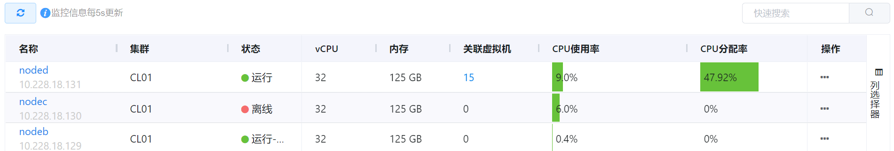
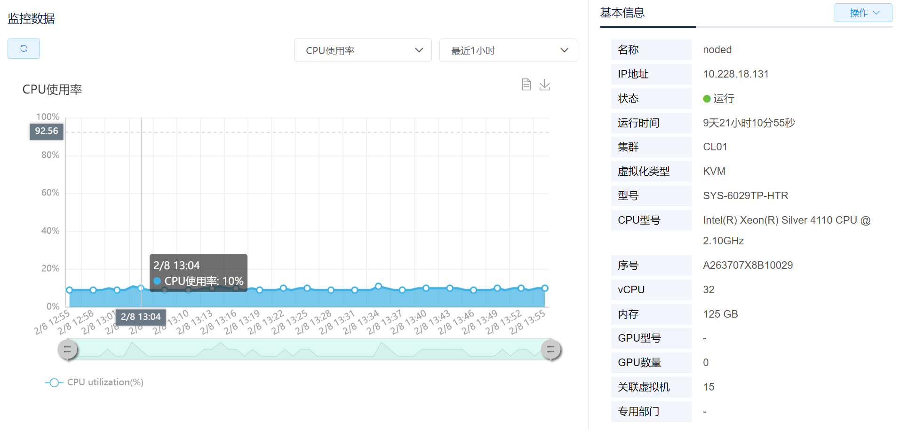
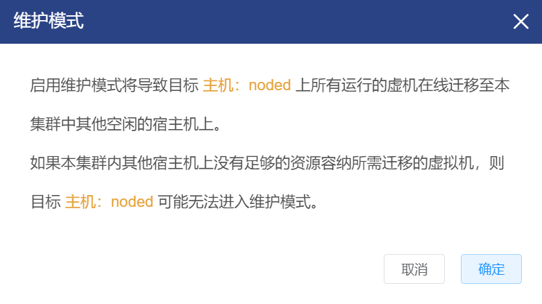
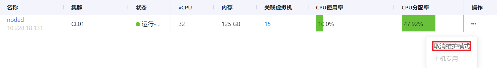
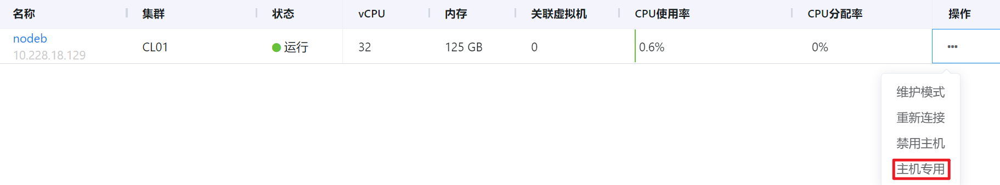
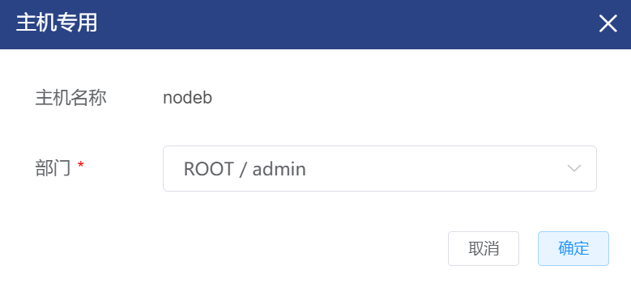
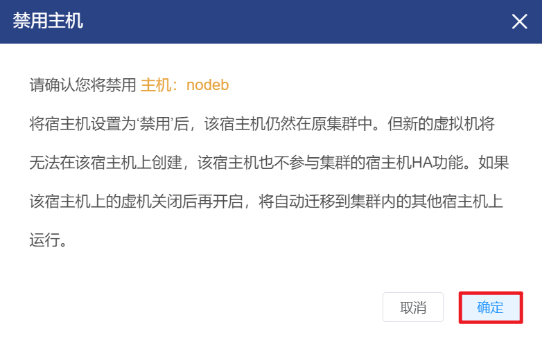
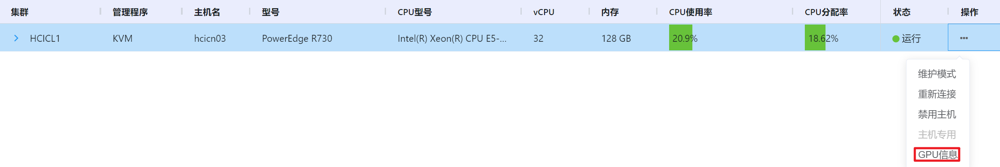

# 4.5.1.主机管理

主机即为计算节点，是运行在物理机上为虚拟机提供计算、网络、存储等资源的物理服务器。

用户可以查看平台内各个主机的状态、配置、使用情况等，也可以对主机进行私有化管理、维护、强制重连、禁用等操作。

在“资源管理”菜单下选择左侧“设备管理”的导航菜单，之后点击“主机”的子菜单，即可看到主机的管理界面：

主机具有运行中、维护模式和关闭三种状态：

- 运行：主机正常运行的模式；
- 运行-维护中：将该主机置于维护模式时，平台自动将该主机上正在运行的所有虚拟机实时迁移到空闲主机中，主机处于维护模式；
- 运行-已禁用：将该主机被禁用后，该主机仍然在原集群中，但新的虚拟机将无法在该主机上创建，该主机也不参与集群的主机HA功能；
- 离线：主机处于关闭状态。

点击某主机名称，即可进入选定主机的详情页面，呈现主机的监控数据和基本信息：

- 监控信息显示CPU使用率、内存使用率、挂载点利用率和网卡流量的图表；
- 基本信息显示主机的运行时间、集群、虚拟机化类型等详细信息。

## 相关操作

HYPERX云管理平台支持管理员对主机进行管理，支持的功能如下：

- 快速搜索：根据主机的名称、所属集群、型号、关联虚拟机等字段全局快速搜索主机；
- 维护模式：将主机置于维护模式，平台自动将该主机上正在运行的所有虚拟机实时迁移到空闲主机中；
- 主机专用：将该主机分配给某个部门私有；
- 释放主机：取消主机被专用的状态，允许平台内其他用户使用；
- 重新连接：当该主机失联时，将这台宿主机重新与数据库连接；
- 禁用主机：禁用选定的主机，停用该主机上的全部资源；
- 启用主机：启用选定的主机，恢复使用主机上的资源；
- GPU信息：显示选定主机上所配置GPU的信息。

操作入口如下：

- 资源管理→设备管理→主机管理

## 操作说明

### 启用主机维护模式

主机维护时自动将该主机上正在运行的所有虚拟机实时迁移到空闲主机中。

① 选择需要置于维护模式的主机后，点击操作列的“维护模式”按钮：

② 将会弹出“维护模式”的操作提示框，点击“确定”按钮后，系统将该主机置于“维护模式”：

> [!NOTE]
>
>   - 主机被置于维护模式后，该主机上正在运行的虚拟机会被实时迁移到空闲主机中，保障业务不会被中断；
>   - 主机被置于维护模式后，仅迁移启用了HA功能的虚拟机，未启用HA的虚拟机将会做关闭处理；
>   - 当主机处于维护模式时，不支持禁用主机和重新连接。
>

### 取消主机维护模式

① 选择需要取消维护模式的主机后，点击操作列的“取消维护模式”按钮：

④ 将会弹出“取消维护模式”的操作提示框，点击“确定”按钮后，系统取消该主机的“维护模式”：

### 主机的重新连接

一般用于主机的配置更新后。主机的内存或硬盘进行了更新后，可以通过该操作重连云平台的数据库。

① 选择需要重新连接的主机后，点击操作列的“重新连接”按钮：

② 将会弹出“重新连接”的操作提示框，点击“确定”按钮后，系统会对选中的主机进行重新连接的操作：

> [!NOTE]
>
> - 处于维护模式或被禁用的主机不支持强制连接，需要解除维护模式或启用主机才能进行强制连接的操作。

### 主机专用

① 选择需要配置部门专用的主机后，点击操作列的“主机专用”按钮：

② 将会弹出“主机专用”的操作提示框，指定私有主机的公司和部门后，点击“创建”按钮，系统将该主机分配给选中的部门私有：

> [!NOTE]
>
> - 当且仅当主机上只运行着一个部门中的虚拟机或主机上没有运行的虚拟机时，支持配置主机专用；
> - 当某主机被设置为某部门专用后，其他部门仍然可见该主机，但在创建虚拟机时，其他部门创建的虚拟机将不会运行在该主机上。

### 释放主机专用

① 选择需要释放部门专用的主机后，点击操作列的“释放主机”按钮：

② 将会弹出“释放主机”的操作提示框，点击“确定”按钮后，系统将释放选中的主机：

### 禁用主机

① 选择需要禁用的主机后，点击操作列的“禁用主机”按钮：

② 将会弹出“禁用主机”的操作提示框，点击“确定”按钮后，系统将禁用选中的主机：

> [!NOTE]
>
> - 将主机设置为“禁用”后，该主机仍然在原集群中，但新的虚拟机将无法在该主机上创建，该主机也不参与集群的主机HA功能；
> - 主机被禁用后，不支持重新连接；
> - 如果该被禁用主机上的虚拟机关闭后再开启，将自动迁移到集群内的其他主机上运行。

### 启用主机

① 选择需要启用的主机后，点击操作列的“启用主机”按钮：

④ 将会弹出“启用主机”的操作提示框，点击“确定”按钮后，系统将启用选中的主机：

### GPU信息

① 选择需要查看的主机后，点击操作列的“GPU信息”按钮：

②将会弹出“GPU信息”的操作提示框 ，并显示选定主机上所配置GPU的信息：

