# 4.3.1.基础网络管理

基础网络是扁平式的网络结构，支持充分利用IP地址资源，并对之进行大规模的拓展。

云平台支持用户创建、重启、删除共享和隔离网络，支持对基础网络的详情、出口规则、公网IP等参数进行配置。

在资源管理菜单下选择左侧“网络”的导航菜单，之后点击“基础网络”的子菜单，即可看到基础网络的管理界面：

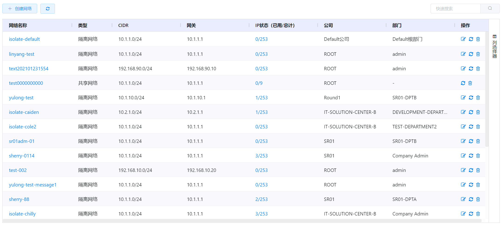

## 详情选项卡

云平台支持查看某个基础网络的详情、出口规则、公网IP、关联虚拟机和 共享网络访问权限 ，并支持对基础网络进行相关操作。

- 详情：显示基础网络的名称、UUID、Zone等信息，支持在此页面对网络进行编辑、重启和删除的快速操作；
- 出口规则（隔离网络）：默认情况下，网络会拒绝所有来自外部的访问请求，但允许对外的访问请求，用户可以通过配置出口规则允许外网访问；
- 公网IP（隔离网络）：显示隔离网络的公网IP，用户可申请新公网IP、为公网IP配置防火墙、端口转发、负载均衡等规则或VPN服务；
- 关联虚拟机：显示基础网络所关联的虚拟机列表，用户可在此查看相关虚拟机的概要信息；
- 共享网络访问权限（共享网络）：显示具有当前共享网络访问权限的公司和部门列表。

## 相关操作

HYPERX云管理平台支持用户对基础网络进行管理，支持的功能如下：

### 特色操作

- 快速搜索：用户可以根据基础网络的名称、CIDR、网关等字段全局搜索基础网络；
- 高级筛选：用户可以从表头右侧根据网络名称、类型、CIDR等字段筛选出符合条件的基础网络；

### 基础操作

- 
  创建网络：添加新的共享网络或隔离网络；
- 编辑网络：查看并编辑网络的详情信息；
- 添加共享网络访问权限：为选定公司下选定部门配置共享网络访问权限；
- 编辑共享网络访问权限：编辑选定公司下可以访问共享网络的部门；
- 隔离网络出口规则的配置：设置出口规则，只允许规则中填写的源CIDR出口；
- 隔离网络出口规则的删除：删除选定的出口规则；
- 重启网络：重新启动共享网络或隔离网络；
- 删除网络：删除选定的基础网络；

### 公网IP相关操作

#### 公网IP

- 获取公网IP：为隔离网络获取公网IP；
- 释放公网IP：释放选定的公网IP;

#### 防火墙

- 创建公网IP防火墙规则：为选定的公网IP创建防火墙规则；
- 编辑公网IP防火墙规则备注：为防火墙规则添加备注信息；
- 删除公网IP防火墙规则：删除选定的防火墙规则；

#### 端口转发

- 创建公网IP端口转发规则：为选定的公网IP创建端口转发规则；
- 删除公网IP端口转发规则：删除选定的端口转发规则；

#### 负载均衡

- 创建公网IP负载均衡规则：为选定的公网IP创建负载均衡规则；
- 编辑公网IP负载均衡算法：编辑选定负载均衡规则的算法；
- 编辑公网IP负载均衡粘性配置：编辑选定负载均衡规则的粘性配置；
- 添加虚拟机至公网IP负载均衡规则：将选定的虚拟机添加到选定负载均衡规则中；
- 将虚拟机从公网IP负载均衡规则中移除：将选定的虚拟机从选定负载均衡规则中移除；
- 删除公网IP负载均衡规则：删除选定的负载均衡规则；

#### VPN

- 启用公网IP的VPN：启用公网IP的VPN服务，将虚拟机路由器作为VPN的服务网关；
- 添加VPN用户：添加可以使用VPN的用户；
- 删除VPN用户：删除选定的VPN用户；
- 禁用公网IP的VPN：禁用公网IP的VPN服务，用户不得通过VPN登录；

#### 静态NAT

- 启用公网IP静态NAT：将选定虚拟机的IP地址与公网IP的地址绑定；
- 关闭公网IP静态NAT：解除虚拟机IP地址与公网IP的地址的绑定关系。

操作入口如下：

- 资源管理→网络→基础网络

## 操作说明

### 基础操作

#### 创建隔离网络

① 在基础网络管理界面中，点击“创建网络”按钮，选择“创建隔离网络”按钮：

② 将会进入”创建隔离网络“的页面，填写网络名称、网络方案、说明等相关信息后，点击“确定”按钮即可添加隔离网络：

> *注：
>
> - 创建隔离网络时，支持选择一种可用的网络方案，不同的网络方案提供给虚拟机的网络服务不同；
> - 网关是虚拟路由的IP地址，为空时系统会默认将其设置为10.1.1.1；
> - 子网掩码是隔离网络的网络掩码，为空时系统会默认将其设置为255.255.255.0；
> - 网络域是用于配置虚拟机网络域名的DNS后缀，为空时系统会按照默认的命名规则自动生成DNS后缀。

#### 创建共享网络

① 在基础网络管理界面中，点击“创建网络”按钮，选择“创建共享网络”按钮：

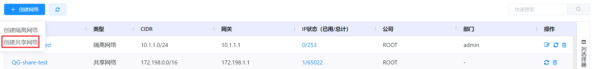

② 将会进入”创建共享网络“的页面，填写网络名称、网络方案、说明等相关信息后，点击“确定”按钮即可添加共享网络：

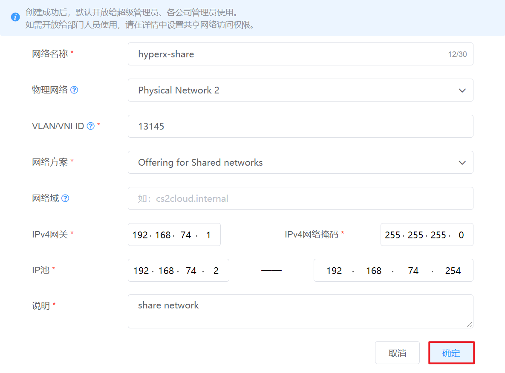

> *注：
>
> - VLAN/VNI ID：共享网络的VLAN/VNI ID是独立而唯一的，不可与其他共享网络的相同；
> - 创建共享网络时，支持选择一种可用的网络方案，不同的网络方案提供给虚拟机的网络服务不同；
> - 网络域是用于配置虚拟机网络域名的DNS后缀，为空时系统会按照默认的命名规则自动生成DNS后缀。
>

#### 基础网络的编辑

① 在基础网络管理界面中，选择需要编辑的基础网络，在操作列中点击“确定”按钮：

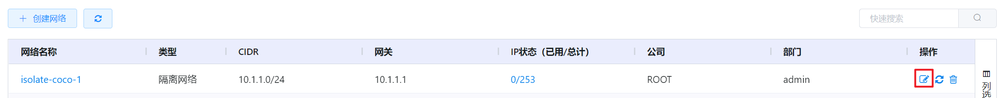

② 即可进入基础网络详情页，修改基础网络的名称、说明、网络方案等信息后，点击“保存”按钮，将更新基础网络的信息：

> *注：
>
> - 其他入口：点击基础网络名称，进入基础网络详情页面，点击“编辑”按钮；
>
> - 共享网络只能通过点击网络名称进行编辑。
>

#### 添加共享网络访问权限

共享网络默认只开放给超级管理员和公司管理员，部门管理员和普通用户需要通过配置访问权限才能使用。超级管理员可以对共享网络的访问权限进行管控。

① 在基础网络管理界面中，选择需要创建访问权限的共享网络，点击共享网络名称：

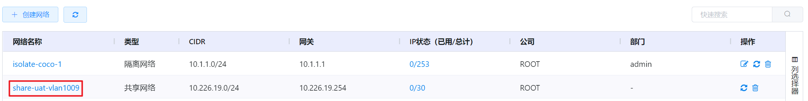

② 选择“共享网络访问权限”选项卡，点击“添加访问权限”按钮：

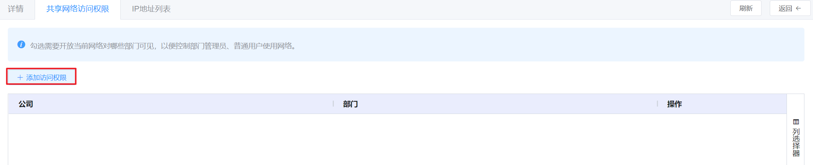

③ 将会弹出“添加访问权限”的操作提示框，选择公司并将需要添加的部门移动到允许访问的一侧后，点击“确定”按钮节即可实现共享网络访问权限的配置：

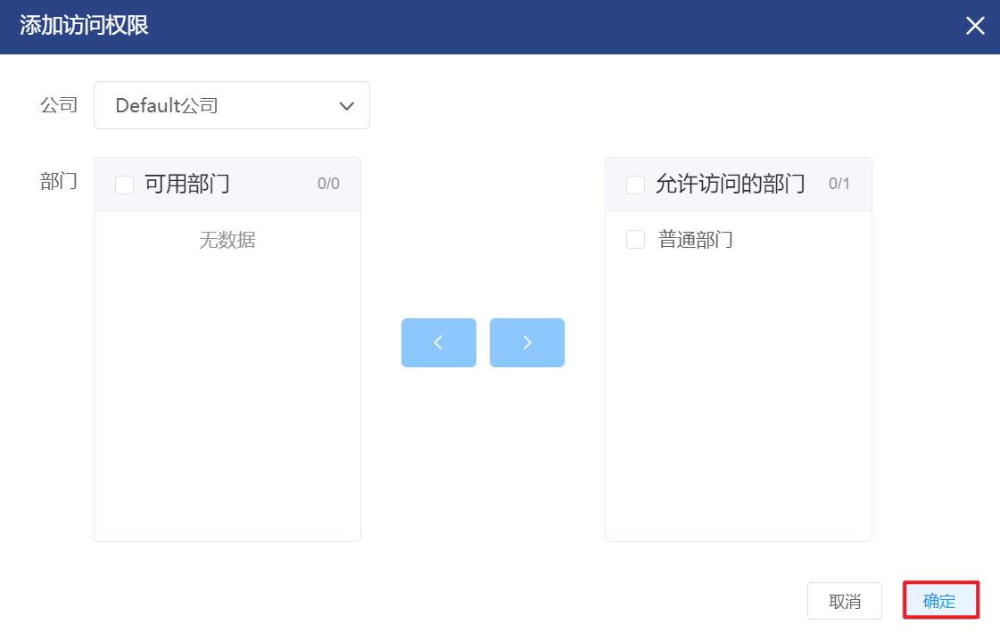

#### 编辑共享网络访问权限

① 在基础网络管理界面中，选择需要编辑访问权限的共享网络，点击共享网络名称：

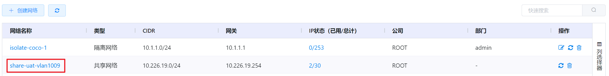

② 选择“共享网络访问权限”选项卡，选择需要编辑权限的公司，点击操作列的“编辑”按钮：

③ 将会弹出“编辑访问权限”的操作提示框，勾选需要赋予访问权限的部门或收回部门的访问权限后，点击“确定”按钮，将会更新选定公司对该共享网络的访问权限：

#### 隔离网络出口规则的配置

出口规则：控制隔离网络中的虚拟机出口流量的规则。若未设置出口规则，允许所有的流量出口；若设置了出口规则，则允许规则中填写的源CIDR出口。

① 在基础网络管理界面中，选择需要配置出口规则的隔离网络，在操作列中点击“编辑”按钮：

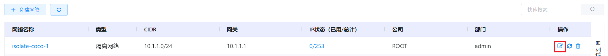

② 选择“出口规则”选项卡，点击“创建规则”按钮：

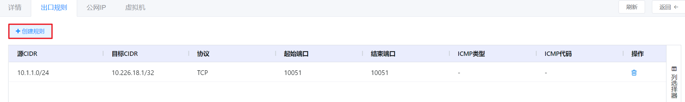

③ 将会弹出”创建规则”的操作提示框，填写源CIDR、选择协议并填写起止端口后，点击“确定”按钮添加出口规则：

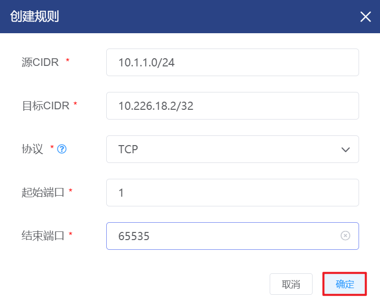

> *注：
>
> - 若填写源CIDR为0.0.0.0/0，则说明允许所有流量出口；
> - 虚拟机发送流量需要的协议，支持TCP、UDP、ICMP和ALL协议。
>   - TCP和UDP协议用来数据交换和终端用户通讯；
>   - ICMP用来发送错误信息或网络监控数据；
>   - ALL为通用协议，对TCP和UDP协议均可以转换；
> - TCP和UDP协议需要填写起止端口，范围需要在1-65535之间，结束端口不得超过起始端口；
> - ICMP协议需要填写ICMP类型和ICMP的错误代码。
>

#### 隔离网络出口规则的删除

① 在基础网络管理界面中，选择需要删除出口规则的隔离网络，在操作列中点击“编辑”按钮：

② 选择“出口规则”选项卡，选择需要删除的出口规则，点击操作列的“删除”按钮：

③ 将会弹出”删除出口规则”的操作提示框，点击“确定”按钮删除选定的出口规则：

#### 基础网络的重启

① 在基础网络管理界面中，选择重启的基础网络，在操作列中点击“重启”按钮：

② 将会弹出“重启网络”的操作提示框，复核网络名称无误后，点击“确定”按钮。将会中断提供的网络服务并重新启动网络：

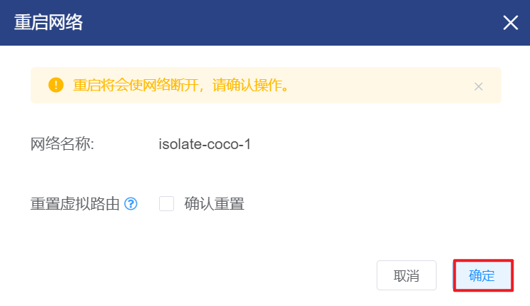

> *注：
>
> - 重启网络时，若勾选“重置虚拟路由”复选框，将会删除虚拟路由并且重建新的虚拟路由。
>

#### 基础网络的删除

① 在基础网络管理界面中，选择删除的基础网络，在操作列中点击“删除”按钮

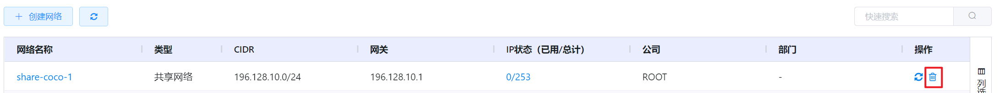

② 将会弹出“删除网络”的操作提示框：复核信息无误后，点击“确定”按钮，即可基础网络进行删除操作：

> *注：
>
> - 若基础网络中有正在运行的虚拟机，则不支持删除该网络。

### 公网IP相关操作

隔离网络在关联虚拟机前没有分配虚拟路由，不支持执行公网IP相关操作。

如需为隔离网络分配虚拟路由，可以通过以下途径：

- 使用该网络创建虚拟机
- 为选定虚拟机添加该网络的网卡

隔离网络分配虚拟路由后，会自动获取一个Source NAT的公网IP，用户可以在Source NAT的公网IP上配置VPN。

#### 公网IP

##### 获取公网IP

① 在基础网络管理界面中，选择需要获取公网IP的隔离网络，在操作列中点击“编辑”按钮：

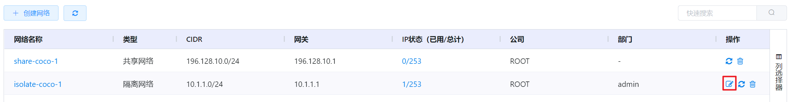

② 进入网络的详情页面，选择“公网IP”选项卡后，点击“获取新的公网IP”按钮：

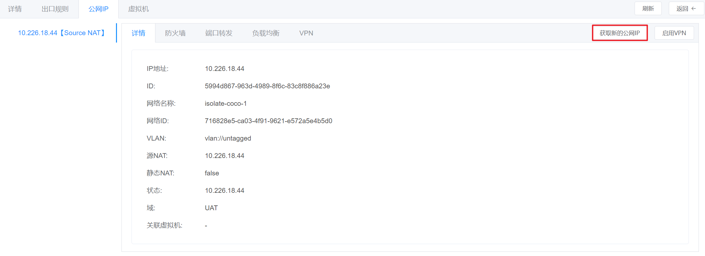

③ 将会弹出”获取新的公网IP”的操作提示框，点击“确定”按钮获取新的公网IP：

④ 即可在“公网IP”选项卡中查看到新获取的公网IP：

##### 释放公网IP

① 在基础网络管理界面中，选择需要释放公网IP的隔离网络，在操作列中点击“编辑”按钮：

② 进入网络的详情页面，选择“公网IP”选项卡后，点击需要释放公网IP详情页中的“释放IP”按钮：

③ 将会弹出“释放IP”的操作提示框，点击“确定”按钮，即可对公网IP执行释放操作：

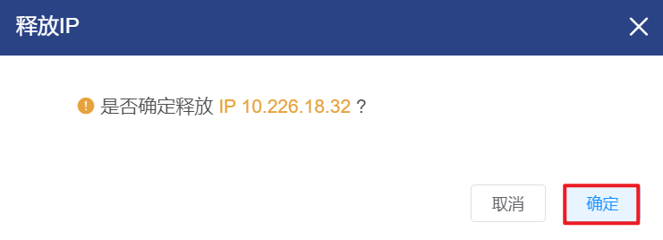

#### 防火墙

##### 创建公网IP防火墙规则

在默认情况下，虚拟路由器会拒绝所有来自外部的访问请求，允许所有对外的访问请求。用户可以通过配置防火墙规则对外部访问的源IP地址、网络协议和端口范围进行限制和约束。

① 在基础网络管理界面中，选择需要创建公网IP防火墙规则的隔离网络，在操作列中点击“编辑”按钮：

② 进入网络的详情页面，选择“公网IP”选项卡中的“防火墙“子选项卡后，点击“创建规则”按钮：

③ 将会弹出“创建规则”的操作提示框，填写源CIDR，选择协议并填写起止端口后，点击“确定”按钮，即可为公网IP创建防火墙规则：

> *注：
>
> - 源CIDR是仅允许流量通过特定地址块内的IP地址，输入CIDR或以逗号分隔的CIDR列表；
> - 若填写源CIDR为0.0.0.0/0，则说明会允许所有来自外部的访问请求
> - 虚拟机发送流量需要的协议，支持TCP、UDP、ICMP协议。
>   - TCP和UDP协议用来数据交换和终端用户通讯；
>   - ICMP用来发送错误信息或网络监控数据；
> - TCP和UDP协议需要填写起止端口，范围需要在1-65535之间，结束端口不得超过起始端口；
> - ICMP协议需要填写ICMP类型和ICMP的错误代码。

##### 编辑公网IP防火墙规则备注

① 在基础网络管理界面中，选择需要编辑公网IP防火墙规则备注的隔离网络，在操作列中点击“编辑”按钮：

② 进入网络的详情页面，选择“公网IP”选项卡中的“防火墙“子选项卡后，选择需要编辑备注的防火墙规则，点击操作列的“编辑”按钮：

③ 将会弹出“编辑备注”的操作提示框，填写相关备注后，点击“确定”按钮，即可为公网IP防火墙规则添加备注：

④ 即可在该防火墙规则列表中查看到添加的备注信息：

##### 删除公网IP防火墙规则

① 在基础网络管理界面中，选择需要删除公网IP防火墙规则的隔离网络，在操作列中点击“编辑”按钮：

② 进入网络的详情页面，选择“公网IP”选项卡中的“防火墙“子选项卡后，选择需要删除的防火墙规则，点击操作列的“删除”按钮：

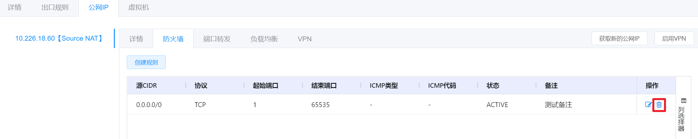

③ 将会弹出“删除防火墙规则”的操作提示框，点击“确定”按钮，即可对防火墙规则执行删除操作：

#### 端口转发

##### 创建公网IP端口转发规则

端口转发用于指定虚拟路由器公网IP及网络端口，同时指定作为转发目标的虚拟机及对应网络端口。虚拟路由器将公网中对指定目标地址及网络端口的请求转发到虚拟机对应的端口上，能支持将访问同一公网IP但分发至不同网络端口的请求分别转发到不同的虚拟机上，从而减少公网IP的消耗。

① 在基础网络管理界面中，选择需要创建公网IP端口转发规则的隔离网络，在操作列中点击“编辑”按钮：

② 进入网络的详情页面，选择“公网IP”选项卡中的“端口转发“子选项卡后，点击“创建转发规则”按钮：

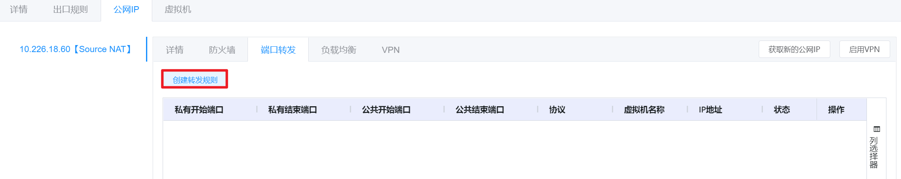

③ 将会弹出“创建转发规则”的操作提示框，填写端口，选择协议、虚拟机和IP后，点击“确定”按钮，即可为公网IP创建端口转发规则：

> *注：
>
> - 私有开始、结束端口是设定所需的虚拟机被转发至公共流量监听的起止端口；
> - 公共开始、结束端口是获取的供公共流量使用的公用IP地址的起止端口；
> - 协议处填写的是两个端口之间使用的通信协议，支持TCP和UDP协议；
> - 虚拟机处选择的是端口转发规则关联的虚拟机，关联后该虚拟机可以使用端口转发策略；
> - IP处绑定的是端口转发规则虚拟机的IP。

##### 删除公网IP端口转发规则

① 在基础网络管理界面中，选择需要删除公网IP端口转发规则的隔离网络，在操作列中点击“编辑”按钮：

② 进入网络的详情页面，选择“公网IP”选项卡中的“端口转发“子选项卡后，选择需要删除的端口转发规则，点击操作列的“删除”按钮：

③ 将会弹出“删除端口转发规则”的操作提示框，点击“确定”按钮，即可对端口转发规则进行删除操作：

[CentOS6.5](http://10.226.18.1:8090/client/#/iso/f78f477d-4619-444f-af0e-de58e4307d5d)

#### 负载均衡

##### 创建公网IP负载均衡规则

负载均衡用于指定虚拟路由器公共网络的IP地址及网络端口，同时指定使用负载均衡服务的虚拟机及对应的网络端口，虚拟路由器将公网访问中制定目标地址及网络端口的请求分发到这些虚拟机的对应端口上。

负载均衡服务支持配置负载均衡的分发模式，包括轮询、基于最少连接数和基于源地址这三种。

① 在基础网络管理界面中，选择需要创建公网IP负载均衡规则的隔离网络，在操作列中点击“编辑”按钮：

② 进入网络的详情页面，选择“公网IP”选项卡中的“负载均衡“子选项卡后，点击“创建规则”按钮：

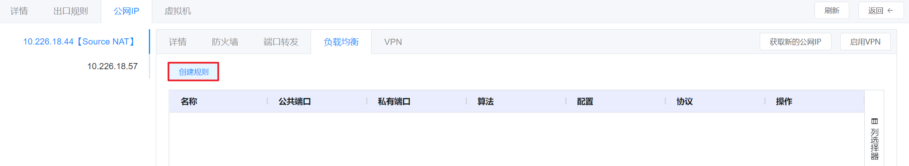

③ 将会进入“创建规则”的界面，填写规则名称、端口，算法、粘性政策、协议等信息后，点击“下一步”按钮：

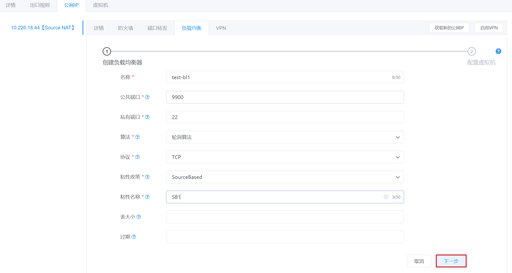

④ 选择需要配置负载均衡的虚拟机和IP后，点击“确定”按钮，即可为公网IP创建负载均衡规则：

> 关于创建负载均衡器相关的名词解释如下：
>
> - 名称：负载均衡规则的名称；
> - 公共端口：用户外部访问的端口；
> - 私有端口：虚拟机提供服务的端口；
> - 算法：使用负载均衡的算法，支持轮询、最小连接和源IP地址；
>   - 轮询算法：将所有请求轮流分配给内部的虚拟机，全部分配一遍后重新循环；
>   - 最小连接算法：从内部列表中选择正在处理的请求数最少的虚拟机提供服务；
>   - 源算法：根据新连接请求的源IP地址进行散列HASH的，将请求分发给具体的虚拟机。
> - 协议：
>   - TCP：传输控制协议，是一种面向连接的、可靠的、基于字节流的传输层通信协议；
>   - UDP：用户数据报协议，是一种无连接的传输层协议，提供面向事务的简单不可靠信息传送服务；
>   - TCP_PROXY：TCP协议代理，代理服务器与服务器两个通信组队间，分别建立TCP连接，进行TCP数据传输；
> - 粘性政策
>   - SourceBased：TCP模式，读取并缓存TCP SYN包头中的源IP地址，并与后端服务器标识进行关联，后续来自同一客户端的TCP连接都会被定向到同一后端服务器。
>     - 粘性名称：粘性政策的名称；
>     - 表大小：负载均衡器中缓存的源IP地址表的最大容量，如果不配置，默认容量为200k；
>     - 过期：源IP地址缓存表中任一条目的有效时间，失效后从表中除去，如果不配置，默认过期时间为200分钟；
>   - AppCookie：HTTP模式，采用cookie-read（只读）方式，读取和缓存HTTP cookie或URL（重写机制）中应用产生的会话cookie信息并后端服务器标识进行关联，用于匹配后续的客户端HTTP请求中的会话cookie。
>     - 粘性名称：粘性政策的名称；
>     - cookie名称：由后端服务器应用产生的会话cookie名称；
>     - 模式：URL解析模式，根据URL重写机制中会话cookie插入形式不同，两种可选模式：path-parameters（默认模式）和query- string，例如“GET url：http://server/path/file;jsessionid=xxxx?param=value”和“GET url：http://server/path/program?jsessionid=xxxx||m=value”；
>     - 长度：负载均衡器用来缓存和匹配会话cookie值的字符数，如果不配置，默认长度是52个字符；
>     - 持续时间：表示负载均衡器缓存的会话cookie信息的有效期，如果不配置，默认值为3小时；
>     - 请求了解：表示负载均衡器从用户请求中获取会话cookie信息，适用于后端服务器返回的响应中无cookie信息或者负载均衡器缓存的会话cookie比后端服务产生的cookie过早失效等情况，以增加服务的可靠性；
>     - 前缀：表示负载均衡器匹配会话cookie前缀或者URL参数前缀；
>   - LbCookie采用cookie植入方式，在服务器HTTP响应头的set-cookie段中植入由负载均衡器产生的cookie信息（一般为服务器标识），后续客户端HTTP请求中将包含被植入的cookie信息。
>     - cookie名称：由后端服务器应用产生的会话cookie名称；
>     - 模式：负载均衡器植入cookie信息的三种模式：
>     - rewrite（改写模式）：在HTTP响应头中，将由指定的cookie值（由后端服务器应用产生）改写为后端服务器标识；
>     - insert（插入模式）：在HTTP响应头中，插入由指定的cookie信息（由负载均衡器产生），cookie值为后端服务器标识；
>     - prefix（添加前缀模式）：在HTTP响应头中，在由指定的cookie名称前添加后端服务器标识和分隔符“;”，适用于客户端不支持多个cookie的情况；
>     - 域：指定cookie插入的域，如果域名以”.”开头，表示浏览器允许被任何以此域名结尾的主机使用，例如：“www.abc.com” 或 “.cnsuning.com”；
>     - 没有缓存：表示不允许客户端缓存由负载均衡插入的cookie，以免其他客户端共享此cookie而可能导致单个后端服务器过载，一般建议此选项和insert模式配合；
>     - 间接的：表示客户端将无法获取由后端服务器产生的cookie信息，在insert模式下，负载均衡器将会删除客户端发送HTTP请求头中的cookie信息。

##### 编辑公网IP负载均衡算法

① 在基础网络管理界面中，选择需要编辑公网IP负载均衡规则算法的隔离网络，在操作列中点击“编辑”按钮：

② 进入网络的详情页面，选择“公网IP”选项卡中的“负载均衡“子选项卡后，选择需要编辑算法的负载均衡规则，点击操作列的“编辑算法”按钮：

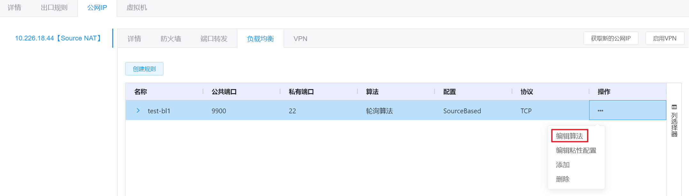

③ 将会弹出“编辑算法”的操作提示框，编辑相关信息后，点击“确定”按钮，即可编辑所选的负载均衡规则的算法：

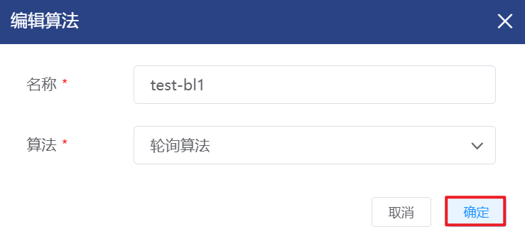

##### 编辑公网IP负载均衡粘性配置

① 在基础网络管理界面中，选择需要编辑公网IP负载均衡规则粘性配置的隔离网络，在操作列中点击“编辑”按钮：

② 进入网络的详情页面，选择“公网IP”选项卡中的“负载均衡“子选项卡后，选择需要编辑粘性配置的负载均衡规则，点击操作列的“编辑粘性配置”按钮：

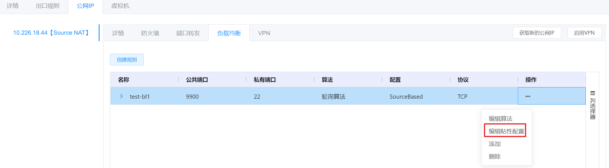

③ 将会弹出“编辑粘性规则”的操作提示框，编辑相关信息后，点击“确定”按钮，即可编辑所选的负载均衡规则的粘性配置：

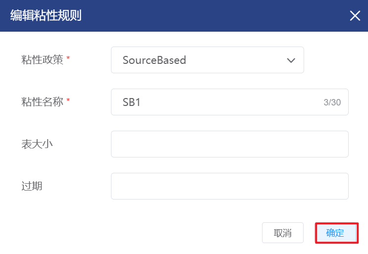

##### 公网IP负载均衡规则添加虚拟机

① 在基础网络管理界面中，选择需要在公网IP负载均衡规则中添加虚拟机的隔离网络，在操作列中点击“编辑”按钮：

② 进入网络的详情页面，选择“公网IP”选项卡中的“负载均衡“子选项卡后，选择需要添加虚拟机的负载均衡规则，点击操作列的“添加”按钮：

③ 将会弹出“配置虚拟机”的操作提示框，选择需要添加的虚拟机和对应的IP后，点击“添加”按钮，即可将选定的负载均衡规则添加到虚拟机中：

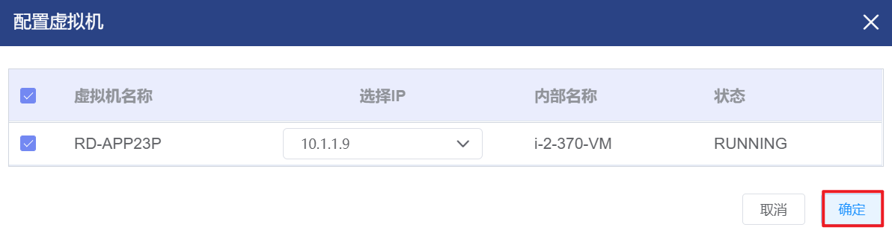

##### 公网IP负载均衡规则移除虚拟机

① 在基础网络管理界面中，选择需要在公网IP负载均衡规则中移除虚拟机的隔离网络，在操作列中点击“编辑”按钮：

② 进入网络的详情页面，选择“公网IP”选项卡中的“负载均衡“子选项卡后，选择需要移除虚拟机的负载均衡规则，点击“更多”拓展标识，显示该负载均衡规则关联的虚拟机：

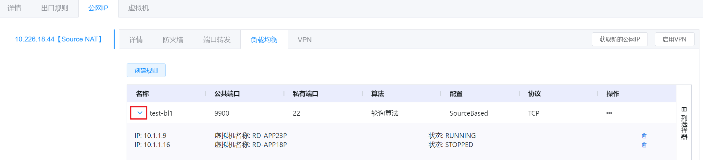

③ 选择移除虚拟机的负载均衡规则，点击操作列的“删除”按钮：

④ 将会弹出“删除”的操作提示框，点击“确定”按钮，即可移除负载均衡规则中选定的虚拟机：

##### 删除公网IP负载均衡

① 在基础网络管理界面中，选择需要删除公网IP负载均衡规则的隔离网络，在操作列中点击“编辑”按钮：

② 进入网络的详情页面，选择“公网IP”选项卡中的“负载均衡“子选项卡后，选择需要删除的负载均衡规则，点击操作列的“删除”按钮：

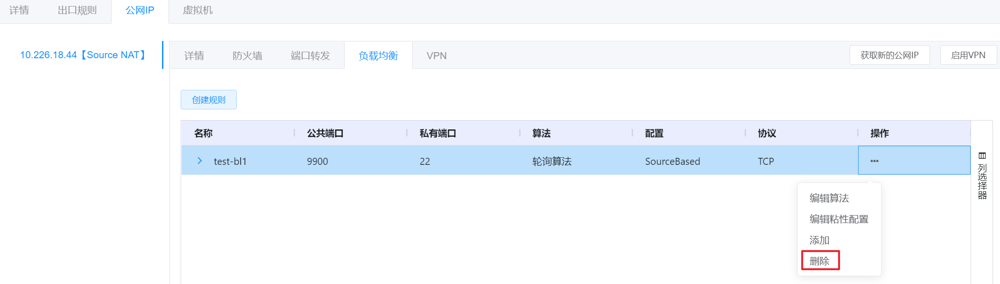

③ 将会弹出“删除负载均衡”的操作提示框，点击“确定”按钮，即可对负载均衡进行删除操作：

#### VPN

平台允许用户创建虚拟私有网络(VPN)访问虚拟机，支持L2TP IPSec VPN类型的VPN服务，将虚拟机路由器作为VPN的服务网关。

支持用户在自己的客户端创建新的VPN连接，访问启用VPN服务的虚拟路由器上的公网IP地址，经身份验证后建立网络加密隧道。同时，用户的客户端设备将会被分配云平台VPN客户端的IP地址，支持访问网络内的虚拟机。

##### 启用公网IP的VPN

① 在基础网络管理界面中，选择需要启用公网IPVPN的隔离网络，在操作列中点击“编辑”按钮：

② 进入网络的详情页面，选择“公网IP”选项卡后，点击“启用VPN”按钮：

③ 将会弹出“启用VPN”的操作提示框，点击“确定”按钮，启用选定公网IP的VPN：

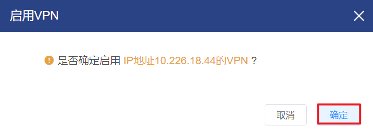

> *注：
>
> - 仅有Source NAT的公网IP支持启用VPN功能；
>
> - 启用VPN后，可以进入VPN选项卡中查看IPSec预共享秘钥或配置用户信息。

##### 查看公网IP的IPSec预共享秘钥

① 在基础网络管理界面中，选择需要查看预共享密钥的隔离网络，在操作列中点击“编辑”按钮：

② 选择“VPN”子选项卡，点击“显示密钥”按钮：

③ 将会弹出公网IP的预共享密钥：

##### 添加VPN用户

① 在基础网络管理界面中，选择需要创建用户的隔离网络，在操作列中点击“编辑”按钮：

② 选择“VPN”子选项卡，点击“创建VPN用户”按钮：

③ 将会弹出“添加用户”的操作提示框，填写用户名和密码后，点击“确定”按钮，添加用户：

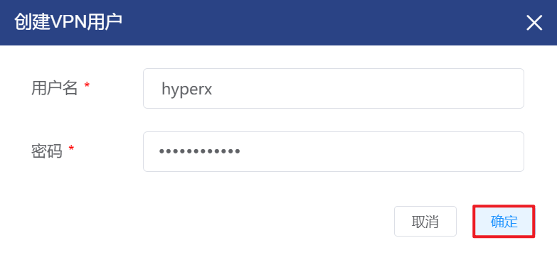

##### 删除VPN用户

①在基础网络管理界面中，选择需要创建用户的隔离网络，在操作列中点击“编辑”按钮：

② 选择“VPN”子选项卡，选择需要删除的用户，点击操作列的“删除”按钮：

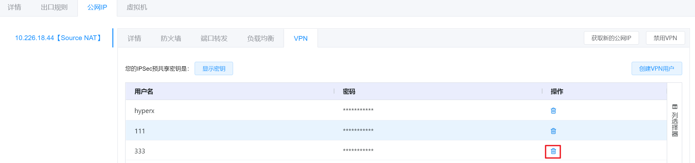

③ 将会弹出“删除用户”的操作提示框，点击“确定”按钮，删除选中的用户：

##### 禁用公网IP的VPN

① 在基础网络管理界面中，选择需要禁用公网IPVPN的隔离网络，在操作列中点击“编辑”按钮：

② 进入网络的详情页面，选择“公网IP”选项卡后，点击“禁用VPN”按钮：

③ 将会弹出“禁用VPN”的操作提示框，点击“确定”按钮，禁用选定公网IP的VPN：

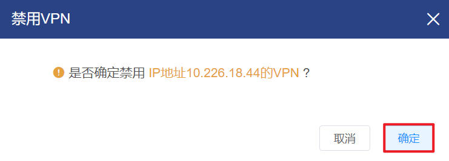

#### 静态NAT

静态NAT用于指定公网的IP地址，同时指定目标虚拟机的IP地址，HyperX云管平台支持用户申请公网IP，并将虚拟路由器将公网IP与虚拟机的IP进行绑定。

该虚拟机所有的网路请求和访问均会使用该公网IP地址，同时该公网IP地址不能被其他虚拟机使用，源NAT的地址不支持配置静态NAT的功能。

##### 启用公网IP的静态NAT

① 在基础网络管理界面中，选择需要启用公网IP静态NAT的隔离网络，在操作列中点击“编辑”按钮：

② 进入网络的详情页面，选择“公网IP”选项卡，点击需要启用静态NAT的公网IP详情页的“启用静态NAT”按钮：

③ 将会弹出“启用静态NAT”的操作提示框，选择虚拟机和IP后点击“确定”按钮，即可启用选定公网IP的静态NAT：

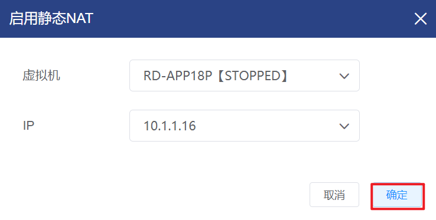

##### 关闭公网IP的静态NAT

① 在基础网络管理界面中，选择需要关闭公网IP静态NAT的隔离网络，在操作列中点击“编辑”按钮：

② 进入网络的详情页面，选择“公网IP”选项卡，点击需要关闭静态NAT的公网IP详情页的“关闭静态NAT”按钮：

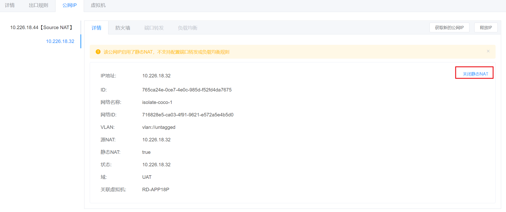

③ 将会弹出“关闭静态NAT”的操作提示框，点击“确定”按钮即可关闭选定公网IP的静态NAT：

