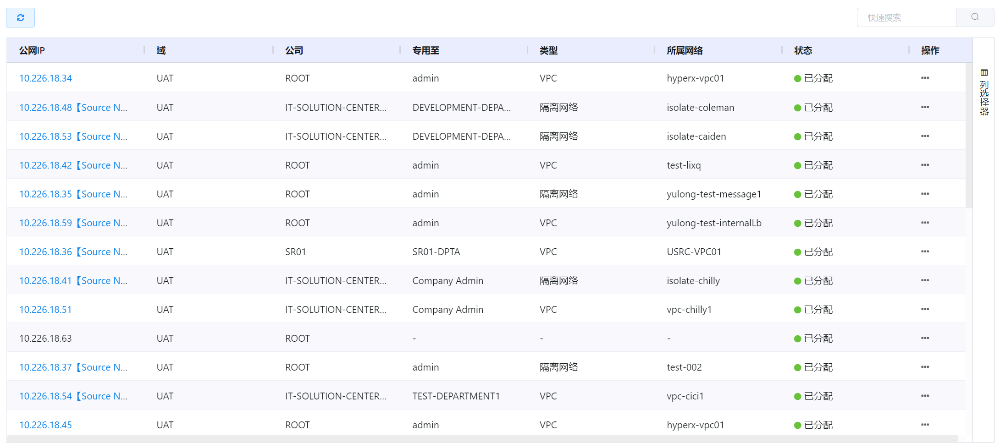
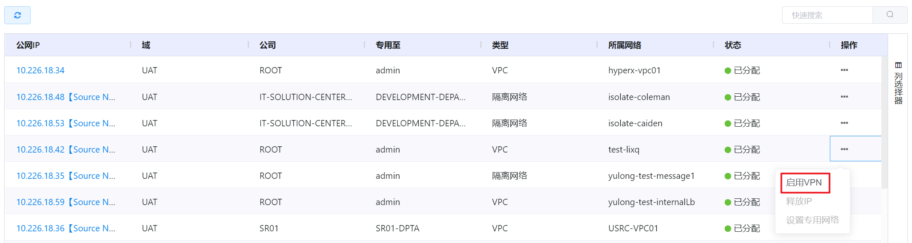
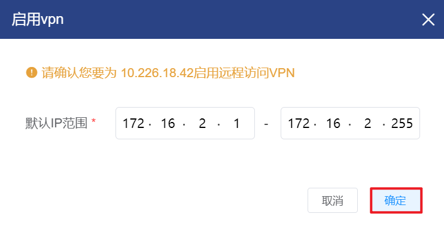
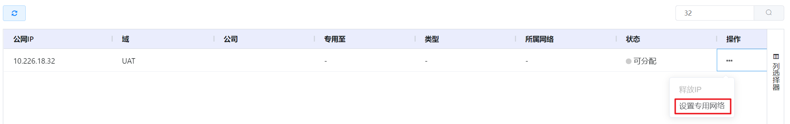

# 4.3.3.公网IP管理

在“资源管理”菜单下选择左侧“网络”的导航菜单，之后点击“公网IP”的子菜单，即可看到公网IP的管理界面：

公网IP的状态有“分配中”、“已释放”和“已分配”三种：

- 分配中：创建公网IP后，在公网IP进入已分配之前的状态，是IP分配的中间状态 ；
- 已释放：处于空闲状态尚未分配网络的公网IP；
- 已分配：已经分配给隔离网络或VPC网络的公网IP。

## 相关操作

HYPERX云管理平台支持用户对公网IP进行管理，支持的功能如下：

- 快速搜索：根据公网IP的IP、域、公司等字段全局快速搜索公网IP；
- 高级筛选：用户可以从表头右侧根据公网IP、域、公司等字段筛选出符合条件的基础网络；
- 启用公网IP的VPN：启用公网IP的VPN服务，将虚拟机路由器作为VPN的服务网关；
- 禁用公网IP的VPN：禁用公网IP的VPN服务，用户不得通过VPN登录；
- 设置公网IP专用网络：将公网IP分配到选定的网络中；
- 释放公网IP：释放选定的公网IP；

操作入口如下：

- 资源管理→网络→公网IP

## 操作说明

### 启用公网IP的VPN

① 在公网IP管理界面中，选择需要启用VPN的公网IP，在操作列中点击“启用VPN”按钮：

② 将会弹出“启用VPN”的操作提示框，点击“确定”按钮，启用选定公网IP的VPN：

> [!NOTE]
>
> - 仅有Source NAT的公网IP支持启用VPN功能；
>
> - 启用公网IP的VPN后，可以进入相应的网络中管理VPN的用户。
>

### 禁用公网IP的VPN

① 在公网IP管理界面中，选择需要禁用VPN的公网IP，在操作列中点击“禁用VPN”按钮：

② 将会弹出“禁用VPN”的操作提示框，点击“确定”按钮，禁用选定公网IP的VPN：

### 设置公网IP专用网络

① 在公网IP管理界面中，选择需要设置专用网络的公网IP，在操作列中点击“设置专用网络”按钮：

② 将会弹出“设置所属网络”的操作提示框，选择网络后点击“确定”按钮，将公网IP分配给指定的网络：

> [!NOTE]
>
> - 仅支持将状态处于“未分配”的公网IP设置到专用网络中；
> - 支持将公网IP分配给基础网络或VPC网络。

### 释放公网IP

① 在公网IP管理界面中，选择需要释放的公网IP，在操作列中点击“释放IP”按钮：

② 将会弹出“释放IP”的操作提示框，点击“确定”按钮，释放选定的公网IP：

