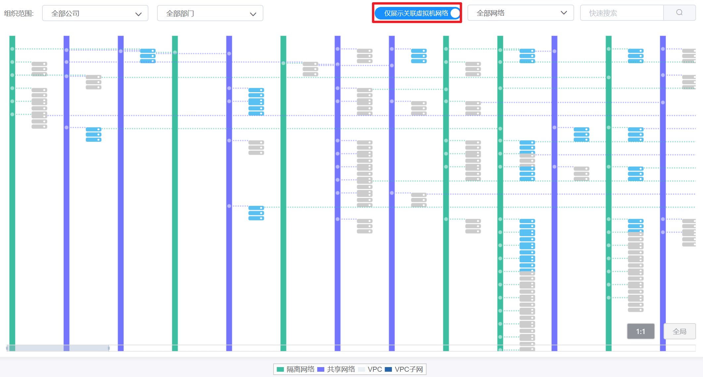

# 4.3.5.拓扑结构

在“资源管理”菜单下选择左侧“网络”的导航菜单，之后点击“网络拓扑”的子菜单，即可看到当前平台的网络拓扑结构：

用户可以查看选定组织下和虚拟机相关的网络或全部网络，默认显示的是和虚拟机关联的网络拓扑结构图：

- 和虚拟机关联的网络：显示选定组织下有虚拟机关联的网络的拓扑结构图；
- 所有网络：显示选定组织下所有网络的拓扑结构图。

其中网络分为隔离网络、共享网络、VPC网络和VPC子网四种，分别使用不同的颜色标识：

- 隔离网络：使用绿色显示；
- 共享网络：使用紫色显示；
- VPC网络：使用浅灰色显示，VPC网络中包裹着深蓝色的VPC子网；
- VPC子网：使用深蓝色显示，处于VPC网络中。

网络关联的虚拟机里有两种状态，分别使用不同的颜色标识：

- 蓝色的虚拟机：代表处于“运行”状态的虚拟机；
- 灰色的虚拟机：代表处于“关闭”状态的虚拟机。

## 相关操作

HYPERX云管理平台支持查看当前平台的网络拓扑结构，支持的功能如下：

- 快速搜索：根据网络名称、IP全局检索拓扑结构中的网络；
- 组织搜索：根据所选择的组织搜索该组织下的拓扑结构；
- 类型搜索：根据网络类型筛选出指定类型的拓扑结构；
- 显示虚拟机关联网络：显示选定组织下有虚拟机关联的网络的拓扑结构图；
- 显示所有网络：显示当前组织中所有现存的网络拓扑结构图。

操作入口如下：

- 资源管理→网络→网络拓扑

## 操作说明

### 显示虚拟机关联网络

在拓扑结构界面中，选择“仅显示虚拟机关联网络”按钮，即可看到与虚拟机关联网络的网络拓扑结构：

### 显示所有网络

在拓扑结构界面中，选择“展示全部网络”按钮，即可看到所有网络的网络拓扑结构，包括运行虚拟机数量为0的虚拟机网络：

