# 4.3.2.VPC管理

VPC是从整体网络中分割出来的逻辑隔离的网络，在该网络中用户具有完全控制权，可以定义IP地址范围、创建子网、配置路由表和网关。

VPC中可以包含多个独立的子网，各个子网共用同一个路由器，且每个子网都拥有独立的访问控制列表(ACL)。

在资源管理菜单下选择左侧“网络”的导航菜单，之后点击“专有网络(VPC)”的子菜单，即可看到VPC的管理界面：

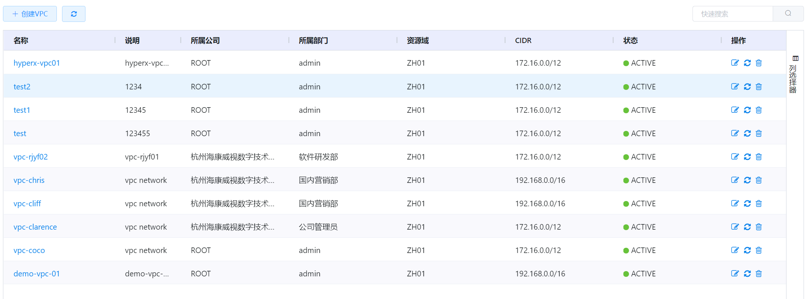

## 相关操作

HYPERX云管理平台支持用户对VPC进行管理，支持的功能如下：

### 特色操作

- 全局搜索：用户可以根据VPC网络的名称、说明、公司等字段全局搜索VPC网络；
- 自定义表头：用户可以从“列选择器”中自定义VPC管理界面列表显示的表头(如名称、说明、公司等)；
- 高级筛选：用户可以从表头右侧根据VPC的名称、说明、公司等字段筛选出符合条件的VPC；

### VPC相关操作

- 
  创建VPC：用户可以创建一个VPC网络；
- 编辑VPC：用户可以编辑选定的VPC网络；
- 重启VPC：用户可以重启选定的VPC网络；
- 删除VPC：用户可以删除选定的VPC网络；

### 子网相关操作

#### 子网基础操作

- 创建子网：在VPC中创建一个子网；
- 编辑子网：编辑VPC中子网的信息；
- 替换子网ACL：用户可以替换VPC中子网的ACL；
- 重启子网：用户可以重启VPC中的选定子网；
- 删除子网：用户可以删除VPC中选定的子网；

#### 内部LB

- 添加子网内部LB：用户可以在子网中添加内部负载均衡规则；
- 添加子网内部LB的虚拟机：用户可以编辑子网内部负载均衡的虚拟机；
- 删除子网内部LB的虚拟机：用户可以编辑子网内部负载均衡的虚拟机；
- 删除子网内部LB：用户可以删除子网中的内部负载均衡规则；

### 路由器相关操作

#### 公网IP

##### 公网IP基础操作

- 获取公网IP：获取新的公网IP;
- 释放公网IP：释放选定的公网IP;

##### 静态NAT

- 启用公网IP静态NAT：将选定虚拟机的IP地址与公网IP的地址绑定；
- 关闭公网IP静态NAT：解除虚拟机IP地址与公网IP的地址的绑定关系；

##### 端口转发

- 创建公网IP端口转发规则：为选定的公网IP创建端口转发规则；
- 删除公网IP端口转发规则：删除选定的端口转发规则；

##### 负载均衡

- 创建公网IP负载均衡规则：为选定的公网IP创建负载均衡规则；
- 编辑公网IP负载均衡算法：编辑选定负载均衡规则的算法；
- 编辑公网IP负载均衡粘性配置：编辑选定负载均衡规则的粘性配置；
- 添加虚拟机至公网IP负载均衡规则：将选定的虚拟机添加到选定负载均衡规则中；
- 将虚拟机从公网IP负载均衡规则中移除：将选定的虚拟机从选定负载均衡规则中移除；
- 删除公网IP负载均衡规则：删除选定的负载均衡规则；

##### VPN

- 启用公网IP的VPN：启用公网IP的VPN服务，将虚拟机路由器作为VPN的服务网关；
- 创建公网IP的VPN用户：添加可以使用VPN的用户；
- 删除公网IP的VPN用户：删除选定的VPN用户；
- 禁用公网IP的VPN：禁用公网IP的VPN服务，用户不得通过VPN登录；

#### 点到点VPN

- 添加点到点VPN网关：将选定路由器的公网IP配置为点到点的VPN网关；
- 查看点到点VPN网关详情：查看点到点VPN网关的详情信息，包括ID、组织等相关信息；
- 删除点到点VPN网关：删除选定的点到点VPN网关；
- 添加点到点VPN连接：添加一个点到点VPN连接；
- 重启点到点VPN连接：重新启动选定的点到点VPN连接；
- 删除点到点VPN连接：删除选定的点到点VPN连接；

#### 网络ACL列表

- 添加ACL列表：在路由器中添加一个ACL列表；
- 添加ACL规则：在ACL列表中添加一条ACL规则；
- 编辑ACL规则：编辑选定的ACL规则；
- 删除ACL规则：删除选定的ACL规则；
- 删除ACL列表：删除选定的ACL列表。

操作入口如下：

-  资源管理→网络→VPC

## 操作说明

### VPC相关操作

#### 创建VPC

① 在VPC管理界面中，点击“创建VPC”按钮：

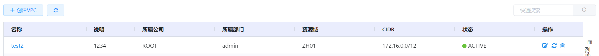

② 在弹出的操作提示框中填写VPC的名称、组织、IP网段、备注等信息后，点击“确定”按钮添加VPC：

#### 编辑VPC

① 在VPC管理界面中，点击操作列的“编辑VPC”按钮：

② 将会进入编辑VPC的页面，修改VPC的名称或说明后，点击“确定”按钮编辑VPC的相关信息：

#### 重启VPC

① 在VPC管理界面中，选择需要重启的VPC，点击操作列的“重启VPC”按钮：

② 将会弹出“重启VPC”的操作提示框，点击“确定”按钮后，重启选定的VPC网络：

> *注：
>
> - 若勾选“重置虚拟路由”复选框，将会删除现有虚拟路由并且重建新的虚拟路由；
>
> 

#### 删除VPC

① 在VPC管理界面中，点击操作列的“删除VPC”按钮：

② 将会弹出“删除”的操作提示框，点击“确定”按钮后，删除选定的VPC网络：

> *注：
>
> - 删除VPC网络前，需要删除VPC中全部的子网。
>

### 子网相关操作

#### 子网基础操作

##### 创建子网

① 在VPC管理界面中，点击需要创建子网的VPC的名称，进入VPC的详情页：

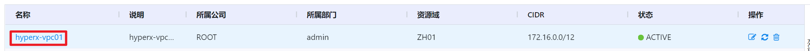

② 在“子网”选项卡中，点击“创建子网”按钮：

③ 在弹出的“创建子网”操作提示框中填写名称、子网类型、网络网段等信息后，点击“确定”按钮创建VPC的子网：

编辑子网

① 在VPC管理界面中，点击需要编辑子网的VPC的名称，进入VPC的详情页：

② 在“子网”选项卡中，选择需要编辑的子网， 点击操作列的“编辑子网”按钮：

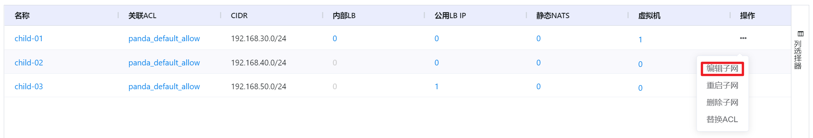

③ 进入编辑子网的页面，修改子网的名称、说明等信息后，点击“确定”按钮编辑VPC的子网：

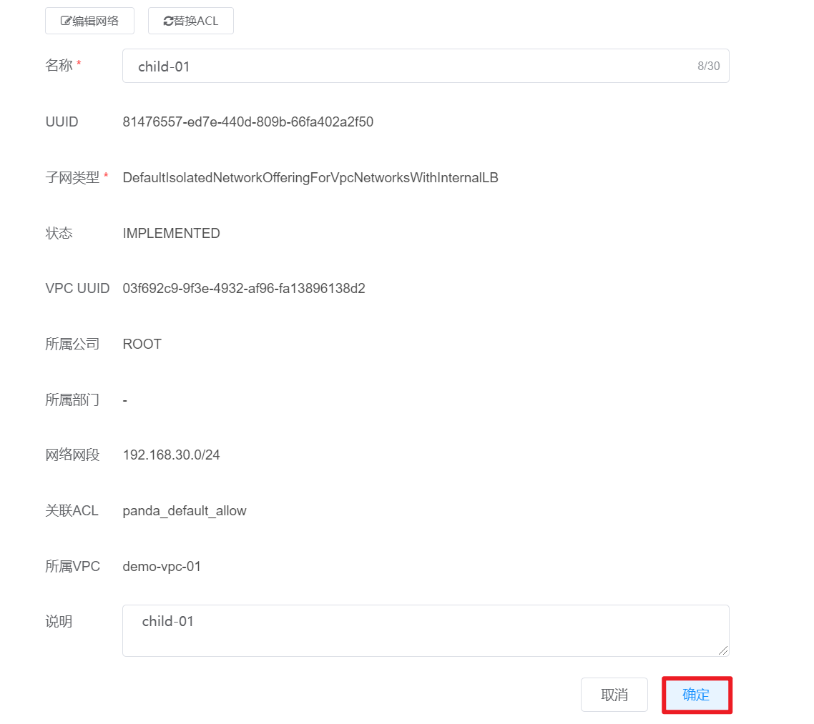

##### 替换子网ACL

① 在VPC管理界面中，点击需要替换子网ACL列表的VPC的名称，进入VPC的详情页：

② 在“子网”选项卡中，选择需要替换ACL的子网， 点击操作列的“替换ACL”按钮：

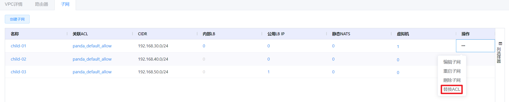

③ 将会弹出“替换ACL”的操作提示框，修改ACL列表后，点击“确定”按钮：

##### T 重启子网

① 在VPC管理界面中，点击需要编辑子网的VPC的名称，进入VPC的详情页：

② 在“子网”选项卡中，选择需要重启的子网，点击操作列的“重启子网”按钮：

③ 将会弹出“重启网络”的操作提示框，点击“确定”按钮后，重启选定的网络：

##### T 删除子网

① 在VPC管理界面中，点击需要删除子网的VPC的名称，进入VPC的详情页：

② 在“子网”选项卡中，选择需要删除的子网，点击操作列的“删除子网”按钮：

③ 将会弹出“删除网络”的操作提示框，点击“确定”按钮后，删除选定的子网：

#### 内部LB

##### 添加VPC子网内部LB

① 在VPC管理界面中，点击需要添加子网内部LB的VPC的名称，进入VPC的详情页：

② 在“子网”选项卡中，选择需要添加内部LB的子网，点击子网“内部LB”的数字：

③ 进入子网内部LB的界面，点击“添加内部LB”按钮：

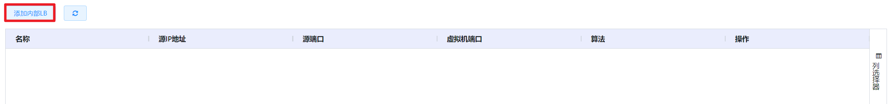

④ 弹出“添加内部LB”的操作提示框，填写相关信息后，点击“确定”按钮添加子网内部的LB：

##### 添加子网内部LB虚拟机

① 在VPC管理界面中，点击需要添加子网内部LB虚拟机的VPC的名称，进入VPC的详情页：

② 在“子网”选项卡中，选择需要添加子网内部LB虚拟机的子网，点击子网“内部LB”的数字：

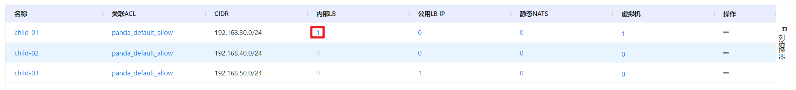

③ 进入子网内部LB的界面，选择需要添加虚拟机的内部LB，点击操作列的“添加”按钮：

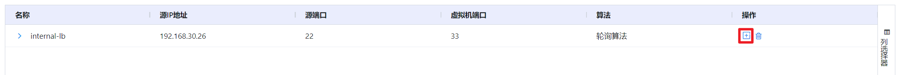

④ 将会弹出“配置虚拟机”的操作提示框，选择虚拟机和IP后，点击“确定”按钮添加子网内部LB的虚拟机：

##### 删除子网内部LB虚拟机

① 在VPC管理界面中，点击需要删除子网内部LB虚拟机的VPC的名称，进入VPC的详情页：

② 在“子网”选项卡中，选择需要编辑子网内部LB虚拟机的子网，点击子网“内部LB”的数字：

③ 点击“更多”小箭头，将会显示子网内部LB的虚拟机：

④ 选择需要删除的子网内部LB的虚拟机，点击操作列的“删除”按钮：

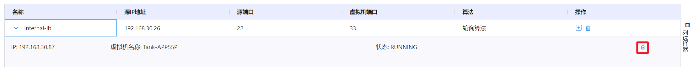

⑤ 将会弹出“删除IP”的操作提示框，点击“确定”按钮删除选定的子网内部LB的虚拟机：

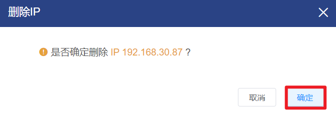

##### 删除子网内部LB

① 在VPC管理界面中，点击需要删除子网内部LB的VPC的名称，进入VPC的详情页：

② 在“子网”选项卡中，选择需要删除内部LB的子网，点击子网“内部LB”的数字：

③ 进入子网内部LB的界面，选择需要删除的内部LB，点击操作列的“删除”按钮：

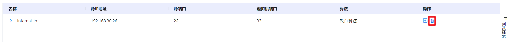

④ 将会弹出“删除内部LB”的操作提示框，点击“确定”按钮删除选定的子网内部LB：

### 路由器相关操作

#### 公网IP

##### 公网IP基础操作

###### 获取公网IP

① 在VPC管理界面中，点击需要获取公网IP的VPC的名称，进入VPC的详情页：

② 在“路由器”选项卡中，选择“公网IP地址”子选项卡，点击“获取新的公网IP”按钮：

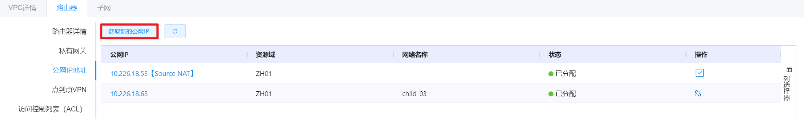

③ 将会弹出“获取新的公网IP”操作提示框，点击“确定”按钮获取新的公网IP:

###### 释放公网IP

① 在VPC管理界面中，点击需要释放公网IP的VPC的名称，进入VPC的详情页：

② 在“路由器”选项卡中，选择“公网IP地址”子选项卡，选择需要释放的公网IP，点击操作列的“释放IP”按钮：

③ 将会弹出“释放”的操作提示框，点击“确定”按钮释放选定的公网IP：

##### 静态NAT

###### 启用公网IP静态NAT

① 在VPC管理界面中，点击需要启用公网IP静态NAT的VPC的名称，进入VPC的详情页：

② 在“路由器”选项卡中，选择“公网IP地址”子选项卡，点击需要启用静态NAT的公网IP名称：

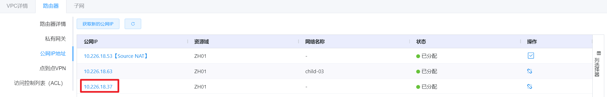

③ 进入公网IP详情页，点击“启用静态NAT”按钮：

④ 将会弹出“启用静态NAT”操作提示框，填写相关信息后点击“确定”按钮即可启用选定公网IP的静态NAT：

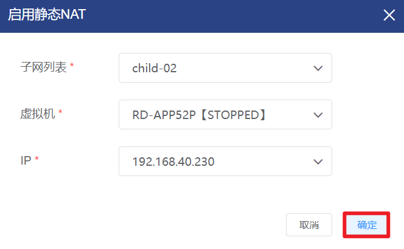

> *注：
>
> - 公网IP启用静态NAT后，不支持配置端口转发和负载均衡规则。

###### 关闭公网IP静态NAT

① 在VPC管理界面中，点击需要关闭公网IP静态NAT的VPC的名称，进入VPC的详情页：

② 在“路由器”选项卡中，选择“公网IP地址”子选项卡，点击需要关闭静态NAT的公网IP名称：

③ 进入公网IP详情页，点击“关闭静态NAT”按钮：

④ 将会弹出“关闭静态NAT”的操作提示框，点击“确定”按钮可关闭选定公网IP的静态NAT：

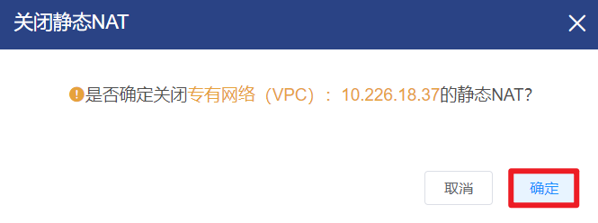

##### 端口转发

###### 创建公网IP端口转发规则

① 在VPC管理界面中，点击需要创建公网IP端口转发规则的VPC的名称，进入VPC的详情页：

② 在“路由器”选项卡中，选择“公网IP地址”子选项卡，点击创建公网IP端口转发规则的公网IP名称：

③ 选择“端口转发”选项卡，点击“创建转发规则”按钮：

④ 将会弹出“创建转发规则”的操作提示框，填写相关信息后点击“确定”按钮即可创建公网IP的端口转发规则：

> *注：
>
> - 公网IP配置端口转发规则后，不支持配置负载均衡规则和启用静态NAT；
> - 公网IP为某一个子网的虚拟机配置端口转发规则后，该公网IP则属于该子网专用，不再允许为VPC的其他子网配置端口转发规则；
> - 如果VPC的私有开始端口与私有结束端口不相同，则公共开始、结束端口需与私有开始、结束端口相同。

###### 删除公网IP端口转发规则

① 在VPC管理界面中，点击需要删除公网IP端口转发规则的VPC的名称，进入VPC的详情页：

② 在“路由器”选项卡中，选择“公网IP地址”子选项卡，点击删除公网IP端口转发规则的公网IP名称：

③ 选择“端口转发”选项卡，选择需要删除的端口转发规则，点击操作列的‘’删除”按钮：

④ 将会弹出“删除”的操作提示框，点击“确定”按钮即可删除选定的公网IP的端口转发规则：

##### 负载均衡

###### 创建公网IP负载均衡规则

① 在VPC管理界面中，点击需要创建公网IP负载均衡规则的VPC的名称，进入VPC的详情页：

② 在“路由器”选项卡中，选择“公网IP地址”子选项卡，点击创建公网IP负载均衡规则的公网IP名称：

③ 选择“负载均衡”选项卡，点击操作列的‘’创建规则”按钮：

④ 将会弹出“创建规则”的操作提示框，填写相关信息后点击“下一步”按钮：

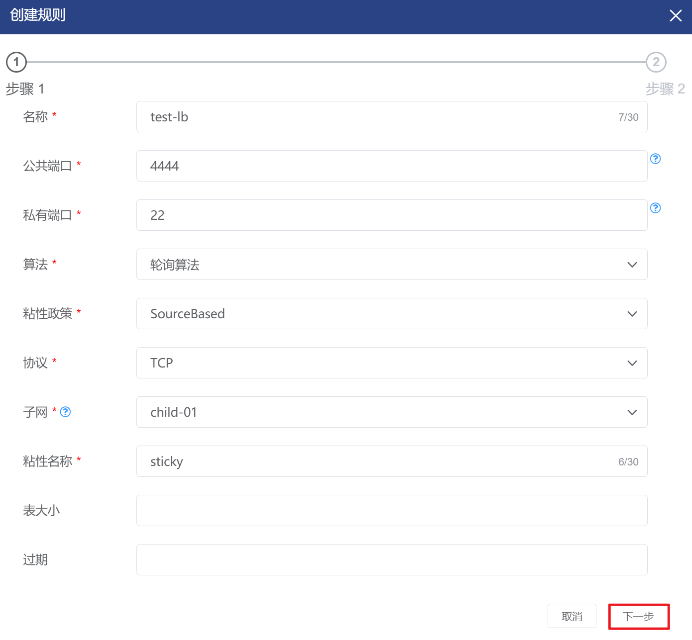

⑤ 选择负载均衡的虚拟机后，点击“确定”按钮即可创建公网IP的负载均衡规则：

> *注：
>
> - 公网IP配置负载均衡规则后，不支持配置端口转发规则和启用静态NAT；
> - 公网IP为某一个子网的虚拟机配置负载均衡规则后，该公网IP则属于该子网专用，不再允许为VPC的其他子网配置负载均衡规则。

######  编辑公网IP负载均衡算法

① 在VPC管理界面中，点击需要编辑公网IP负载均衡规则的VPC的名称，进入VPC的详情页：

② 在“路由器”选项卡中，选择“公网IP地址”子选项卡，点击编辑公网IP负载均衡规则的公网IP名称：

③ 在“负载均衡”选项卡中，选择需要编辑算法的负载均衡规则，点击操作列的“编辑算法”按钮：

④ 将会弹出“编辑规则”的操作提示框，编辑算法后点击“确定”按钮即可：

######  编辑公网IP负载均衡粘性配置 

① 在VPC管理界面中，点击需要编辑公网IP负载均衡规则的VPC的名称，进入VPC的详情页：

② 在“路由器”选项卡中，选择“公网IP地址”子选项卡，点击编辑公网IP负载均衡规则的公网IP名称：

③ 在“负载均衡”选项卡中，选择需要编辑粘性规则的负载均衡规则，点击操作列的“编辑粘性规则”按钮：

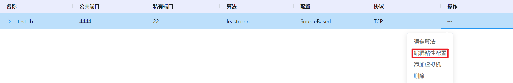

④ 将会弹出“编辑粘性规则”的操作提示框，编辑粘性规则后点击“确定”按钮即可：

######  添加虚拟机至公网IP负载均衡规则 

① 在VPC管理界面中，点击需要编辑公网IP负载均衡规则虚拟机的VPC的名称，进入VPC的详情页：

② 在“路由器”选项卡中，选择“公网IP地址”子选项卡，点击编辑公网IP负载均衡规则虚拟机的公网IP名称：

③ 在“负载均衡”选项卡中，选择需要加载虚拟机的负载均衡规则，点击操作列的“添加虚机”按钮：

④将会弹出“配置虚拟机”的操作提示框，选择虚拟机后点击“确定”按钮即可：

######  将虚拟机从公网IP负载均衡规则中移除 

① 在VPC管理界面中，点击需要编辑公网IP负载均衡规则虚拟机的VPC的名称，进入VPC的详情页：

② 在“路由器”选项卡中，选择“公网IP地址”子选项卡，点击编辑公网IP负载均衡规则虚拟机的公网IP名称：

③ 在“负载均衡”选项卡中， 选择需要移除虚拟机的负载均衡规则，点击“更多”拓展标识，显示该负载均衡规则关联的虚拟机：

④ 选择移除虚拟机的负载均衡规则，点击操作列的“删除”按钮： 

⑤ 将会弹出“删除”的操作提示框，点击“确定”按钮，即可移除负载均衡规则中选定的虚拟机 ：

###### 删除公网IP负载均衡规则

① 在VPC管理界面中，点击需要删除公网IP负载均衡规则的VPC的名称，进入VPC的详情页：

② 在“路由器”选项卡中，选择“公网IP地址”子选项卡，点击删除负载均衡规则的公网IP名称：

③ 在“负载均衡”选项卡中，选择需要删除的负载均衡规则，点击操作列的“删除”按钮：

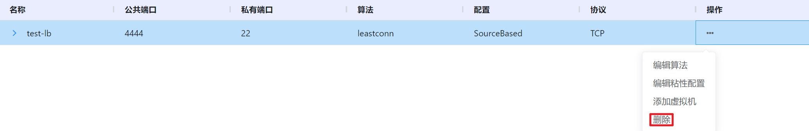

④ 将会弹出“删除”的操作提示框，点击“确定”按钮即可删除选定的负载均衡规则：

##### VPN

###### 启用公网IP的VPN

① 在VPC管理界面中，点击需要启用公网IP的VPN的VPC的名称，进入VPC的详情页：

② 在“路由器”选项卡中，选择“公网IP地址”子选项卡，选择需要启用VPN的公网IP，点击操作列的“启用VPN”按钮：

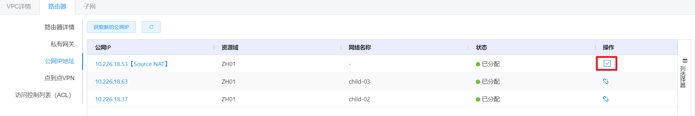

③ 将会弹出“启用远程访问VPN”的操作提示框，点击“确定”按钮即可启用远程访问VPN：

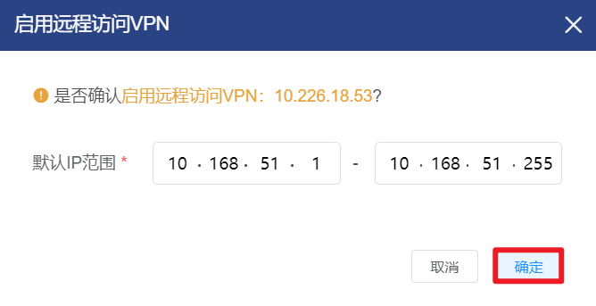

###### 显示VPN的IPSec预共享秘钥

① 在VPC管理界面中，点击需要显示VPN的IPSec预共享秘钥的VPC的名称，进入VPC的详情页：

② 在“路由器”选项卡中，选择“公网IP地址”子选项卡，选择需要显示VPN的IPSec预共享秘钥的公网IP名称：

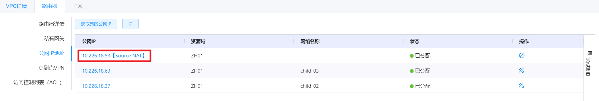

③ 选择“VPN”选项卡，点击“显示密钥”按钮：
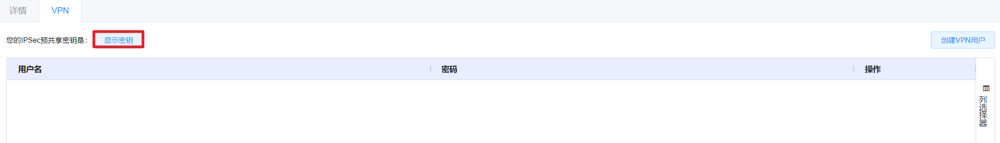

④ 即可看到IPSec预共享密钥：

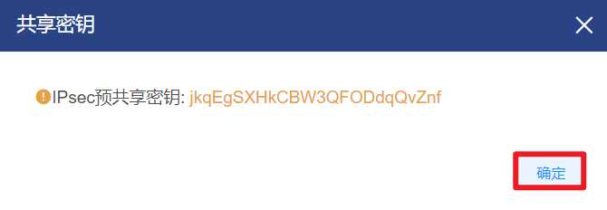

###### 创建VPN用户

① 在VPC管理界面中，点击需要创建VPN用户的VPC的名称，进入VPC的详情页：

② 在“路由器”选项卡中，选择“公网IP地址”子选项卡，选择需要创建VPN用户的公网IP名称：

③ 选择“VPN”选项卡，点击“创建VPN用户”按钮：

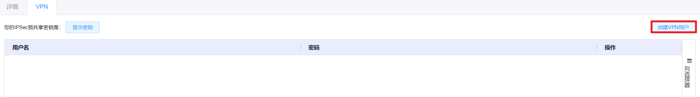

④ 将会弹出“创建VPN用户”的操作提示框，填写用户名和密码后，点击“确定”按钮，即可为选定的VPN添加用户：

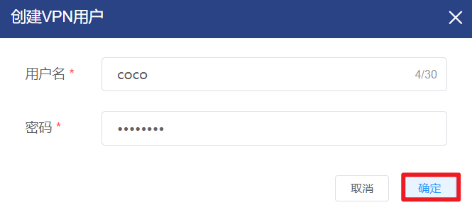

###### 删除VPN用户

① 在VPC管理界面中，点击需要删除VPN用户的VPC的名称，进入VPC的详情页：

② 在“路由器”选项卡中，选择“公网IP地址”子选项卡，选择需要删除VPN用户的公网IP名称：

③ 选择“VPN”选项卡，选择需要删除的用户，点击操作列的“删除”按钮：

④ 将会弹出“删除用户“的操作提示框，点击“确定”按钮即可删除选定的VPN用户：

###### 禁用公网IP的VPN

① 在VPC管理界面中，点击需要禁用公网IP的VPN的VPC的名称，进入VPC的详情页：

② 在“路由器”选项卡中，选择“公网IP地址”子选项卡，选择需要禁用VPN的公网IP，点击操作列的“禁用VPN”按钮：

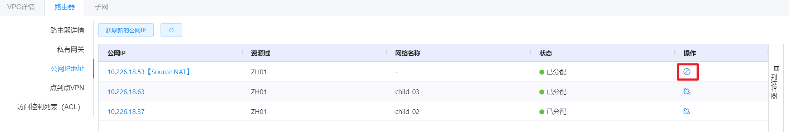

③ 将会弹出“禁用VPN”的操作提示框，点击“确定”按钮即可禁用远程访问VPN：

#### 点到点VPN

##### 添加点到点VPN网关

① 在VPC管理界面中，点击需要添加点到点VPN网关的VPC的名称，进入VPC的详情页：

② 在“路由器”选项卡中，选择“点到点VPN”子选项卡，点击“添加点到点VPN网关”按钮：

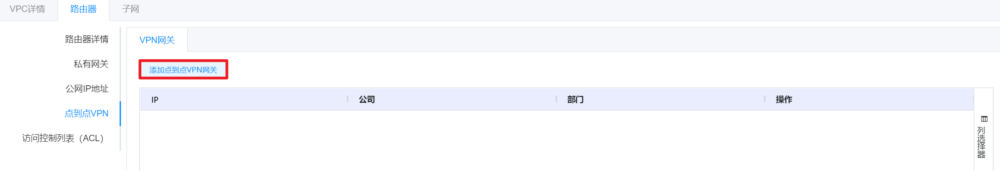

③ 将会弹出“创建VPN网关”的操作提示框，点击“确定”按钮即可添加点到点VPN网关：

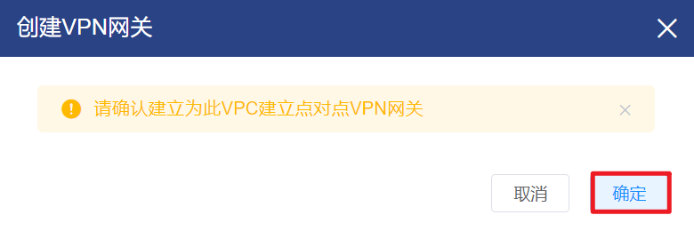

##### 查看点到点VPN网关详情

① 在VPC管理界面中，点击需要查看点到点VPN网关的VPC的名称，进入VPC的详情页：

② 在“路由器”选项卡中，选择“点到点VPN”子选项卡，选择需要查看的点到点VPN，点击操作列的“详情”按钮：

③ 即可查看点到点VPN网关的详情信息：

##### 删除点到点VPN网关

① 在VPC管理界面中，点击需要删除点到点VPN网关的VPC的名称，进入VPC的详情页：

② 在“路由器”选项卡中，选择“点到点VPN”子选项卡，选择需要删除的点到点VPN，点击操作列的“删除”按钮：

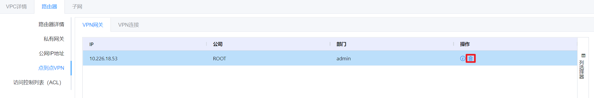

③ 将会弹出“删除”的操作提示框，点击“确定”按钮即可删除选定的点到点VPN网关：

> *注：
>
> - 当且仅当VPN网关下有VPN连接时，VPN网关不支持删除。

##### 添加点到点VPN连接

① 在VPC管理界面中，点击需要添加点到点VPN连接的VPC的名称，进入VPC的详情页：

② 在“路由器”选项卡中，选择“点到点VPN”下的“VPN连接”子选项卡，点击“添加VPN连接”按钮：

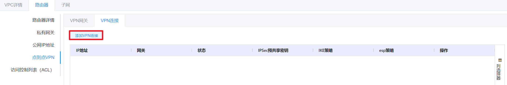

③ 将会弹出“创建VPN连接”的操作提示框，选择VPN网关后，点击“确定”按钮即可添加点到点VPN连接：

##### 查看点到点VPN连接

① 在VPC管理界面中，点击需要添加点到点VPN连接的VPC的名称，进入VPC的详情页：

② 在“路由器”选项卡中，选择“点到点VPN”下的“VPN连接”子选项卡，选择需要查看的点到点VPN连接，点击操作列的“详情”按钮：

③ 即可查看点到点VPN连接的详情信息：

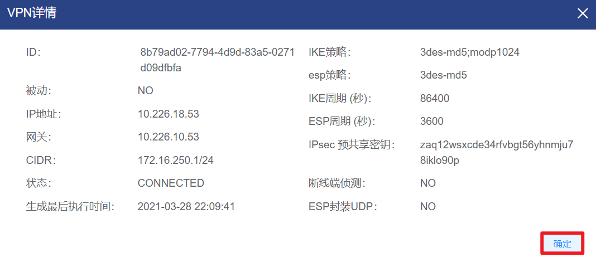

##### 重启点到点VPN连接

① 在VPC管理界面中，点击需要重启点到点VPN连接的VPC的名称，进入VPC的详情页：

② 在“路由器”选项卡中，选择“点到点VPN”下的“VPN连接”子选项卡，选择需要重启的点到点VPN连接，点击操作列的“重启”按钮：

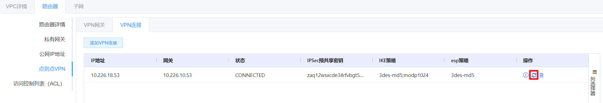

③ 将会弹出“重启VPN连接”的操作提示框，点击“确定”按钮即可重启选定的VPN连接：

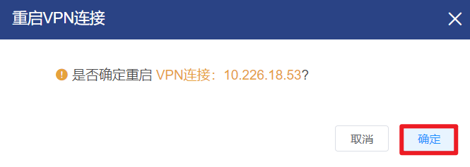

##### 删除点到点VPN连接

① 在VPC管理界面中，点击需要删除点到点VPN连接的VPC的名称，进入VPC的详情页：

② 在“路由器”选项卡中，选择“点到点VPN”下的“VPN连接”子选项卡，选择需要删除的点到点VPN连接，点击操作列的“删除”按钮：

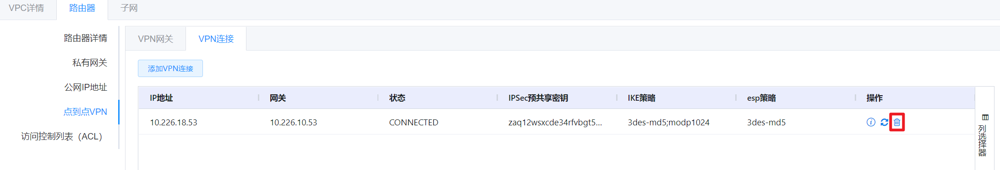

③ 将会弹出“删除”的操作提示框，点击“确定”按钮即可删除选定的VPN连接：

####  网络ACL列表

##### 添加ACL列表

① 在VPC管理界面中，点击需要添加ACL列表的VPC的名称，进入VPC的详情页：

② 在“路由器”选项卡中，选择“访问控制列表(ACL)”子选项卡，点击“添加ACL”按钮：

③ 将会弹出“添加ACL”的操作提示框，填写相关信息后点击“确定”按钮即可成功添加ACL列表：

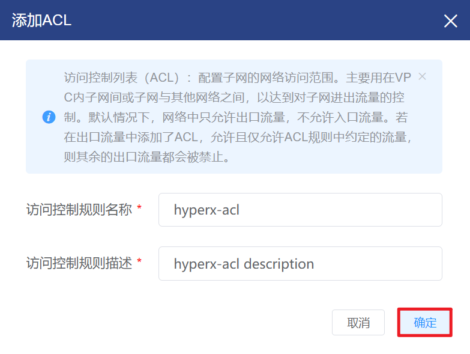

##### 添加ACL规则

① 在VPC管理界面中，点击需要添加ACL规则VPC的名称，进入VPC的详情页：

② 在“路由器”选项卡中，选择“访问控制列表(ACL)”子选项卡，选择需要添加规则的ACL，点击操作列的“配置ACL列表”按钮：

③ 将会进入配置ACL的界面，点击“增加规则”按钮：

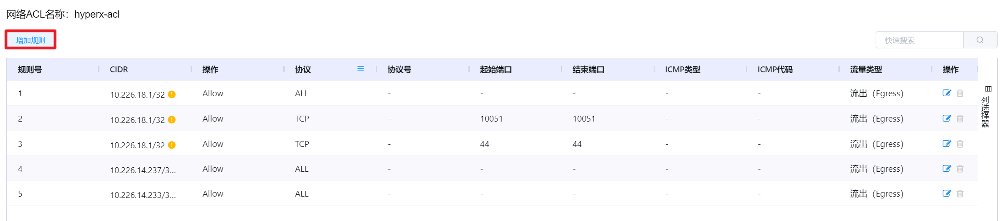

④ 将会弹出“创建网络ACL规则”的操作提示框，填写相关信息后点击“确定”按钮即可添加ACL规则：

> *注：
>
> - 仅自定义的ACL列表支持添加ACL规则，默认的default_deny和default_allow列表不支持添加ACL规则；
> - 为保证VPC内虚拟机能正常显示监控信息，新建的ACL列表会自动创建监控CIDR、端口的ACL规则。

##### 编辑ACL规则

① 在VPC管理界面中，点击需要编辑ACL规则VPC的名称，进入VPC的详情页：

② 在“路由器”选项卡中，选择“访问控制列表(ACL)”子选项卡，选择需要编辑规则的ACL，点击操作列的“配置ACL列表”按钮：

③ 将会进入配置ACL的界面，选择需要编辑的ACL规则，点击操作列的“编辑ACL规则”按钮：

④ 将会弹出“编辑网络ACL规则”的操作提示框，编辑相关信息后点击“确定”按钮即可成功编辑ACL规则：

##### 删除ACL规则   

① 在VPC管理界面中，点击需要删除ACL规则VPC的名称，进入VPC的详情页：

② 在“路由器”选项卡中，选择“访问控制列表(ACL)”子选项卡，选择需要删除规则的ACL，点击操作列的“配置ACL列表”按钮：

③ 将会进入配置ACL的界面，选择需要删除的ACL规则，点击操作列的“删除ACL规则”按钮：

④ 将会弹出“删除”的操作提示框，点击“确定”按钮即可删除选定的ACL规则：

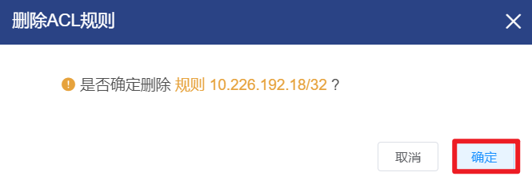

##### 删除ACL列表

① 在VPC管理界面中，点击需要删除ACL列表VPC的名称，进入VPC的详情页：

② 在“路由器”选项卡中，选择“访问控制列表(ACL)”子选项卡，选择需要删除的ACL，点击操作列的“删除ACL列表”按钮：

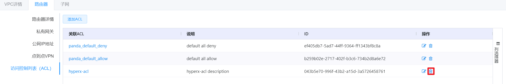

③ 将会弹出“确认删除”的操作提示框，点击“确定”按钮即可删除选定的ACL列表：

