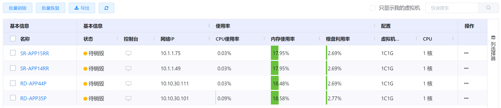
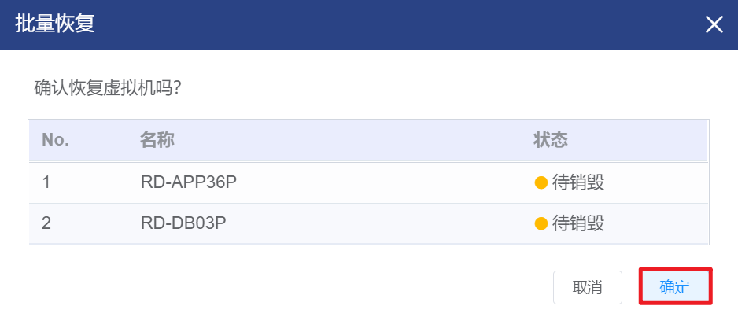

# 4.2.6.回收站管理

回收站用于存放处于“待销毁”状态的虚拟机，管理员可以从回收站中的虚拟机执行恢复或彻底销毁的操作。

在“资源管理”菜单下选择左侧“虚拟资源管理”的导航菜单，之后点击“回收站”的子菜单，即可看到回收站的管理界面：

处于“回收站”状态的虚拟机有以下两个来源：

- 用户从虚拟机列表手动执行删除的虚拟机；

- 超过用户为虚拟机设置的“回收日期”被系统根据回收策略自动回收的虚拟机。

## 相关操作

HYPERX云管理平台支持用户对回收站中的虚拟机进行管理，支持的功能如下：

- 显示我的虚拟机：开放给管理员用户，支持管理员迅速在所管理虚拟机和所拥有虚拟机间切换；
- 全局搜索：用户可以根据虚拟机的名称、所有者、IP等字段全局搜索虚拟机；
- 高级筛选：用户可以从表头右侧根据虚拟机的名称、状态、虚拟机规格等字段筛选出符合条件的虚拟机；
- 自定义表头：用户可以自定义回收站中虚拟机列表显示的表头(如名称、资源标签、IP等)；
- 彻底销毁虚拟机：将虚拟机彻底销毁，释放所占用资源并停止计费，不支持管理员做恢复操作；
- 恢复虚拟机：管理员可以将选定的虚拟机恢复到虚拟机列表中；
- 导出虚拟机列表：用户可以导出选定条件下回收站中的虚拟机列表，表格的格式为XLSX；
- 资源总计：在虚拟机页面的底部，显示该用户所筛选回收站中的虚拟机CPU、内存资源、磁盘容量的总计。

操作入口如下：

- 资源管理→虚拟资源管理→回收站

## 操作说明

### 虚拟机的恢复

① 在回收站管理界面中，勾选需要恢复的虚拟机，在操作列中点击“批量恢复”按钮：

② 将会弹出“恢复”的操作提示框，可以复核待操作虚拟机的相关信息，复核信息无误后，点击“确定”按钮，即可将选中虚拟机恢复到虚拟机列表中：

> [!NOTE]
>
> - 虚拟机被恢复到虚拟机列表后，状态会被置为“关闭”状态；
> - 虚拟机被恢复后，回收日期会被置空，虚拟机将不会受到回收时间影响；
> - 回收站中也支持恢复单台虚拟机，入口如下：
>   - 点击操作列的“恢复”按钮；
>   - 点击操作列的“更多”按钮或虚拟机名称，进入虚拟机详情页，然后点击右侧“运行信息”操作列中的“恢复”按钮。

### 虚拟机的彻底销毁

① 在回收站管理界面中，勾选需要恢复的虚拟机，在操作列中点击“批量销毁”按钮：

② 将会弹出“彻底销毁”的操作提示框，点击“确定”按钮，彻底销毁选中的虚拟机：

> [!NOTE]
>
> - 彻底销毁的虚拟机资源会被释放，对该虚拟机的计费会停止，管理员将不能恢复该虚拟机；
> - 回收站中也支持彻底销毁单台虚拟机，入口如下：
>   - 点击操作列的“彻底销毁”按钮；
>   - 点击操作列的“更多”按钮或虚拟机名称，进入虚拟机详情页，然后点击右侧“运行信息”操作列中的“彻底销毁”按钮。

