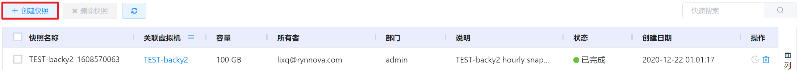
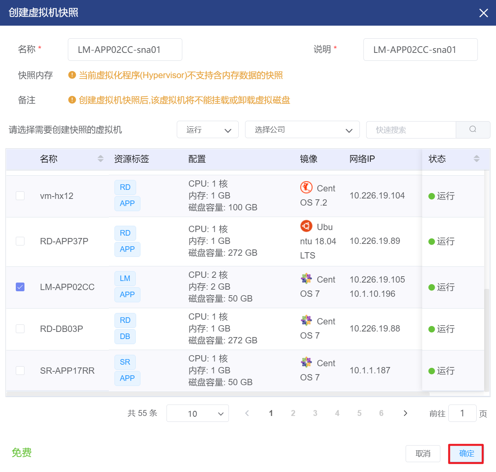
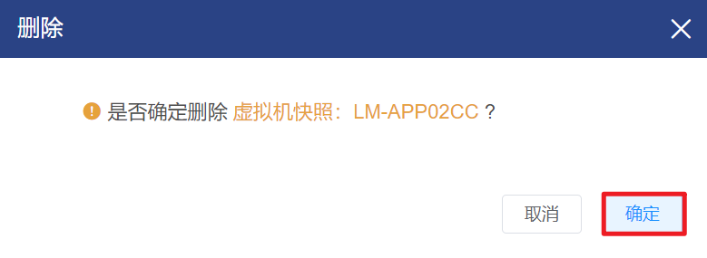

# 4.2.2.虚拟机快照管理

虚拟机快照是在虚拟机运行的过程中设定一个快照点，无论虚拟机在之后的操作中发生什么变化，包括系统崩溃、操作异常，都可以恢复到设定虚拟机快照的状态。

在“资源管理”菜单下选择左侧“虚拟机资源管理”的导航菜单，之后点击”虚拟机快照”的子菜单，即可看到虚拟机快照的管理界面：

## 相关操作

HYPERX云管理平台支持用户对虚拟机快照进行管理，支持的功能如下：

- 快速搜索：用户可以根据虚拟机快照的名称、关联虚拟机、所有者等字段全局快速搜索虚拟机快照；
- 快速筛选：支持根据虚拟机快照的名称、关联虚拟机、所有者等字段进行高级筛选；
- 创建快照：为选定的虚拟机创建快照；
- 回滚快照：将虚拟机回滚到创建快照时的状态。
- 删除快照：删除选定的虚拟机快照；
- 批量删除快照：支持选择多个虚拟机快照，批量执行删除操作。

操作入口如下：

- 资源管理→虚拟资源管理→虚拟机快照

## 操作说明

### 创建虚拟机快照

① 在虚拟快照管理界面中，点击"创建快照"按钮：

② 将会弹出“创建虚拟机快照”的操作提示框，填写快照相关信息后，点击“确定”按钮，即可为虚拟机创建快照：

> [!NOTE]
>
> - 虚拟机处于关闭状态或虚拟机所在主机使用KVM虚拟化时不支持使用内存快照；
> - 若虚拟机中的磁盘创建了备份或定时备份，则不支持为虚拟机创建快照；
> - 若为虚拟机创建了快照，不支持在虚拟机上挂载或卸载虚拟磁盘；
> - 若为虚拟机创建了快照，则虚拟机所挂载的磁盘不支持备份或定时备份；
> - 如果选择创建内存快照，可能会消耗较长时间。

### 回滚虚拟机快照

① 在虚拟机快照管理界面中，选择需要回滚的快照，在操作列中点击“回滚”按钮：

② 将会弹出“虚拟机快照回滚”的操作提示框，复核信息无误后，点击“确定”按钮，即可为选定的恢复虚拟机的快照：

> [!WARNING]
>
> - 虚拟机需要处于“关闭”状态才能执行“回滚快照”的操作；
> - 恢复快照将会覆盖现有内容，将虚拟机恢复到快照记录的状态，请提前备份重要数据。

### 删除虚拟机快照

① 在虚拟机快照管理界面中，选择需要删除的快照，在操作列中点击“删除快照”按钮：

② 将会弹出“确认删除”的操作提示框，点击“确定”按钮，即可删除选定的虚拟机快照：

### 批量删除虚拟机快照

① 在虚拟机快照管理界面中，勾选需要删除虚拟机快照的复选框，点击“删除快照”按钮：

② 将会弹出“确认删除”的操作提示框，点击“确定”按钮，即可删除选定的虚拟机快照：

