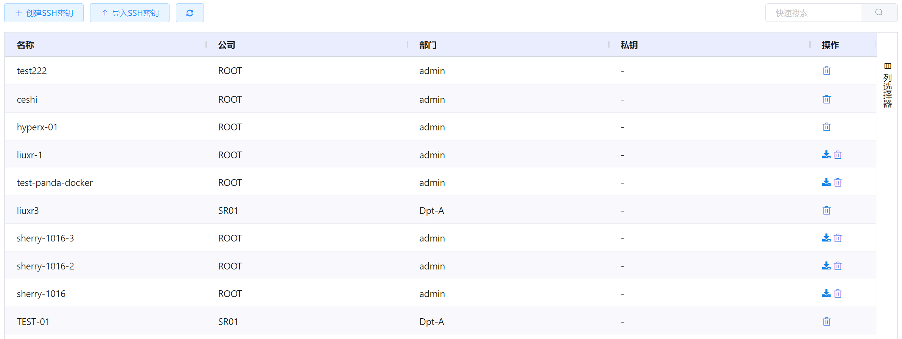
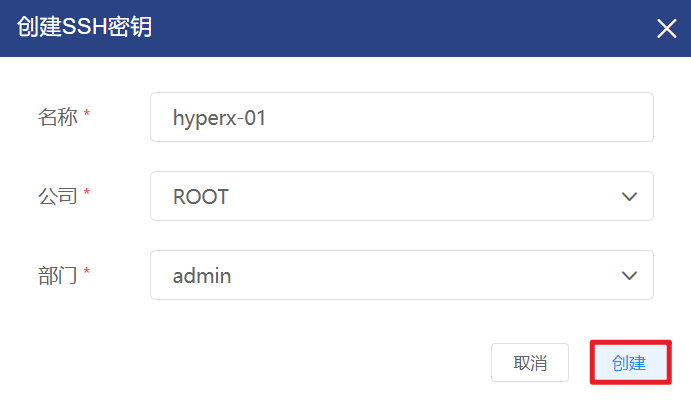
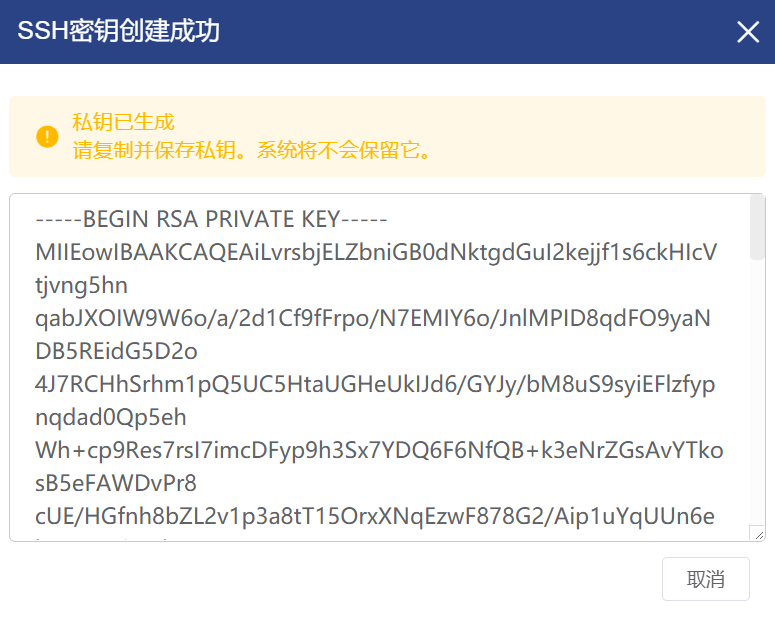
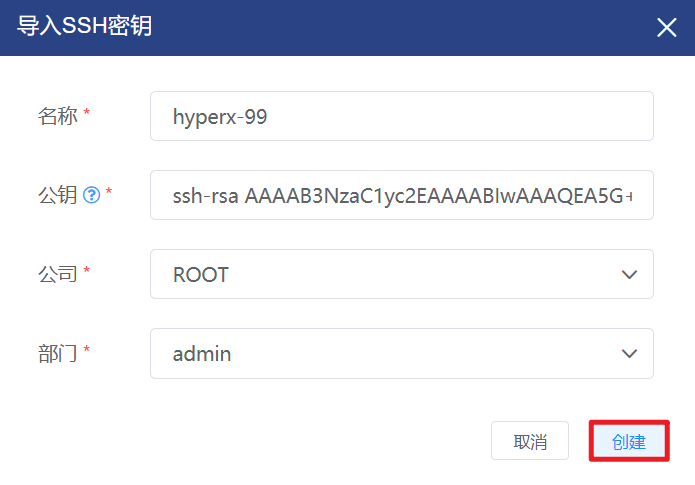
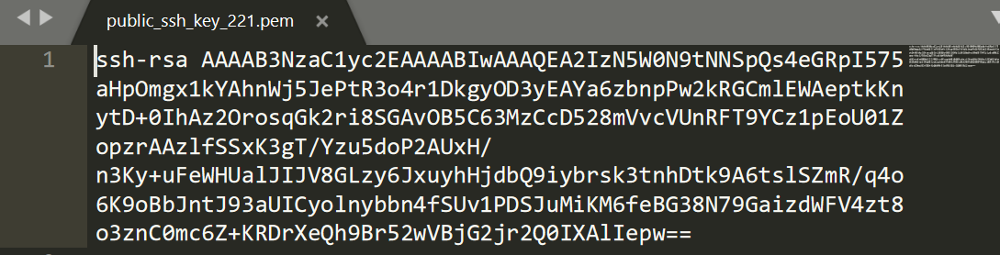
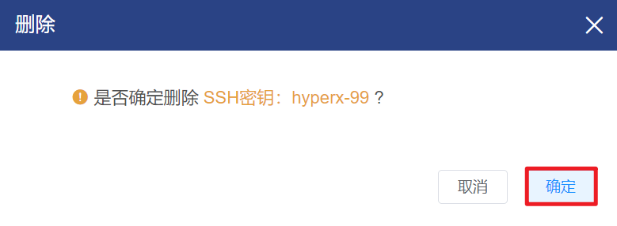

# 4.2.5.SSH密钥管理

SSH密钥是一种由公钥和私钥组成的，仅支持Linux虚拟机的登录认证方式，安全便捷。

用户可以创建/导入SSH密钥，在创建虚拟机时配置该SSH密钥，实现通过私钥连接虚拟机。

在“资源管理”菜单下选择左侧“虚拟机资源管理”的导航菜单，之后点击“SSH密钥”的子菜单，即可看到SSH密钥的管理界面：

## 相关操作

HYPERX云管理平台支持用户对亲和组进行管理，支持的功能如下：

- 快速搜索：用户可以根据SSH密钥的名称、公司、部门等字段全局快速搜索SSH密钥；
- 高级筛选：用户可以从表头右侧根据SSH密钥的名称、公司、部门等字段筛选出符合条件的SSH密钥；
- 创建SSH密钥：用户可以通过自动生成密钥的方式创建SSH密钥；
- 导入SSH密钥：用户可以通过手动导入公钥的方式创建SSH密钥；
- 下载公钥：用户可以将自己导入的公钥文件下载到本地；
- 删除SSH密钥：用户可以删除选定的SSH密钥。

操作入口如下：

- 资源管理→虚拟资源管理→SSH密钥

## 操作说明

### 创建SSH密钥

① 在SSH密钥管理界面中，点击“创建SSH密钥”按钮：

② 将会弹出“创建SSH密钥”的操作提示框，填写SSH密钥的名称和组织信息后点击“创建”按钮：

③ 将会弹出“SSH密钥创建成功”的操作提示框，并显示自动生成的私钥：

> [!WARNING]
>
> - SSH密钥仅支持Linux系统虚拟机的登录认证；
> - 为保障安全性，系统将不会保存用户的私钥，需要用户请复制并保存。

### 导入SSH密钥

① 在SSH密钥管理界面中，点击“导入SSH密钥”按钮：

② 将会弹出“导入SSH密钥”的操作提示框，填写SSH密钥的名称、公钥和组织信息后点击“创建”按钮，即可通过手动导入公钥的方式将SSH密钥注入到平台：

> [!NOTE]
>
> - SSH密钥仅支持Linux系统虚拟机的登录认证；
> - 云平台将会把所填的公钥注入到SSH密钥中，用户可以通过自定义的私钥使用；
> - 对于通过导入公钥方式创建的SSH密钥，支持下载所上传的公钥。

### 下载公钥

① 在SSH密钥管理界面中，选择需要下载公钥的SSH密钥，点击操作列的“下载”按钮：

② 会将用户公钥的pem文件下载到本地，文件内容为用户导入SSH密钥时填写的公钥：

### 删除SSH密钥

① 在SSH密钥管理界面中，选择需要删除的SSH密钥，点击操作列的“删除”按钮：

② 将会弹出“删除”的操作提示框 ，点击“确定”按钮后，将删除选中的SSH密钥：

> [!NOTE]
>
> - 删除SSH密钥后，之前使用此SSH密钥配置的虚拟机仍能通过私钥登入虚拟机控制台。

