# 4.2.1.虚拟机管理

虚拟机是运行在主机上，具有独立的IP地址，支持访问公共网络，独立运行应用服务的完整计算机系统。

用户能够在平台中创建、删除虚拟机，也可以对虚拟机进行开关、调用控制台、配置网络、配置存储等操作。

在“资源管理”菜单下选择左侧”虚拟机资源管理”的导航菜单，之后点击”虚拟机”的子菜单，即可看到虚拟机的管理界面：

在虚拟机的详情页中支持查看选定虚拟机的详情、运行、配置和绑定资源信息，并支持对虚拟机执行相关操作。

- 基本信息：显示虚拟机的名称、所有者、所在组织等基本信息；
- 运行信息：显示虚拟机的状态、所在资源域、POD等运行信息；
- 配置：显示虚拟机CPU、插槽数、每个插槽内核数等配置信息；
- 绑定资源：显示虚拟机挂载的虚拟磁盘、网络IP、GPU等资源信息。

> [!NOTE]
>
> - 用户可以通过点击虚拟机名称或点击操作列的“更多”按钮进入虚拟机的详情页。

与此同时，在详情页中，也支持查看选定虚拟机的监控信息、虚拟磁盘、网络、快照和每日成本，并执行相关的操作。

- 监控页：支持查看虚拟机的监控图像，并支持为之配置告警通知的阈值和范围；
- 虚拟磁盘页：支持查看虚拟机挂载的磁盘情况，并支持对虚拟机挂载的虚拟磁盘执行相关操作；
- 网络页：支持查看虚拟机配置的网络情况，并支持对虚拟机配置的网络执行相关操作；
- 快照页：支持查看虚拟机创建的快照情况，并支持对虚拟机创建的快照执行相关操作；
- 每日成本页：支持查看虚拟机规格、存储、镜像、公网IP和服务的成本用量统计。

## 虚拟机生命周期

虚拟机的生命周期是虚拟机从创建到删除历经的各种状态，概述如下：

| 状态     | 状态属性 | 相关说明                                                     |
| -------- | -------- | ------------------------------------------------------------ |
| 资源验证 | 中间状态 | 创建虚拟机后，在虚拟机状态进入运行之前的状态，分配资源的过程。 |
| 启动中   | 中间状态 | 虚拟机从关闭到运行的中间状态。                               |
| 运行     | 稳定状态 | 虚拟机正常运行状态，此状态下的虚拟机可以正常运行业务。       |
| 停止中   | 中间状态 | 虚拟机从运行到关闭的中间状态。                               |
| 关闭     | 稳定状态 | 虚拟机被关闭，此状态的虚拟机不能对外提供业务。               |
| 重新启动 | 中间状态 | 虚拟机正在执行重新启动的操作。                               |
| 迁移中   | 中间状态 | 虚拟机正在执行热迁移的操作。                                 |
| 销毁中   | 中间状态 | 虚拟机处于正在被删除的状态。                                 |
| 故障     | 稳定状态 | 虚拟机正处于异常状态，不能对外提供业务，需要联系管理员进行处理。 |

## 相关操作

HYPERX云管理平台支持用户对虚拟机进行管理，支持的功能如下：

### 特色操作

- 显示我的虚拟机：开放给管理员用户，支持管理员迅速在所管理虚拟机和所拥有虚拟机间切换；
- 全局搜索：用户可以根据虚拟机的名称、所有者、IP等字段全局搜索虚拟机；
- 自定义表头：用户可以从“列选择器”中自定义虚拟机管理界面列表显示的表头(如资源标签、计算规格、配置等)；
- 高级筛选：用户可以从表头右侧根据虚拟机的名称、状态、虚拟机规格等字段筛选出符合条件的虚拟机；
- 资源总计：在虚拟机页面的底部，显示该用户所筛选虚拟机CPU、内存资源、关联磁盘容量的总计。

### 基础操作

- 创建虚拟机：填写基本信息、选择镜像、配置和网络后，创建满足业务的虚拟机；
- 关机/开机：将处于运行状态的虚拟机关闭/将处于停止状态的虚拟机开启；
- 重启：重新启动运行中状态的虚拟机，若勾选“强制重启”将立刻为虚拟机断电重启；
- 删除：删除选定的虚拟机，若勾选“彻底销毁”复选框，将会彻底删除选定的虚拟机；
- 导出虚拟机列表：用户可以导出选定条件下的虚拟机列表，表格的格式为XLSX；
- 控制台：在云平台中打开虚拟机的控制台，支持在控制台中对虚拟机进行相关的操作；
- 批量操作：支持批量勾选虚拟机列表的复选框，对选中的虚拟机执行开机、关机、重启、删除或快照的操作。

### 常规操作

- 配置监控告警：配置虚拟机CPU、内存、磁盘利用率的阈值，当用量超出阈值时向勾选的用户发送邮件提醒；
- 修改名称：重新自定义虚拟机的名称；
- 变更所有者：将虚拟机的所有者变更为选定公司、选定部门的某用户；
- 编辑备注：编辑虚拟机的备注信息；
- 设置回收时间：将会在虚拟机到期前后为用户提供邮件提醒，到期后将会依据虚拟机所在部门配置的虚拟机回收策略处理；
- 显示密码：显示处于运行或关闭状态的虚拟机的密码；
- 删除保护：管理员可用，开启删除保护后虚拟机将不支持被删除；
- 克隆虚拟机：支持克隆当前虚拟机全部配置和内容，创建一台新的虚拟机；
- 迁移：仅管理员可用，将运行中状态的虚拟机迁移到指定的其他可用主机上；
- 配置亲和组：为处于关闭状态的虚拟机配置亲和组；
- 重置密码：为处于关闭状态的虚拟机重置密码；
-  HA高可用配置 ：当虚拟机所处主机发生故障时，会优先将开启了HA的虚拟机迁移到其他主机中；
-  登录方式：支持Linux操作系统的虚拟机切换登录方式，切换密码验证或SSH密钥验证。

### 配置操作

- 调整配置：调整处于关闭状态虚拟机的虚拟机规格；
- 重装系统：为处于运行中状态的虚拟机重装操作系统；
- 创建镜像：将现有处于关闭状态的虚拟机创建为镜像；
- 高级配置：手工指定虚拟机的CPU Socket数量。

### 绑定资源

- 挂载/卸载GPU：在虚拟机所在主机上有可用GPU的前提下，为虚拟机挂载GPU，或将GPU从虚拟机上卸载；
- 挂载/卸载ISO：为虚拟机挂载一个ISO，或将ISO从虚拟机上卸载；
- 挂载/卸载USB：在虚拟机所在主机上有可用USB的前提下，为虚拟机挂载USB，或将USB从虚拟机上卸载；
- 配置SSH密钥：为处于关闭状态的虚拟机配置SSH密钥。

### 虚拟磁盘操作

- 挂载虚拟磁盘：将选定的虚拟磁盘挂载在虚拟机上；
- 创建虚拟磁盘：创建一个虚拟磁盘，并将该虚拟机磁盘挂载在虚拟机上；
- 卸载虚拟磁盘：将选定虚拟磁盘从虚拟机上卸载；
- 单次备份虚拟磁盘：为选定虚拟磁盘创建一个实时的备份；
- 定时备份虚拟磁盘：为选定的虚拟磁盘配置定时器，选择定时快照执行的周期和份数后系统将会定时执行；
- 删除虚拟磁盘定时备份：删除选定的虚拟磁盘定时器。

### 网络操作

- 加入网络：将选定的网络添加到虚拟机上；
- 编辑网络主IP：编辑选定网络的主IP地址；
- 获取辅助IP地址：为选定网络获取一个辅助IP地址；
- 删除辅助IP：删除选定网络中选定的辅助IP地址;
- 设置默认网络：将选定的网络设置为默认网络；
- 删除网络：将选定的网络从虚拟机上删除。

### 快照操作

- 创建快照：为虚拟机在运行的过程中设定快照点；
- 创建定时快照：为虚拟机配置定时器，选择定时快照执行的周期和份数后系统将会定时执行；
- 删除定时快照：删除选定的快照定时器；
- 回滚快照：将虚拟机回滚到所设定的快照点；
- 删除快照：删除选定的虚拟机快照。

操作入口如下：

- 资源管理→虚拟资源管理→虚拟机

## 操作说明

### 基础操作

#### 虚拟机的创建

① 在虚拟机管理界面中，点击“创建虚拟机”按钮：

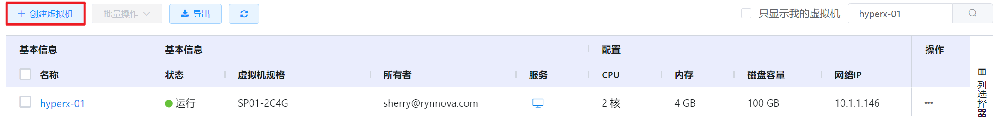

② 将会进入创建虚拟机的界面，在虚拟机创建界面中包含基本信息、镜像、配置、网络配置、创建这5个步骤。

基本信息——设置虚拟机所有者、数量、资源标签、名称、回收时间和相关备注信息，设置界面如下：

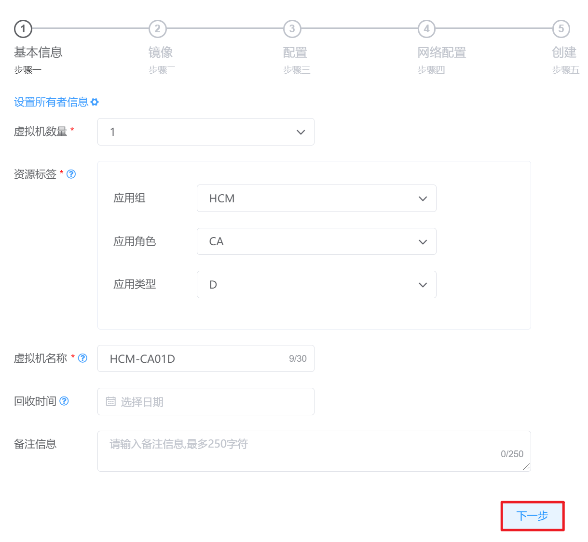

> [!NOTE]
>
> - 批量创建虚拟机支持的最大创建数量为10台；
> - 单台虚拟机时，虚拟机名称支持自定义；批量创建虚拟机时，虚拟机名称根据资源标签自动生成。
>   - 自动生成：默认为“应用组-应用角色”+“顺序编号”+“应用类型”+“-公司序号”。若创建单台虚拟机支持自定义名称，若创建多台虚拟机将自动命名；
>   - 自定义：由用户自主命名，支持英文大小写、数字、中文以及下划线，虚拟机名称应控制在2-20个字符内；
> - 用户可以自定义虚拟机的回收时间，平台将会在虚拟机到期前后依据虚拟机所在部门配置的虚拟机回收策略处理。

镜像——选择虚拟机加载的镜像，设置界面如下：

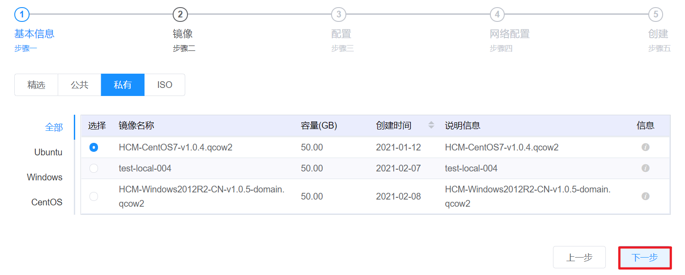

配置——选择虚拟机的配置规格，挂载虚拟磁盘，配置亲和组或启用专用主机功能，设置界面如下：

> [!NOTE]
>
> - 如果用户选择Linux操作系统的镜像，则支持选择虚拟机的登录方式，密码登录或密钥对登录；
> - 如果CPU数量选择自动，则会根据当前方案的CPU数量整除8、4、2得到CPU插槽数；
> - 若当前虚拟机需要配置组件(如windows虚拟机入域组件)，可以选择相应的组件；
> - 关联亲和组可选的列表即为当前虚拟机所属部门所有的亲和组列表；
> - 若当前虚拟机所属部门没有专用主机，勾选“部署至专用主机”按钮不会生效，平台会将该虚拟机分配到可用资源最多的主机中；
> - 虚拟机默认开启HA，开启HA后，用户如果在虚拟机内或其他非云管平台处执行关机操作，平台会自动将虚拟机开机。

网络配置——配置虚拟机的网络信息，支持自动分配或手动设定，设置界面如下：

> [!NOTE]
>
> - 虚拟机的网络支持自动分配和手动设定。
>   - 自动分配：平台会把虚拟机分配至IP最空闲的网段上。平台上共享网络间的虚拟机可以相互通讯，并支持访问外网；
>   - 手动设定：手动设定一个或多个虚拟机的IP地址，各个可用网络会显示可用IP数，当网络可用IP为0不支持选择；同时，需要注意：
>     - 用户可以设置多个网络IP，但需要指定一个默认IP；
>     - 用户选择开启或关闭DHCP功能；
>     - 用户可以自定义所选网络的IP。

创建——显示配置详情如下，点击“创建虚拟机”按钮，即可完成虚拟机的创建：

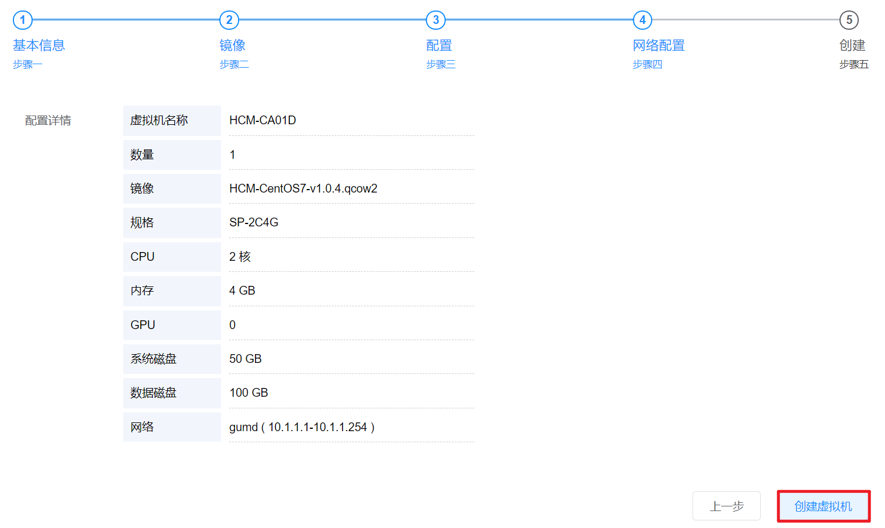

③ 在创建虚拟机的过程中，右侧有当前部门可用配额和创建虚拟机的费用统计悬浮框，用户可以据此调整虚拟机的配置：

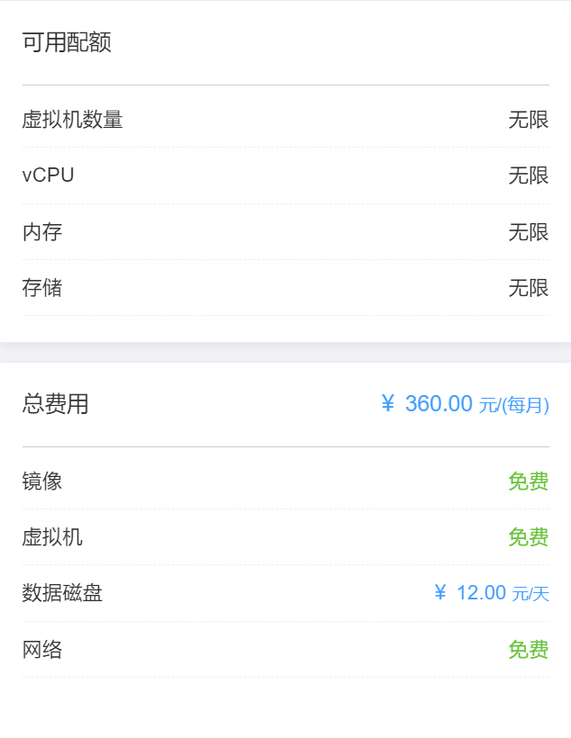

#### 虚拟机的开机、关机、重启、快照

① 在虚拟机管理界面中，勾选需要进行操作虚拟机的复选框，点击“批量操作”按钮，选择需要进行的操作：

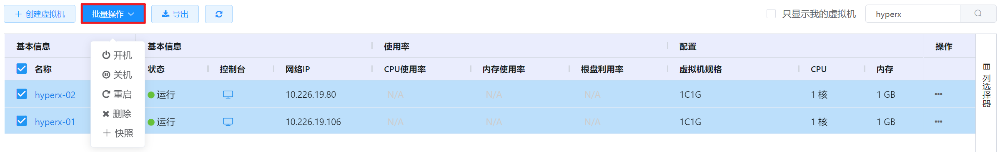

② 将会弹出”确认操作”的操作提示框，可以复核待操作虚拟机的相关信息(以关机作为例)，复核信息无误后，点击“确定”按钮，即可对选中虚拟机执行相关操作：

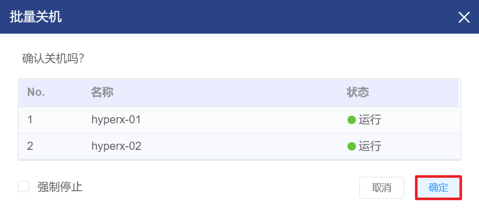

> [!NOTE]
>
> - 在停止虚拟机时，如果勾选“强制停止”按钮，将会立刻为虚拟机断电，未保存的数据可能会丢失；
> - 在重启虚拟机时，如果勾选“强制重启”按钮，将会立刻为虚拟机断电重启，未保存的数据可能会丢失；
> - 开机、关机、重启、快照操作支持批量处理，用户可勾选虚拟机左侧的复选框后点击相应的按钮执行批量操作；
> - 批量操作时，若勾选的虚拟机中有操作状态不符合规定的虚拟机，将会给出提示告警；
> - 若虚拟机挂载了外接设备，非批量关机时支持用户将该虚拟机的外接设备同步卸载，避免浪费资源。

#### 虚拟机的删除

① 在虚拟机管理界面中，勾选需要进行操作虚拟机的复选框，点击“批量操作”按钮，选择“删除”操作：

② 将会弹出”批量删除”的操作提示框，可以复核待操作虚拟机的相关信息(以删除虚拟机数据盘但未彻底销毁虚拟机为例)，之后点击“确定”按钮，即可对选中虚拟机进行删除操作：

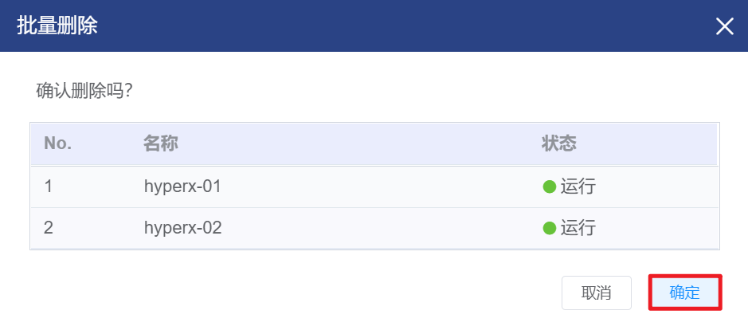

> [!NOTE]
>
> - 删除虚拟机前，要确保该虚拟机的“删除保护”处于“关闭”状态；
> - 删除后，虚拟机会被移入回收站，管理员可以进入回收站中对虚拟机进行管理；
> - 如需了解恢复虚拟机的相关内容，请查阅回收站管理章节。

#### 导出虚拟机列表

① 在虚拟机管理界面中，根据虚拟机的名称、状态、虚拟机规格等字段筛选出符合条件的虚拟机，点击“导出”按钮：

②将会弹出“导出Excel”的操作提示框，点击“确定”按钮：

③即可将虚拟机列表以XLSX的格式保存在本地，打开XLSX文件，效果如下：

#### 打开虚拟机控制台

① 在虚拟机管理界面中，选择需要打开控制台的虚拟机，在操作列中点击"控制台"按钮：

 ② 将会在新页面中打开虚拟机的控制台： 

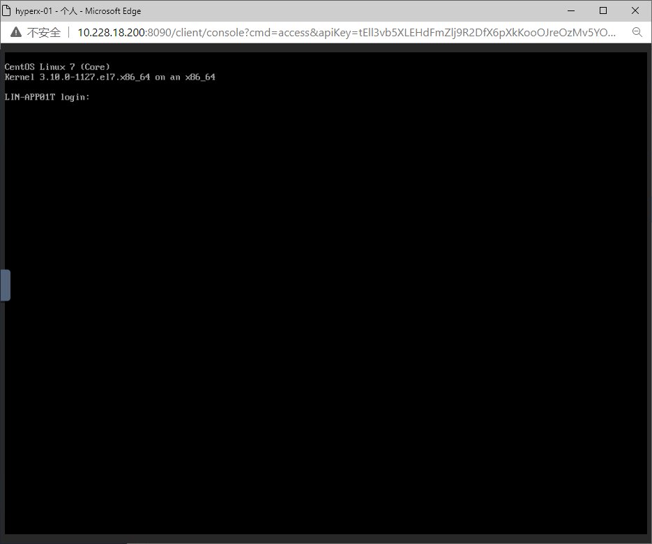

> [!NOTE]
>
> - 当且仅当虚拟机处于“运行”状态支持打开控制台，对之进行相关操作；
> - 如需查看虚拟机密码，请查阅“显示密码”操作；
> - 其他入口：
>   - 点击“更多”按钮或虚拟机名称，进入虚拟机详情页，点击右侧“运行信息”操作列中的“控制台”按钮；
>   - 点击虚拟机服务列的控制台图标。

### 常规操作

#### 配置监控告警

① 在虚拟机管理界面中，选择需要配置监控告警的虚拟机，在操作列中点击“更多”按钮，进入虚拟机的详情页面：

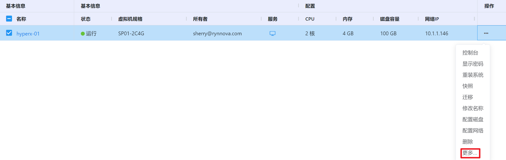

② 在“监控”选项卡中，点击“配置告警”按钮：

③ 将会弹出“配置监控告警”的操作提示框，用户配置CPU、内存、磁盘利用率的阈值和邮件通知的范围后，点击“确定”按钮，即可为选定的虚拟机配置监控告警：

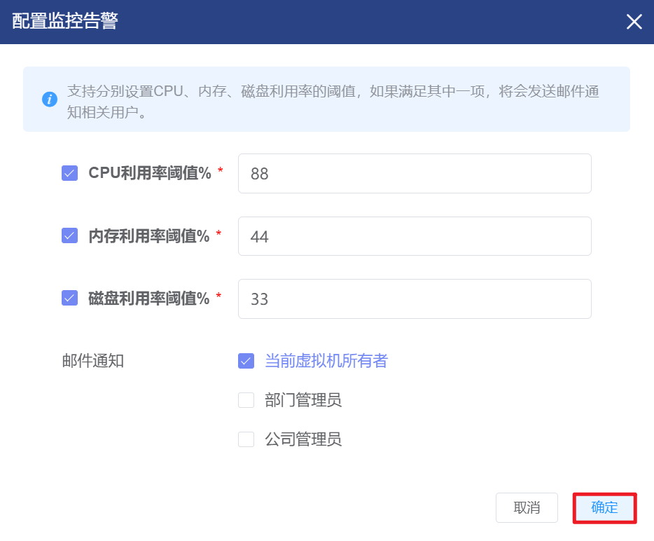

> [!NOTE]
>
> - 对于没有安装监控的虚拟机，“监控”选项卡中将不显示“配置告警”的按钮；
> - 当虚拟机的CPU、内存、磁盘用量超过用户设置的阈值后，将会根据邮件通知的范围向用户发送邮件。

#### 修改虚拟机名称

① 在虚拟机管理界面中，选择需要修改名称的虚拟机，在操作列中点击"修改名称"按钮：

② 将会弹出“修改名称”的操作提示框(默认显示原虚拟机名称)，可以填写新的虚拟机名称，点击“确定”按钮，即可修改虚拟机的名称：

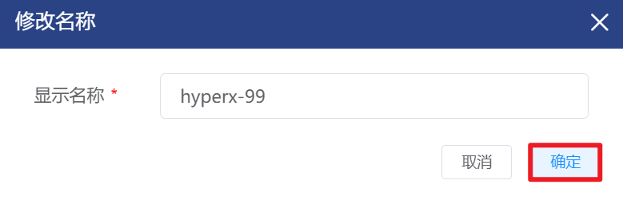

> [!NOTE]
>
> - 该名称修改的是虚拟机的显示名称，支持重复命名，虚拟机的主机名称为系统唯一标识，不支持修改。

#### 变更虚拟机所有者

① 在虚拟机管理界面中，选择需要变更所有者的虚拟机，在操作列中点击“更多”按钮，进入虚拟机的详情页面：

② 点击“基本信息”操作列的“变更所有者”按钮：

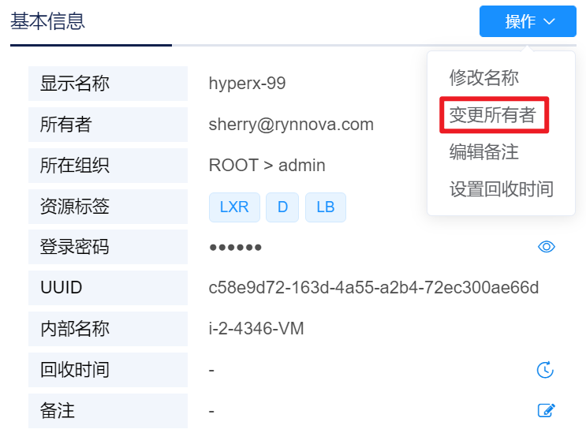

③ 将会弹出“变更所有者”的操作提示框，填写接收虚拟机的公司、部门和用户名，点击“确定”按钮，即可将选定虚拟机变更到所填用户的名下：

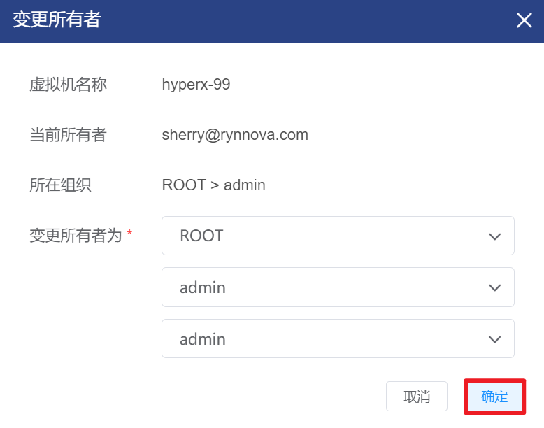

> [!NOTE]
>
> - 若虚拟机需要变更给同公司，其他部门的用户，需要满足以下条件：
>   - 需要删除该虚拟机的快照和定时快照；
>   - 需要删除该虚拟机所挂载磁盘的备份和定时备份。
> - 若虚拟机需要变更给其他公司的用户：
>   - 需要处于“关闭”状态；
>   - 带有隔离网络或VPC子网：
>     - 若目标部门有可用隔离网络或VPC子网，会将虚拟机的隔离网络或VPC子网删除，添加目标部门的隔离网络或VPC子网；
>     - 若目标部门有可用隔离网络或VPC子网，会在目标部门创建隔离网络，将虚拟机的隔离网络或VPC子网删除，添加目标部门新建的隔离网络。

#### 编辑虚拟机备注

① 在虚拟机管理界面中，选择需要编辑备注的虚拟机，在操作列中点击“更多”按钮，进入虚拟机的详情页面：

② 点击“基本信息”操作列的“编辑备注”按钮：

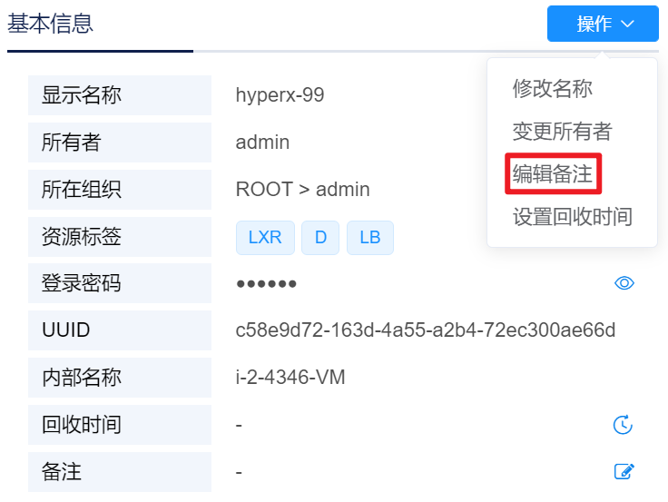

③ 将会弹出“编辑备注”的操作提示框，编辑虚拟机的备注信息后，点击“确定”按钮，即可修改虚拟机的备注信息：

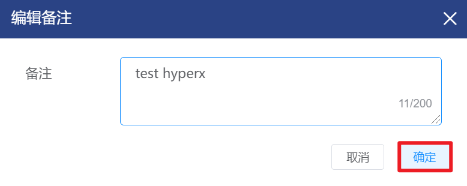

#### 设置虚拟机回收日期

① 在虚拟机管理界面中，选择需要设置回收时间的虚拟机，在操作列中点击“更多”按钮，进入虚拟机的详情页面：

② 点击“基本信息”操作列的“设置回收时间”按钮：

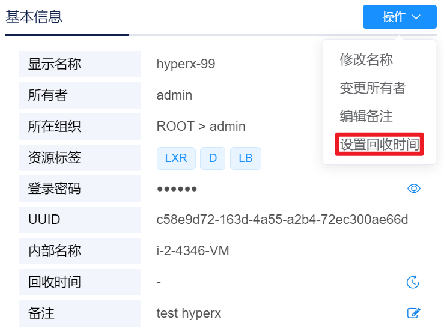

③ 将会弹出“设置回收时间”的操作提示框，可以设置虚拟机的回收时间。可以从日历上选择一个日期，或从左侧导航栏中选择时间点自动生成回收日期：设置回收日期后，点击“确定”按钮：

> [!NOTE]
>
> - 若选择“关闭”按钮，在用户手动删除虚拟机前，系统将不会自动回收该虚拟机；
> - 虚拟机回收日期前，平台将会在虚拟机到期前后依据虚拟机所在部门配置的虚拟机回收策略处理；
> - 超级管理员可以将“回收站”中的虚拟机恢复使用，具体操作请查阅回收站管理章节。

#### 显示密码

① 在虚拟机管理界面中，选择需要显示密码的虚拟机，在操作列中点击“显示密码”按钮：

② 将会弹出“显示密码”的操作提示框：

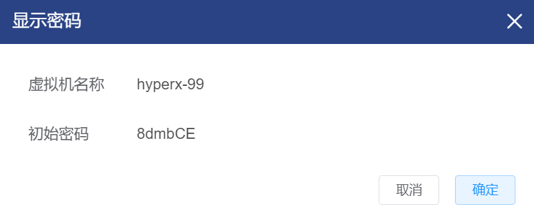

> [!NOTE]
>
> - 仅支持使用镜像安装操作系统的虚拟机查看密码；
> - 当且仅当虚拟机处于“运行”或“停止”状态支持查看虚拟机的密码，其他状态不予显示；
> - 其他入口：
>   - 在虚拟机详情页面的“基本信息”中，点击右侧“运行信息”操作列中的“显示密码”按钮；
>   - 在虚拟机详情页面的“基本信息”中，点击“登录密码”右侧的图标。

#### 开启删除保护

① 在虚拟机管理界面中，选择需要开启删除保护的虚拟机，在操作列中点击“删除保护”按钮：

② 将会弹出“删除保护”的操作提示框，点击“确定”按钮，即可开启选中的虚拟机的删除保护：

> [!NOTE]
>
> - 仅超级管理员支持配置虚拟机的删除保护信息；
> - 虚拟机开启删除保护后，不支持被删除。

#### 关闭删除保护

① 在虚拟机管理界面中，选择需要关闭删除保护的虚拟机，在操作列中点击“删除保护”按钮：

② 将会弹出“删除保护”的操作提示框，点击“确定”按钮，即可关闭选中的虚拟机的删除保护：

#### 虚拟机克隆

① 在虚拟机管理界面中，选择需要克隆的虚拟机，在操作列中点击“克隆”按钮：

② 将会弹出“虚拟机克隆”的操作提示框，填写新的显示名称并设置密码后，点击“确定”按钮，即可克隆选定的虚拟机：

> [!NOTE]
>
> - 克隆的虚拟机配置、网卡、磁盘信息和源虚拟机保持一致；
> - 当且仅当虚拟机操作系统为windows时，克隆虚拟机时允许选择配置入域组件；
> - 源虚拟机所使用的网卡IP地址不足时，克隆虚拟机失败。

#### 迁移虚拟机

① 在虚拟机管理界面中，选择需要迁移到其他主机的虚拟机，在操作列中点击“迁移”按钮：

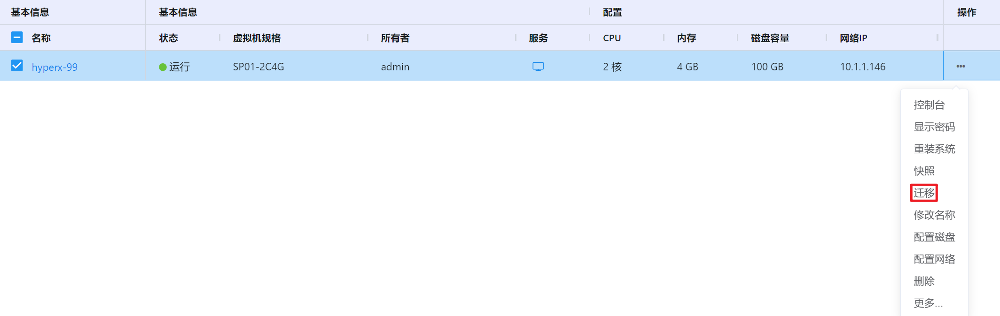

② 将会弹出”迁移”的操作提示框，选择新的所属主机后，点击“确定”按钮，即可将选中的虚拟机迁移到所选择新主机中：

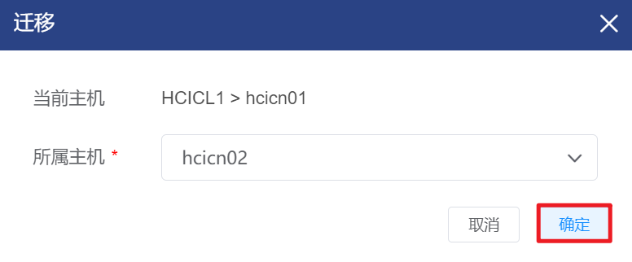

> [!NOTE]
>
> - 迁移虚拟机的功能只针对超级管理员开放；
> - 当且仅当虚拟机处于“运行”状态时，支持将虚拟机迁移到其他可用主机中。

#### 配置亲和组

① 在虚拟机管理界面中，选择需要配置亲和组的虚拟机，在操作列中点击“更多”按钮，进入虚拟机的详情页面：

② 点击“运行信息”操作列的“配置亲和组”按钮：

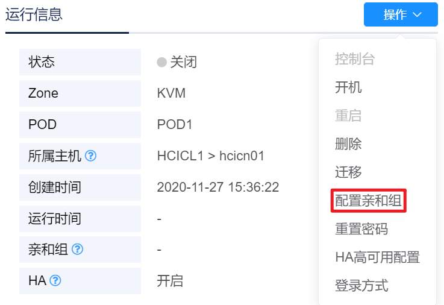

③ 将会弹出“配置亲和组”的操作提示框，选择需要加入的亲和组后，点击“确定”按钮，即可将虚拟机加入选定的亲和组中：

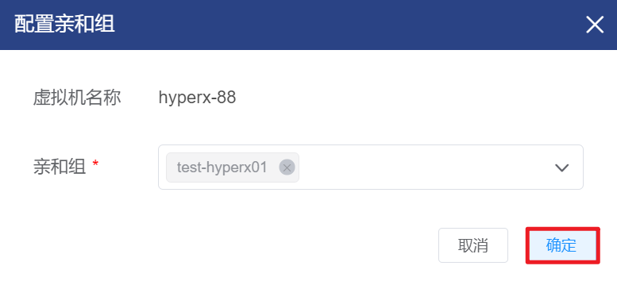

> [!NOTE]
>
> - 当且仅当虚拟机处于“停止”状态支持为虚拟机配置亲和组策略，该亲和组策略将会在虚拟机开机后生效；
> - 一台虚拟机支持配置多个亲和组策略。

#### 重置密码

① 在虚拟机管理界面中，选择需要重置密码的虚拟机，在操作列中点击“更多”按钮，进入虚拟机的详情页面：

② 点击“运行信息”操作列的“重置密码”按钮：

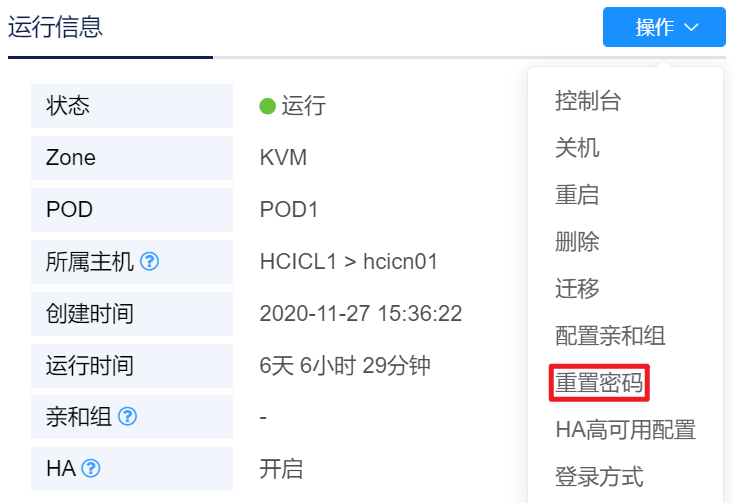

③ 将会弹出“重置密码”的操作提示框，可以选择随机生成密码或手动指定密码。

- 随机：选择“随机”单选框，点击“确定”按钮，即可生成随机的密码：

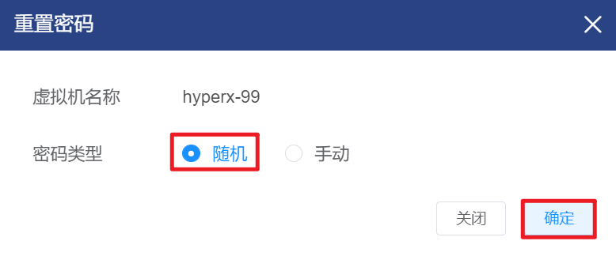

- 手动：选择“手动”单选框，输入自定义的6位密码，复核确认后点击“确定”按钮，即可手动指定密码：

> [!NOTE]
>
> - 当且仅当虚拟机处于“停止”状态支持重置虚拟机的密码；
> - 如果的当前登录方式为“SSH密钥”，则不支持重置虚拟机密码；
> - 若选择手动指定密码，支持设置大小写英文和数字混合的6-32位密码，其中支持设置特殊字符。

####  HA高可用配置 

① 在虚拟机管理界面中，选择需要进行HA高可用配置的虚拟机，在操作列中点击“更多”按钮，进入虚拟机的详情页面：

② 点击“运行信息”操作列的“HA高可用配置”按钮：

③ 将会弹出“HA高可用配置”的操作提示框，如果选择开启HA并点击“确定”按钮，那么当虚拟机所处主机发生故障时，会优先将开启了HA的虚拟机迁移到其他主机中：

> [!NOTE]
>
> - 开启HA高可用后，用户如果在虚拟机内或其他非云管平台处执行关机操作，平台会自动将虚拟机开机。

#### 登录方式

① 在虚拟机管理界面中，选择需要切换登录方式的虚拟机，在操作列中点击“更多”按钮，进入虚拟机的详情页面：

② 点击“运行信息”操作列的“登录方式”按钮：

③ 将会弹出“登录方式”的操作提示框，显示当前的登录方式、更换后的方式后，点击“确定”按钮，即可实现登录方式的切换；

- 如果虚拟机当前登录方式是“密码登录”，可以切换登录方式为“SSH密钥”，选择密钥对后点击“确定”按钮，即可实现登录方式的切换：

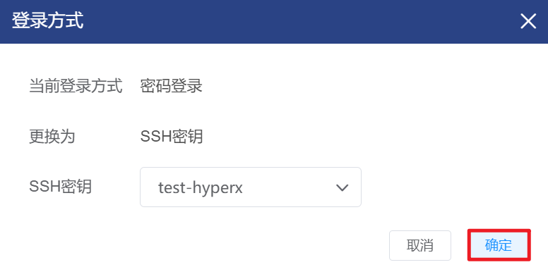

- 如果虚拟机当前登录方式是“SSH密钥”，可以切换登录方式为“密码登录”，设置新密码后点击“确定”按钮，即可实现登录方式的切换：

> [!NOTE]
>
> - 仅Linux操作系统的虚拟机支持切换登录方式；
> - 登录方式为“密码登录”时，支持仅支持切换为“SSH密钥”，切换后不得重置虚拟机密码；
> - 登录方式为“SSH密钥”时，支持仅支持切换为“密码登录”，切换后不得更换虚拟机SSH密钥。

### 配置操作

#### 调整虚拟机配置

① 在虚拟机管理界面中，选择需要调整配置的虚拟机，在操作列中点击“更多”按钮，进入虚拟机的详情页面：

② 点击“配置”操作列的“调整配置”按钮：

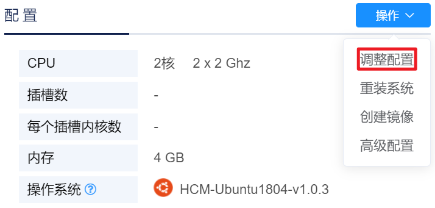

③ 将会弹出“调整配置”的操作提示框，显示当前的虚拟机名称、方案和描述，选定新虚拟机规格后，点击“确定”按钮，即可实现配置的调整：

> [!NOTE]
>
> - 当且仅当虚拟机处于“关闭”状态时，支持为虚拟机调整配置；
> - 虚拟机调整配置后，平台会自动重新启动该虚拟机。

#### 重装虚拟机系统

① 在虚拟机管理界面中，选择需要重装系统的虚拟机，点击操作列的”重装系统“按钮：

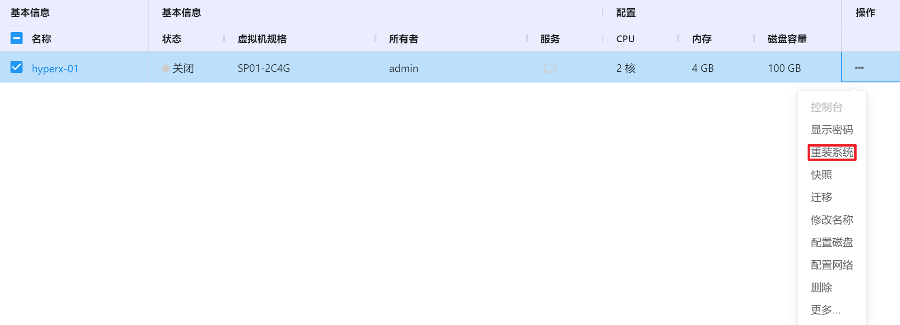

② 将会弹出“重装系统”的操作提示框，用户可以复核待操作虚拟机的相关信息，选择需要重装系统的镜像后，点击“确定”按钮，即可为选中的虚拟机重装系统：

> [!NOTE]
>
> - 虚拟机重装系统会导致系统磁盘上的数据被覆盖，数据盘不受影响。用户需要提前备份好系统磁盘的重要文件；
> - 虚拟机重装系统后，相关的快照文件均会失效，系统会自动清理相关文件。

#### 创建虚拟机镜像

① 在虚拟机管理界面中，选择需要创建镜像的虚拟机，在操作列中点击“更多”按钮，进入虚拟机的详情页面：

② 点击“配置”操作列的“创建镜像”按钮：

③ 将会弹出“创建镜像”的操作提示框，填写名称、说明、最低核数等信息后，点击“确定”按钮，即可实现镜像的创建：

> [!NOTE]
>
> - 当且仅当虚拟机处于“停止”状态时，支持将虚拟机创建为镜像；
> - 如需查看新建的镜像，请进入”资源管理->区域管理->镜像“模块；
> - 如需了解镜像相关参数，请查阅镜像管理章节。

#### 手工指定虚拟机的CPU Socket数量

① 在虚拟机管理界面中，选择需要指定CPU Socket数量的虚拟机，在操作列中点击“更多”按钮，进入虚拟机的详情页面：

② 点击“配置”操作列的“高级配置”按钮：

③ 将会弹出“高级配置”的操作提示框，用户选择插槽数后，点击“确定”按钮，即可实现手工指定虚拟机的CPU Socket数量：

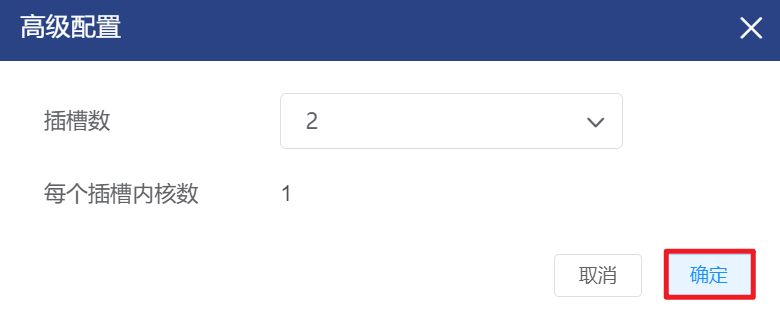

> [!NOTE]
>
> - 当且仅当虚拟机处于“停止”状态时，支持手工指定虚拟机的CPU Socket数量；
> - 选择插槽数后，会自动计算配置每个插槽的CPU内核数。

### 绑定资源

#### 挂载GPU

① 在虚拟机管理界面中，选择需要挂载GPU的虚拟机，在操作列中点击“更多”按钮，进入虚拟机的详情页面：

② 点击“绑定资源”操作列的“挂载GPU”按钮：

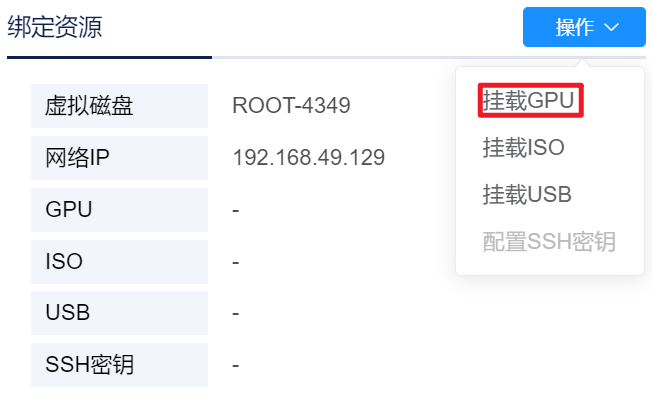

③ 将会弹出“挂载GPU”的操作提示框，选择GPU的型号和数量后，点击“确定”按钮，挂载选定的GPU：

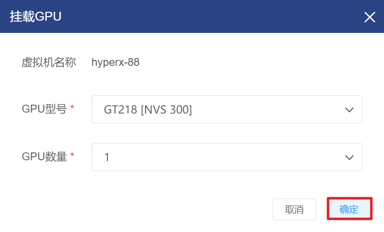

> [!NOTE]
>
> - 当且仅当虚拟机所在主机上有可用GPU、且虚拟机所用的规格支持GPU时，才可进行GPU的挂载；
> - 超级管理员可以在设备管理->外部设备中实现对虚拟机GPU的挂载。

#### 卸载GPU

① 在虚拟机管理界面中，选择需要卸载GPU的虚拟机，在操作列中点击“更多”按钮，进入虚拟机的详情页面：

② 点击“绑定资源”操作列的“卸载GPU”按钮：

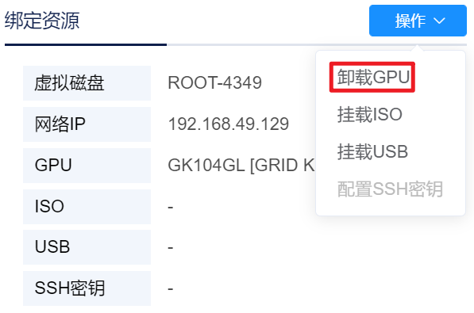

③ 将会弹出“卸载GPU”的操作提示框，点击“确定”按钮，卸载选定的GPU：

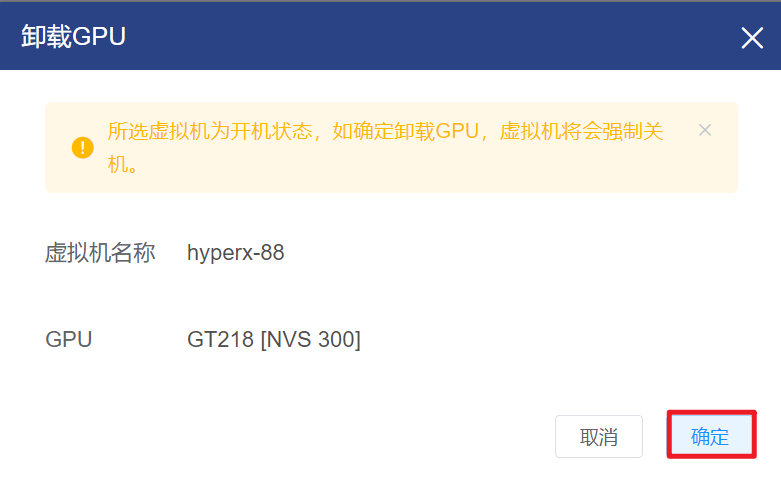

> [!NOTE]
>
> - 当且仅当虚拟机处于停止状态时支持挂载GPU，如果虚拟机处于运行状态，系统会自动关机后卸载GPU；
> - 超级管理员可以在设备管理->外部设备中实现对虚拟机GPU的卸载。

#### 挂载ISO

① 在虚拟机管理界面中，选择需要挂载ISO的虚拟机，在操作列中点击“更多”按钮，进入虚拟机的详情页面：

② 点击“绑定资源”操作列的“挂载ISO”按钮：

③ 将会弹出“挂载ISO”的操作提示框，选择需要挂载的ISO后，点击“确定”按钮，即可将选中的ISO挂载到虚拟机上：

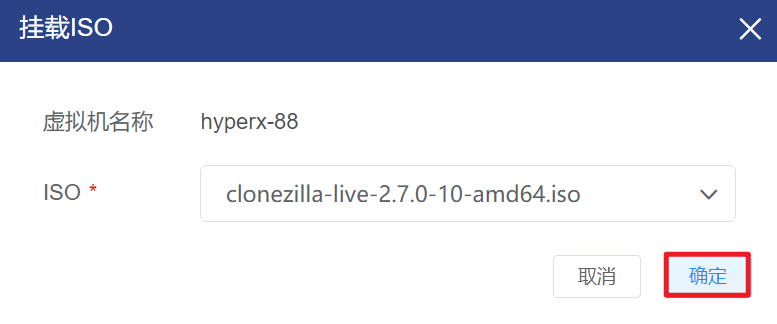

#### 卸载ISO

① 在虚拟机管理界面中，选择需要卸载ISO的虚拟机，在操作列中点击“更多”按钮，进入虚拟机的详情页面：

② 点击“绑定资源”操作列的“卸载ISO”按钮：

③ 将会弹出“卸载ISO”的操作提示框，点击“确定”按钮，即可卸载选中的ISO：

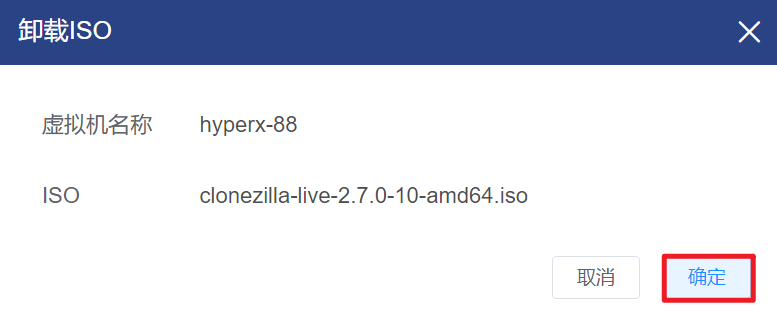

#### 挂载USB

① 在虚拟机管理界面中，选择需要挂载USB的虚拟机，在操作列中点击“更多”按钮，进入虚拟机的详情页面：

② 点击“绑定资源”操作列的“挂载USB”按钮：

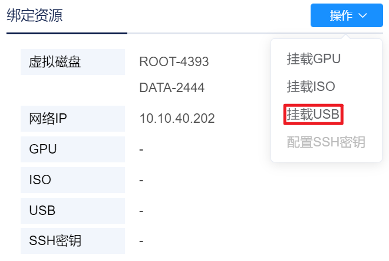

③ 将会弹出“挂载USB”的操作提示框，点击“确定”按钮，挂载选定的USB：

> [!NOTE]
>
> - 超级管理员可以在设备管理->外部设备中实现对虚拟机USB的挂载。

#### 卸载USB

① 在虚拟机管理界面中，选择需要卸载USB的虚拟机，在操作列中点击“更多”按钮，进入虚拟机的详情页面：

② 点击“绑定资源”操作列的“卸载USB”按钮：

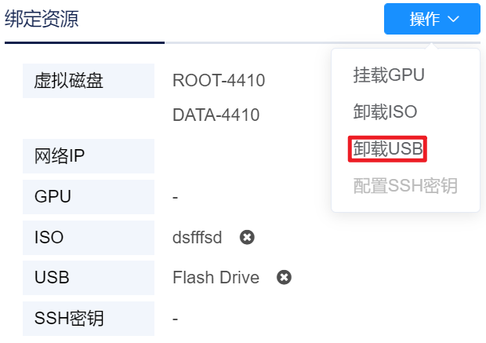

③ 将会弹出“卸载USB”的操作提示框，点击“确定”按钮，卸载选定的USB：

> [!NOTE]
>
> - 超级管理员可以在设备管理->外部设备中实现对虚拟机USB的卸载。

#### 配置SSH密钥

① 在虚拟机管理界面中，选择需要配置SSH密钥的虚拟机，在操作列中点击“更多”按钮，进入虚拟机的详情页面：

② 点击“绑定资源”操作列的“配置SSH密钥”按钮：

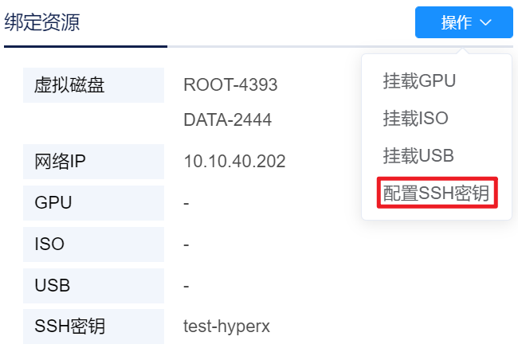

③将会弹出“配置SSH密钥”的操作提示框，选择需要启用的密钥后，点击“确定”按钮，用户即可用添加的密钥登录虚拟机：

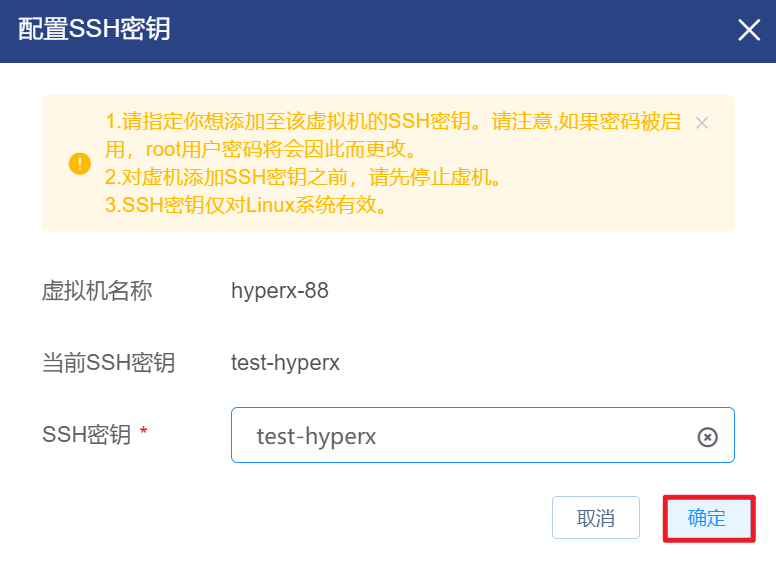

> [!NOTE]
>
> - 当且仅当虚拟机处于“停止”状态且登录方式为“SSH密钥”时，支持卸载虚拟机配置SSH密钥；
> - SSH密钥支持且仅支持Linux操作系统；
> - 若用户不能使用私钥登录，请检查虚拟机的网络状态是否正常。

### 虚拟磁盘操作

#### 挂载虚拟磁盘

① 在虚拟机管理界面中，选择需要挂载虚拟磁盘的虚拟机，在操作列中点击"配置磁盘"按钮：

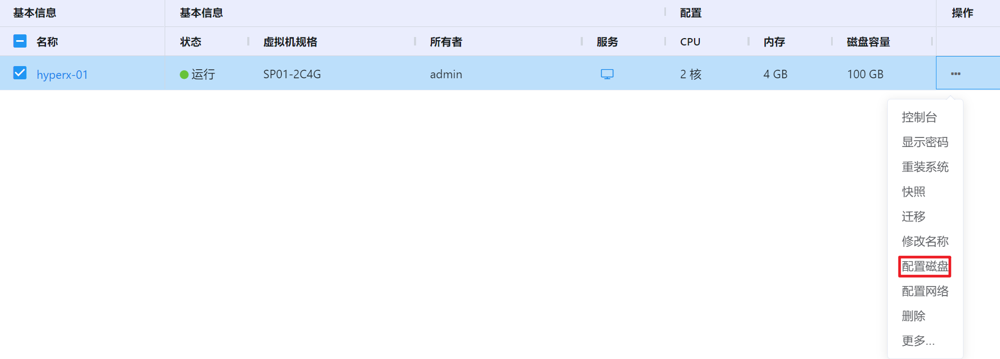

② 进入虚拟机详情页面的“虚拟磁盘”选项卡中，点击“挂载虚拟磁盘”按钮：

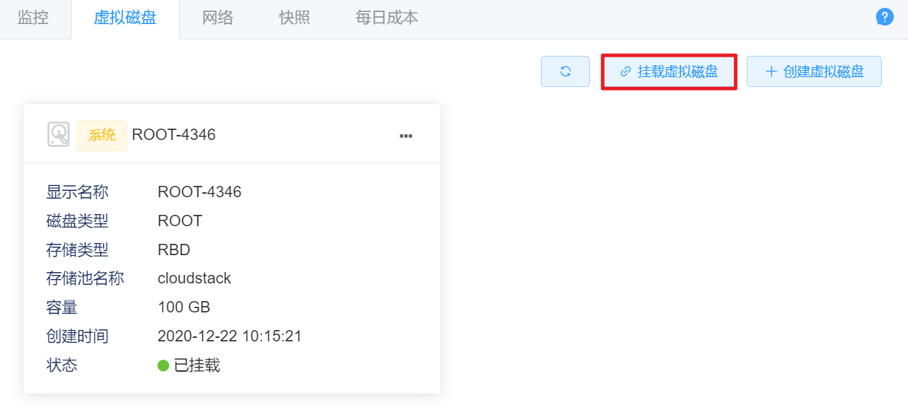

③ 将会弹出“挂载虚拟磁盘”的操作提示框，显示当前用户可挂载的虚拟磁盘列表；选定需要挂载的虚拟磁盘后，点击“确定“按钮，即可为虚拟机挂载选中的磁盘：

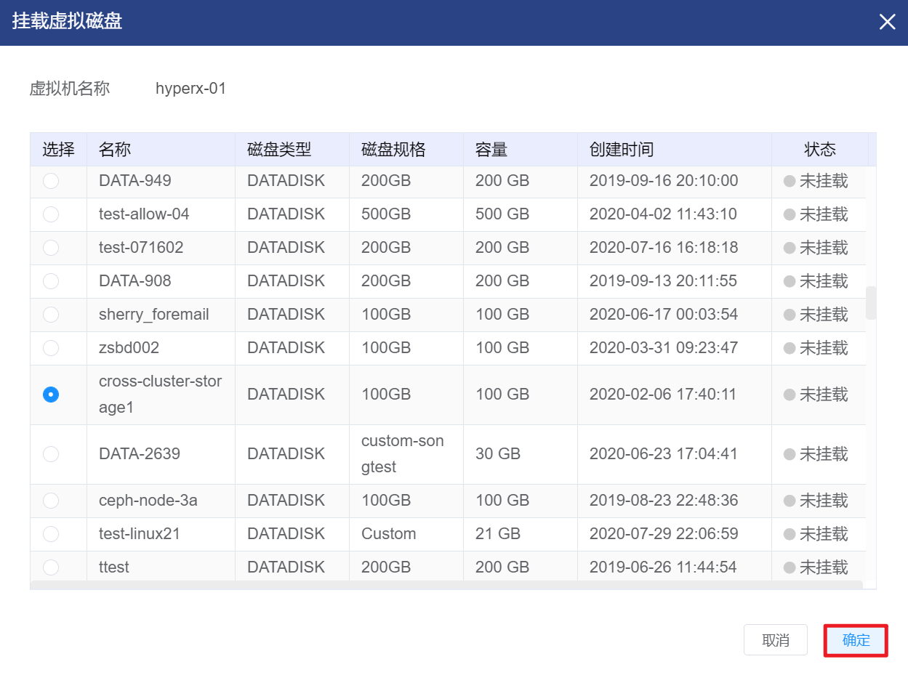

> [!NOTE]
>
> - 当且仅当虚拟机没有快照时，支持虚拟磁盘挂载到虚拟机上；
> - 所提供的虚拟磁盘列表中仅提供规格适合当前虚拟机，且处于“未挂载”状态的虚拟磁盘。

#### 创建虚拟磁盘

① 在虚拟机管理界面中，选择需要创建并挂载虚拟磁盘的虚拟机，在操作列中点击"配置磁盘"按钮：

② 进入虚拟机详情页面的“虚拟磁盘”选项卡中，点击“创建虚拟磁盘”按钮：

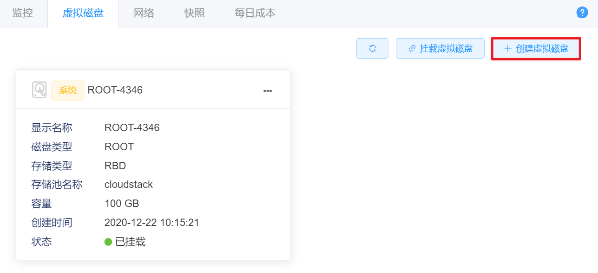

③ 将会弹出“创建虚拟磁盘”的操作提示框，可以填写虚拟磁盘的显示名称、类型和磁盘类型，填写信息并复核价格后，点击“确定”按钮，即可新建虚拟磁盘并将其挂载在虚拟机上：

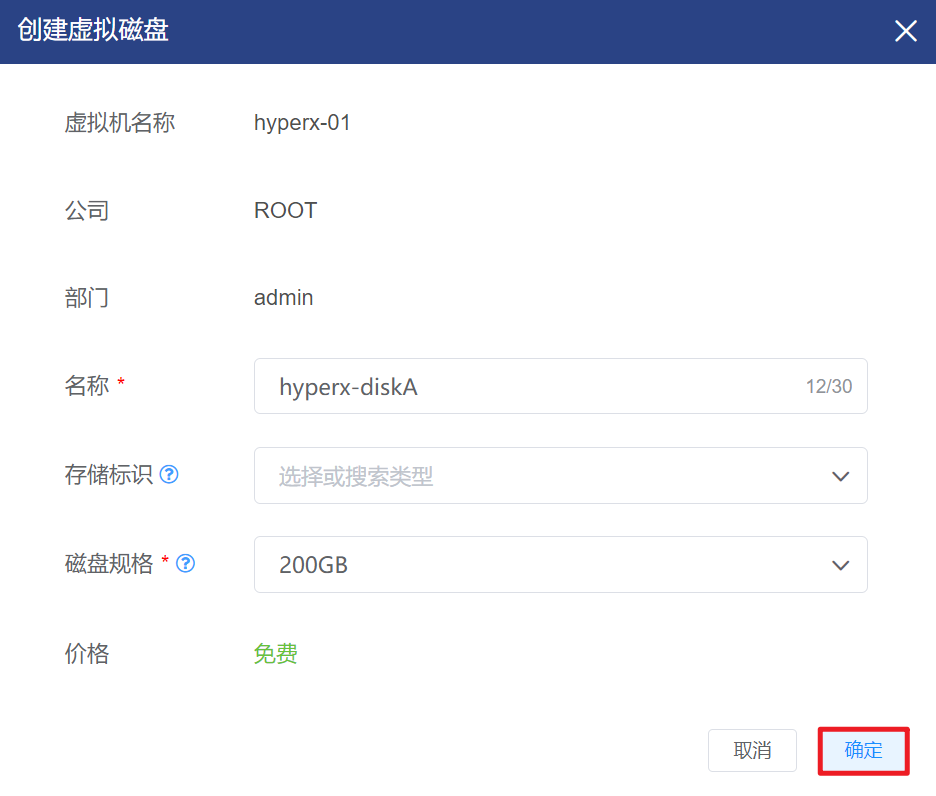

#### 卸载虚拟磁盘

① 在虚拟机管理界面中，选择需要卸载虚拟磁盘的虚拟机，在操作列中点击"配置磁盘"按钮：

② 进入虚拟机详情页面的“虚拟磁盘”选项卡中，选择需要卸载的虚拟磁盘，点击操作列的”卸载“按钮：

③ 将会弹出”卸载磁盘”的操作提示框，点击“确定”按钮，即可将选中的虚拟磁盘从虚拟机上卸载。

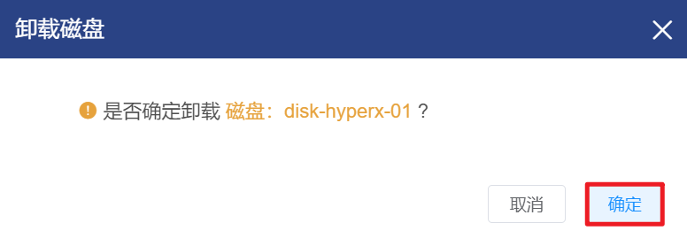

> [!WARNING]
>
> - 由于虚拟机的系统磁盘用于安装操作系统，若卸载系统磁盘虚拟机将无法正常运行，所以平台不支持卸载系统磁盘；
> - 拥有快照的虚拟机不支持卸载虚拟磁盘。

#### 单次备份虚拟磁盘

① 在虚拟机管理界面中，选择需要备份虚拟磁盘的虚拟机，在操作列中点击"配置磁盘"按钮：

② 进入虚拟机详情页面的“虚拟磁盘”选项卡中，选择需要备份的虚拟磁盘，点击操作列的”单次备份“按钮：

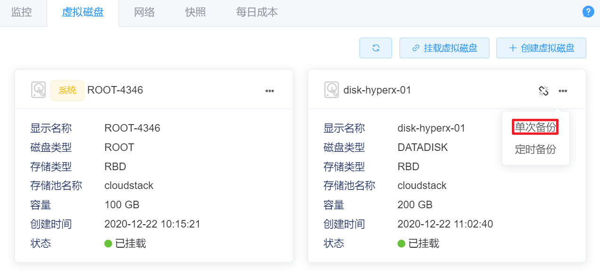

③ 将会弹出“创建磁盘备份”操作提示框，填写磁盘备份的名称后，点击“确定”按钮，即可为虚拟磁盘创建备份：

> [!NOTE]
>
> - 若该磁盘所在虚拟机存在快照或定时快照，则该磁盘不支持备份；
> - 如需查看新建的磁盘备份，请进入”资源管理->虚拟资源管理->磁盘备份“模块。

#### 定时备份虚拟磁盘

① 在虚拟机管理界面中，选择需要定时备份虚拟磁盘的虚拟机，在操作列中点击"配置磁盘"按钮：

② 进入虚拟机详情页面的“虚拟磁盘”选项卡中，选择需要定时备份的虚拟磁盘，点击操作列的”定时备份“按钮：

③ 将会弹出“定时备份”的操作提示框，填写相关信息后，点击“添加”按钮，即可为选定的磁盘创建定时备份：

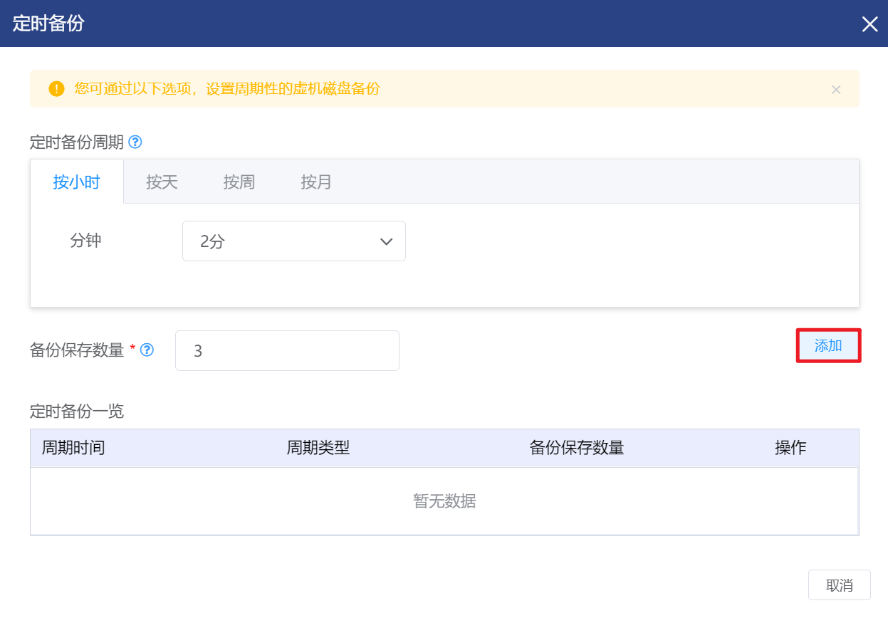

> [!NOTE]
>
> - 若该磁盘所在虚拟机存在快照或定时快照，则该磁盘不支持备份；
> - 可以选择根据小时、天、周或月的某一个时间点，系统将在该时间点自动为虚拟磁盘创建备份；
> - 备份保留数量即为定时备份的最大保留数量，系统将清理旧的定时备份，保存最新的定时备份；
> - 用户可以分别按小时、按天、按周、按月设置多个定时器，但每一类时间维度仅支持设置一个定时器。

#### 删除虚拟磁盘定时备份

① 在虚拟机管理界面中，选择需要删除虚拟磁盘定时备份的虚拟机，在操作列中点击"配置磁盘"按钮：

② 进入虚拟机详情页面的“虚拟磁盘”选项卡中，选择需要删除定时备份的虚拟磁盘，点击操作列的”定时备份“按钮：

③将会弹出“定时备份”的操作提示框，选择需要删除的定时器，点击操作列的“删除”按钮：

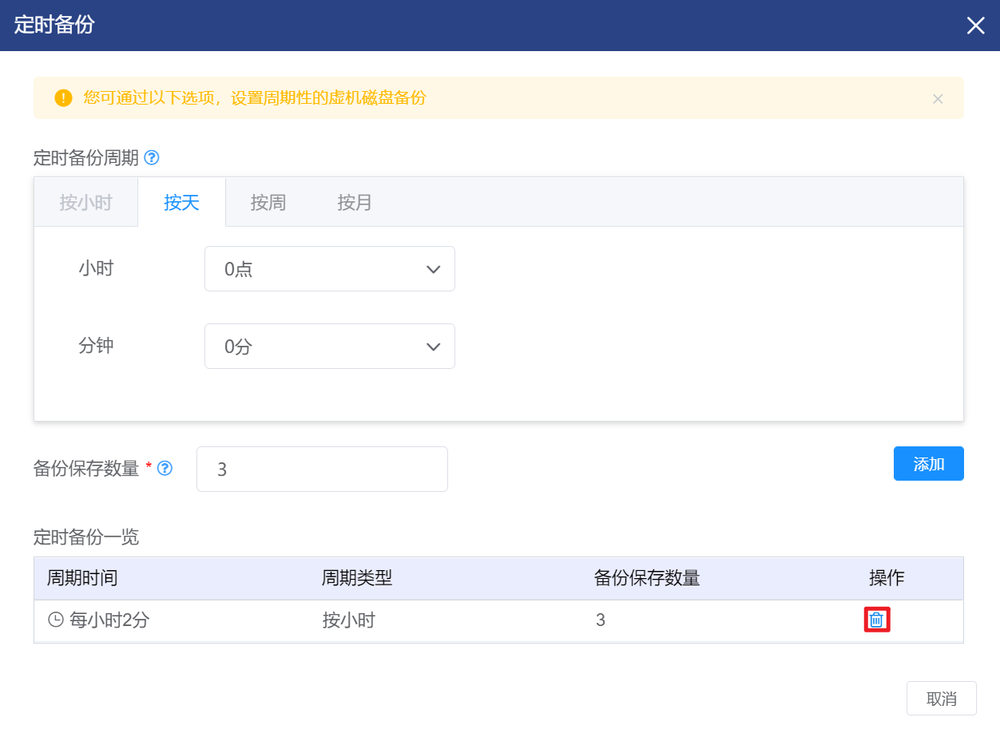

 ④将会弹出“删除定时备份规则”的操作提示框，点击“确定”按钮，即删除选定的虚拟磁盘定时器：

> [!NOTE]
>
> - 若用户设置了多类时间维度的定时器，仅删除用户选择的那一条定时器记录；
> - 用户删除定时器后，之前平台依据定时器自动创建的定时备份不会受到影响。

### 网络操作

#### 为虚拟机添加网络

① 在虚拟机管理界面中，选择需要添加网络的虚拟机，在操作列中点击"配置网络"按钮：

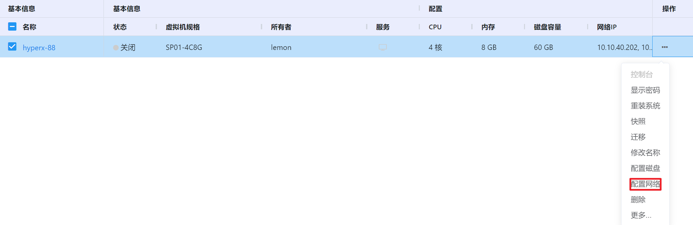

② 进入虚拟机详情页面的“网络”选项卡中，点击“加入网络”按钮:

③ 将会弹出”加入网络”的操作提示框，列表显示可用的网络，选择新增的网络后，点击“确定”按钮，即可将选定的网络添加到虚拟机中：

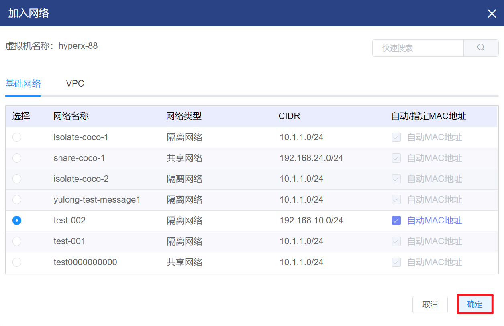

#### 编辑网络主IP

① 在虚拟机管理界面中，选择需要编辑网络主IP的虚拟机，在操作列中点击"配置网络"按钮：

② 进入虚拟机详情页面的“网络”选项卡中，选择需要编辑主IP的网络，点击操作列的“编辑主IP”按钮：

③ 将会弹出“编辑主IP地址”的操作提示框，填写网络的主IP地址后，点击“确定”按钮，即可实现网络主IP的编辑：

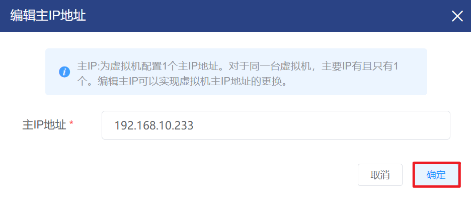

> [!NOTE]
>
> - 当且仅当虚拟机处于“停止”状态时，支持编辑网络的主IP。

#### 获取网络的辅助IP

① 在虚拟机管理界面中，选择需要获取辅助IP的虚拟机，在操作列中点击"配置网络"按钮：

② 进入虚拟机详情页面的“网络”选项卡中，选择需要获取辅助IP的网络，点击操作列的“获取辅助IP地址”按钮，即可实现辅助IP地址的获取：

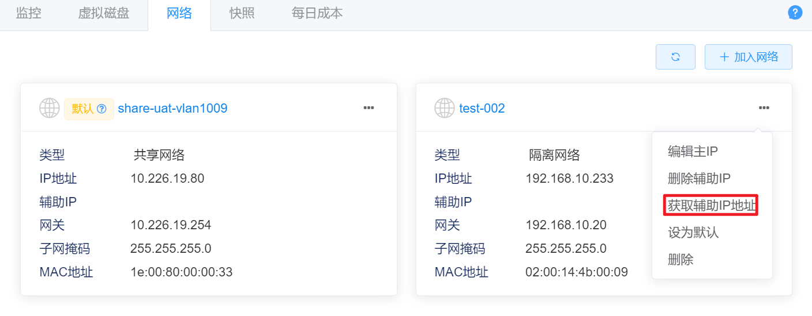

③ 即可在网卡中看到新获取的辅助IP地址：

#### 删除网络的辅助IP

① 在虚拟机管理界面中，选择需要删除辅助IP的虚拟机，在操作列中点击"配置网络"按钮：

② 进入虚拟机详情页面的“网络”选项卡中，选择需要删除辅助IP的网络，点击操作列的“删除辅助IP”按钮：

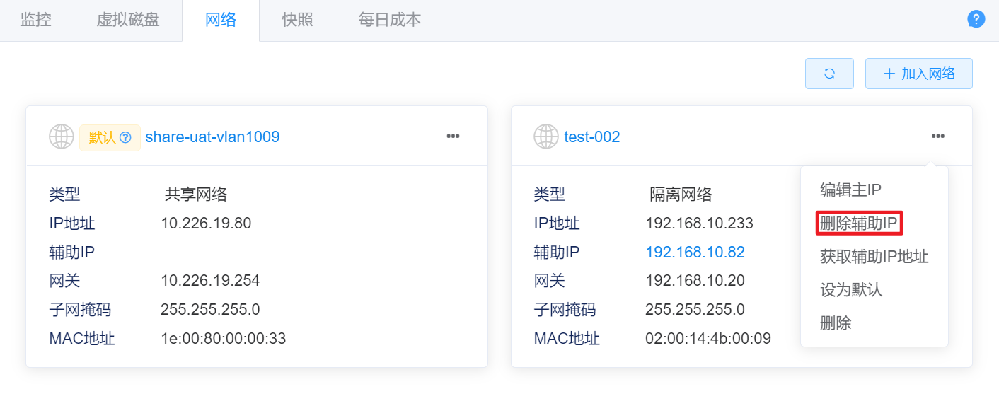

③ 将会弹出“删除辅助IP”操作提示框，点击辅助IP的删除按钮，删除选定的的辅助IP：

#### 设置默认网络

① 在虚拟机管理界面中，选择需要设置默认网络的虚拟机，在操作列中点击"配置网络"按钮：

② 进入虚拟机详情页面的“网络”选项卡中，选择需要设为默认的网络，点击操作列的“设为默认”按钮：

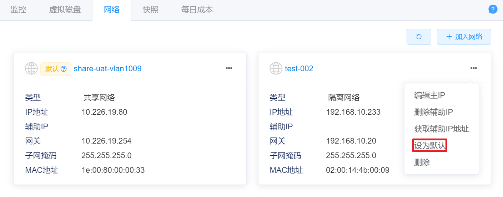

③ 将会弹出“设置默认网络”的操作提示框，点击“确定”按钮，即可将选定的网络设为虚拟机的默认网络：

#### 删除虚拟机的网络

① 在虚拟机管理界面中，选择需要删除网络的虚拟机，在操作列中点击"配置网络"按钮：

② 进入虚拟机详情页面的“网络”选项卡中，选择需要删除的网络，点击操作列的“删除”按钮：

③ 将会弹出”删除”的操作提示框，点击“确定”按钮，即可删除选定的网络：

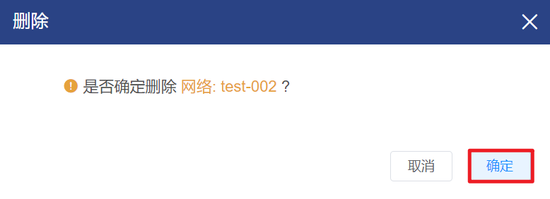

### 快照操作

#### 创建虚拟机快照

① 在虚拟机管理界面中，选择需要创建快照的虚拟机，在操作列中点击"快照"按钮：

② 将会弹出“创建快照”的操作提示框，填写快照相关信息后，点击“确定”按钮，即可为虚拟机创建快照：

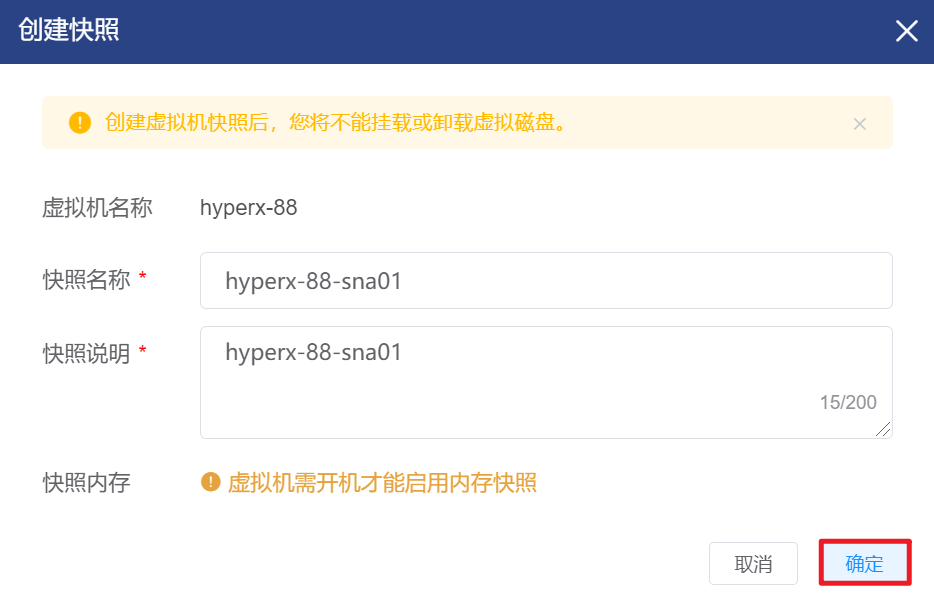

> [!NOTE]
>
> - 虚拟机所在主机使用KVM虚拟化时暂不支持使用快照内存，如果选择快照内存，可能消耗较长时间；
> - 若该虚拟机关联的虚拟磁盘存在备份或定时备份，则该虚拟机不支持快照。

#### 创建虚拟机定时快照

① 在虚拟机管理界面中，选择需要创建定时快照的虚拟机，在操作列中点击“更多”按钮，进入虚拟机的详情页面：

② 选择“快照”选项卡，点击“定时快照”按钮：

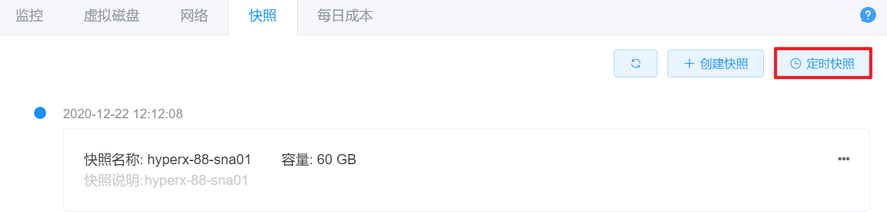

③ 将会弹出“定时快照”的操作提示框，填写相关信息后，点击“添加”按钮，即可为虚拟机创建定时快照：

> [!NOTE]
>
> - 若该虚拟机关联的虚拟磁盘存在备份或定时备份，则该虚拟机不支持定时快照；
> - 可以选择根据小时、天、周或月的某一个时间点，系统将在该时间点自动为虚拟机快照；
> - 快照保留数量即为定时快照的最大保留数量，系统将清理旧的定时快照，保存最新的定时快照；
> - 用户可以分别按小时、按天、按周、按月设置多个定时器，但每一类时间维度仅支持设置一个定时器。

#### 删除虚拟机定时快照

① 在虚拟机管理界面中，选择需要删除定时快照的虚拟机，在操作列中点击“更多”按钮，进入虚拟机的详情页面：

② 选择“快照”选项卡，点击“定时快照”按钮：

③ 选择“定时快照一览”中需要删除的计时器，点击右侧操作列的“删除”按钮：

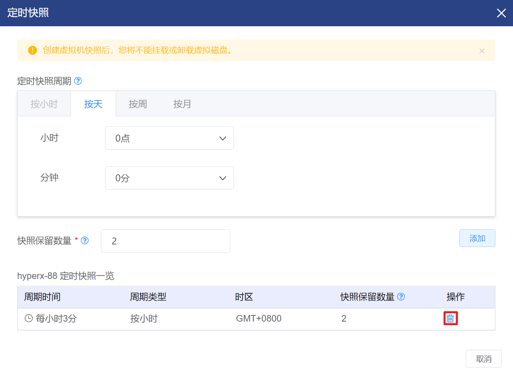

④ 将会弹出“删除定时快照规则”的操作提示框，点击“确定”按钮删除选中的定时快照：

#### 回滚虚拟机快照

① 在虚拟机管理界面中，选择需要回滚快照的虚拟机，在操作列中点击“更多”按钮，进入虚拟机的详情页面：

② 选择“快照”选项卡，选择需要回滚的快照，点击操作列的“回滚”按钮：

③ 将会弹出”虚拟机快照回滚”的操作提示框，点击“确定”按钮回滚选中的定时快照：

> [!NOTE]
>
> - 当且仅当虚拟机处于“停止”状态时，支持回滚虚拟机的快照；
> - 回滚快照将会覆盖现有内容，将虚拟机恢复到快照记录的状态，请备份重要数据。

#### 删除虚拟机快照

① 在虚拟机管理界面中，选择需要删除快照的虚拟机，在操作列中点击“更多”按钮，进入虚拟机的详情页面：

② 选择“快照”选项卡，选择需要删除照，点击操作列的“删除”按钮：

③ 将会弹出”删除快照”的操作提示框，点击“确定”按钮删除选定的虚拟机快照：

​	