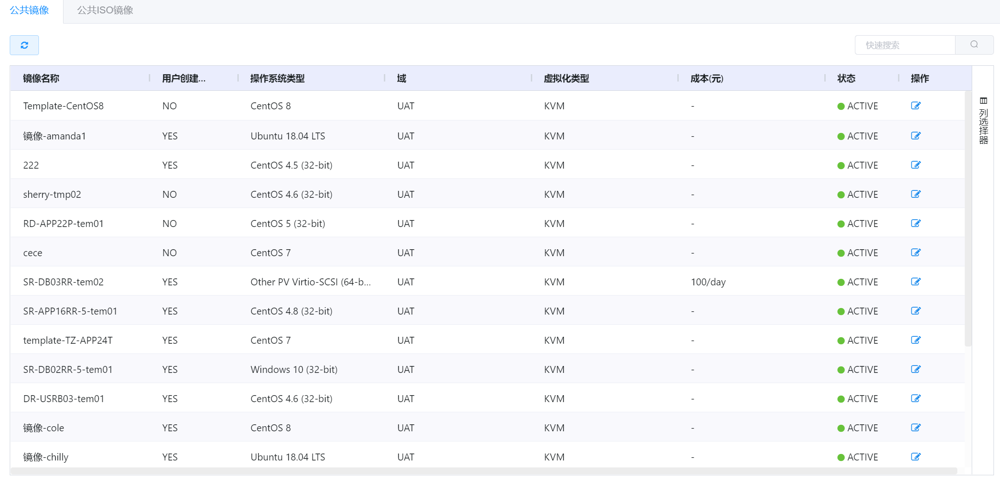
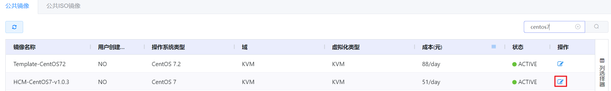

# 4.4.3.3.镜像定价管理

管理员可以为平台内的镜像配置价格，用于资源分析和成本统计。

在“资源管理”菜单下选择左侧“区域管理”导航菜单，之后点击“资源规格”下的“镜像定价”子菜单，即可看到镜像定价的管理界面：

在此页面，可以查看镜像的名称、用户创建模板、操作系统类型等信息。

镜像定价的管理界面有公共镜像和公共ISO镜像这两个界面，默认显示的是公共镜像：

- 公共镜像：平台中全部的公共镜像；

- 公共ISO镜像：平台中全部的公共ISO镜像。

云平台中，镜像的状态有两种：

- ACTIVE：处于可用状态的镜像，支持用户使用当前镜像创建虚拟机；

- INACTIVE：正在上传或上传失败的镜像，不支持用户使用。

## 相关操作

HYPERX云管理平台支持用户对镜像定价进行管理，支持的功能如下：

- 快速搜索：根据镜像的名称、操作系统类型、域等字段全局快速搜索镜像；
- 高级筛选：用户可以从表头右侧根据镜像名称、用户创建模板、操作系统类型等字段筛选出符合条件的镜像；
- 编辑镜像价格：编辑选定镜像的成本单价。

操作入口如下：

- 资源管理→区域管理→资源规格→镜像定价

## 操作说明

### 编辑镜像价格

① 在镜像定价管理界面中，选择需要编辑价格的镜像，点击操作列的“编辑”按钮：

② 将会弹出“编辑成本”的操作提示框，填写选定镜像的成本后，点击“确定”按钮，编辑镜像的定价：

