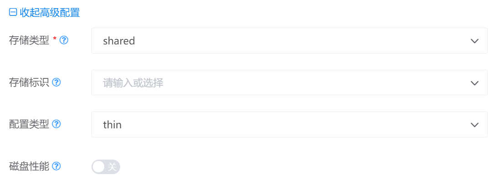
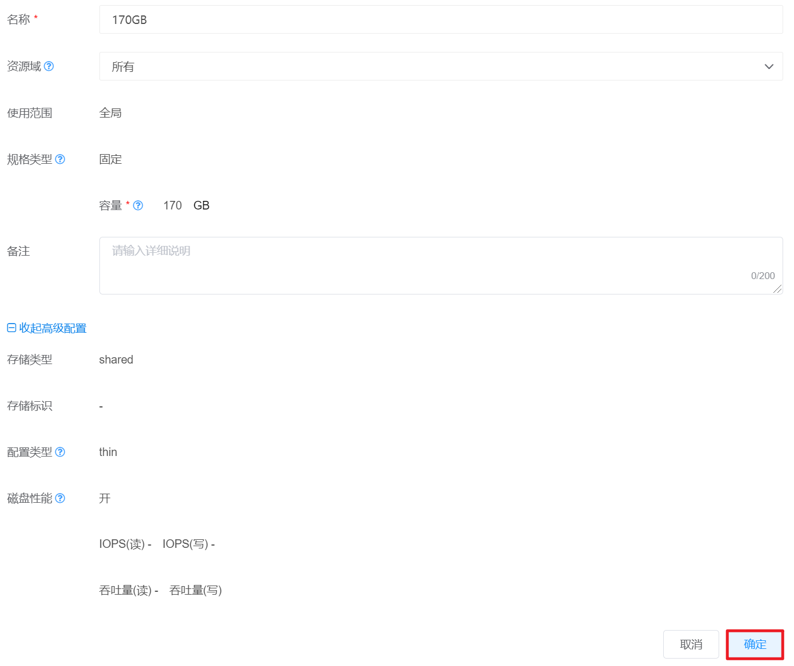
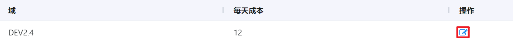

# 4.4.3.2.磁盘规格管理

磁盘规格时为用户提供创建虚拟机所需的系统磁盘和数据磁盘所使用的计算方案，管理员可以创建多个磁盘规格方案供用户选择。

在“资源管理”菜单下选择左侧“区域管理”导航菜单，之后点击“资源规格”下的“磁盘规格”子菜单，即可看到磁盘规格的管理界面：

在此页面，可以查看磁盘规格的名称、类型、大小、自定义、域和操作列。

## 相关操作

HYPERX云管理平台支持用户对磁盘规格进行管理，支持的功能如下：

- 快速搜索：根据磁盘规格的名称、类型、域等字段全局快速搜索磁盘规格；
- 高级筛选：用户可以从表头右侧根据名称、存储类型、存储标识等字段筛选出符合条件的磁盘规格；
- 创建磁盘规格：输入磁盘规格的名称、域、存储类型等信息创建新的磁盘规格；
- 编辑磁盘规格：编辑磁盘规格的名称、域、描述等相关信息；
- 编辑磁盘规格单价：为磁盘规格编辑单价信息；
- 删除磁盘规格：彻底删除选定的磁盘规格。

操作入口如下：

- 资源管理→区域管理→资源规格→磁盘规格

## 操作说明

### 创建磁盘规格

① 在磁盘规格管理界面中，点击“创建磁盘规格”按钮：

② 在“创建磁盘规格”的界面中，需要依次执行创建磁盘规格、磁盘规格定价这2个操作。

创建磁盘规格——配置磁盘规格的名称、存储类型、存储标识等信息。设置界面如下：

> [!NOTE]
>
> - 如果选择“使用范围”为“全局”，则该磁盘规格支持整个平台使用，如果选择“使用范围”为“制定公司”，则该磁盘规格只支持选定的公司使用；
> - 磁盘规格加入规格组后，才能被使用，支持在创建磁盘规格时指定磁盘规格组；
> - 如果选择规格类型为“自定义范围”，支持自定义磁盘规格的容量的大小区间，目前支持自定的容量区间为10GB-32TB。

如需配置高级信息，点击“设置高级配置”按钮，可以对主机标识、存储标识、存储类型等信息进行配置：

完善全部信息后，点击“下一步”按钮，进入下一步配置。

> [!NOTE]
>
> - 存储类型分为“share”（使用共享存储的主存储）和“local”（使用计算节点的本地磁盘）；
> - 设置存储标识后，系统将指定虚拟机创建运行在带有相同标签的主机节点上；
> - 磁盘类型是磁盘的调配机制，分为“thin”（精简-分配存储大小为实际使用大小）、"sparse"（稀疏-分配所需大小，但没有置零操作）和"fat"（厚置-分配所需大小，并将物理设备上保留的数据置零 ）。
> - 若开启对磁盘性能的配置，则需要配置IOPS读写量和吞吐读写量：
>
> 

磁盘规格定价——配置各个域中磁盘的价格。设置界面如下：

完善全部信息后，点击“确定”按钮，即可完成磁盘规格的创建。

### 编辑磁盘规格

① 在磁盘规格管理界面中，选择需要编辑的磁盘规格，点击操作列的“编辑”按钮：

② 将会进入“编辑磁盘规格”的页面，编辑磁盘规格的名称、域、描述等信息后，点击“确定”按钮更新磁盘规格信息：

### 编辑磁盘规格单价

① 在磁盘规格管理界面中，选择需要编辑单价的磁盘规格，点击操作列的“编辑单价”按钮：

② 将会进入“编辑磁盘规格单价”的页面，选择需要编辑的单价，点击操作列的“编辑”按钮：

③ 将会弹出“设置价格”的操作提示框，修改相关信息后，点击“确定”按钮，即可编辑磁盘单价：

### 删除磁盘规格

① 在磁盘规格管理界面中，选择需要删除的磁盘规格，点击操作列的“删除”按钮：

② 将会弹出“删除”的操作提示框，点击“确定”按钮删除选中的磁盘规格：

> [!NOTE]
>
> - 磁盘规格被删除后，使用该规格的磁盘不受影响。