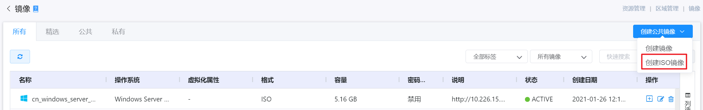
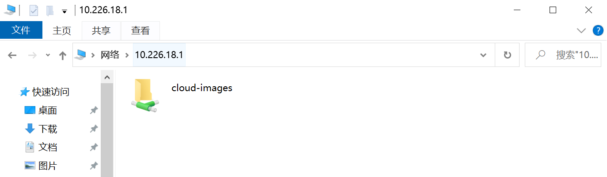
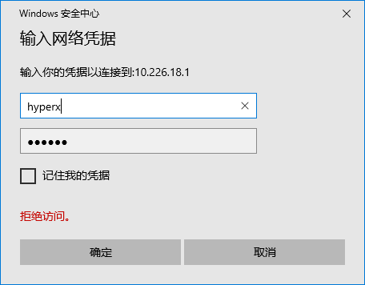
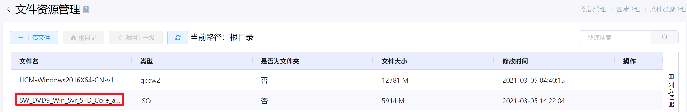
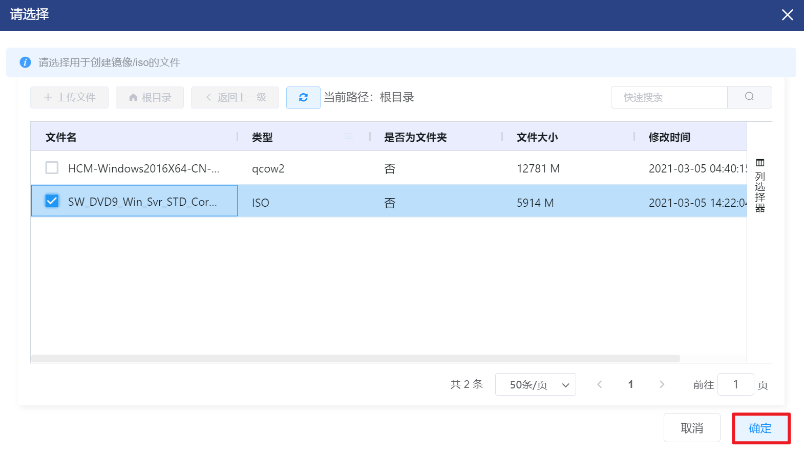
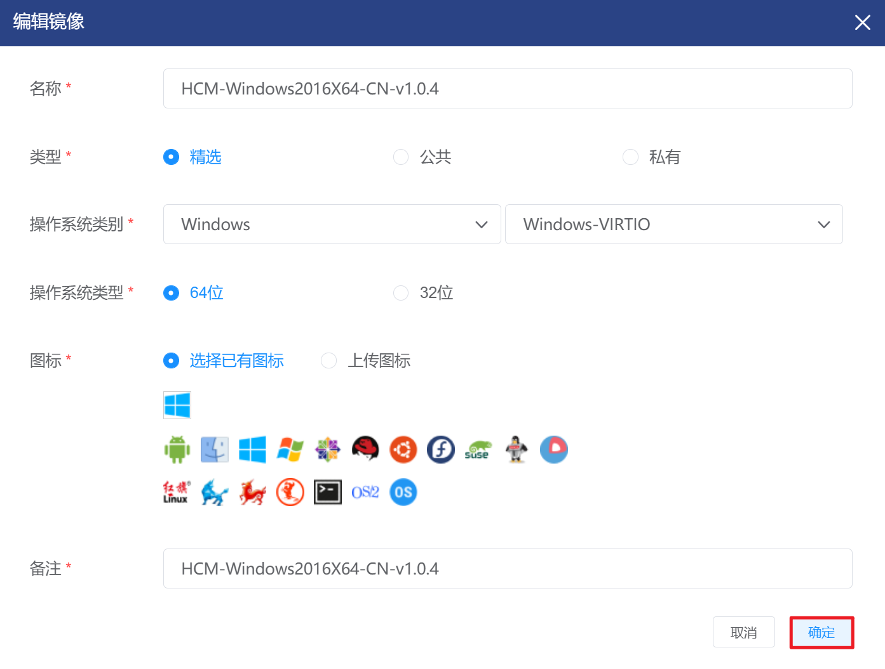
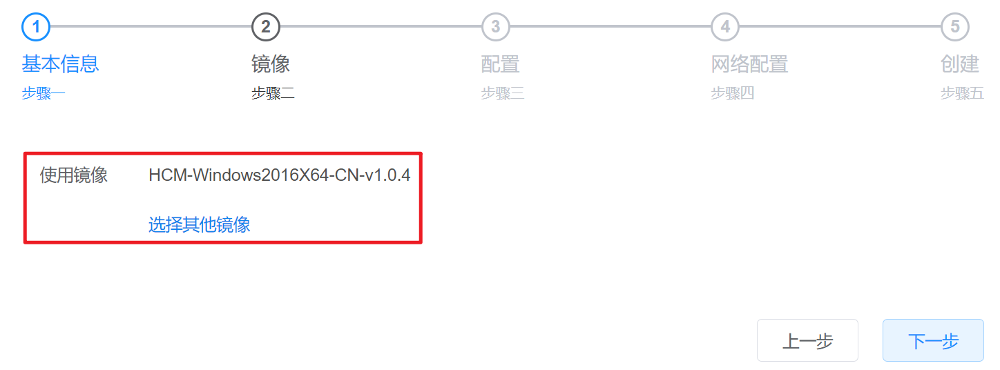

# 4.4.2.镜像管理

镜像是可用于启动虚拟机的操作系统映像，ISO是包含操作系统数据可启动介质的磁盘映像或工具包。

用户可以通过镜像直接创建包含操作系统的虚拟机；也可以创建不含操作系统的虚拟机，将含有可启动介质的ISO镜像挂载在机器上，手动安装操作系统。

在“资源管理”菜单下选择左侧“区域管理”导航菜单，之后点击“镜像”的子菜单，即可看到镜像的管理界面：

在此页面，可以查看镜像的名称、操作系统、虚拟化属性等字段信息和操作列。

镜像的管理界面分为所有、精选、公共和私有，超级管理员默认显示的是“所有”界面，非超管用户默认显示的是“精选”界面：

- 所有：用户有权限编辑和使用的精选、公共、私有类的镜像和ISO镜像。
- 精选：具有完善配置、推荐使用的镜像和ISO镜像。管理员可将私有镜像/ISO镜像设置为精选镜像/ISO镜像，该镜像/ISO镜像将出现在精选列表中。
- 公共：所有用户均可编辑和使用的镜像和ISO镜像。用户可将私有镜像/ISO镜像设置为公共镜像/ISO镜像，该镜像/ISO镜像将出现在公共列表中。
- 私有：用户上传的镜像和ISO镜像均为私有类，仅用户可以编辑和使用，可以将私有类修改为精选类或公共类。

云平台中，镜像的状态有两种：

- ACTIVE：处于可用状态的镜像，支持用户使用当前镜像创建虚拟机；
- INACTIVE：正在上传或上传失败的镜像，不支持用户使用。

云平台中，关于镜像和ISO镜像的定义如下：

- 镜像：包含操作系统的磁盘镜像，由不同操作系统的虚拟机并自定义安装服务(例如zabbix filebeat 等工具)封装而成，用户可以选择不同的模板创建虚拟机。
- ISO镜像：用户刻录/从官网下载的可安装系统光盘或工具包，用户可以选择含有可启动介质的ISO镜像创建虚拟机。

## 相关操作

HYPERX云管理平台支持用户对镜像进行管理，支持的功能如下：

- 标签搜索：根据镜像的标签搜索镜像；
- 类型检索：根据镜像的格式(镜像或ISO镜像)搜索镜像；
- 快速搜索：根据镜像的名称、说明、状态等字段全局快速搜索镜像；
- 高级筛选：用户可以从表头右侧根据名称、操作系统、虚拟化属性等字段筛选出符合条件的镜像；
- 创建镜像：通过输入镜像的http或选择文件目录中的镜像文件，在当前区域中创建镜像；
- 创建ISO镜像：输入ISO镜像的http或选择文件目录中的ISO镜像文件，在当前区域中创建ISO镜像；
- 选定镜像/ISO镜像创建虚拟机：使用选定的镜像或ISO镜像创建一个或多个虚拟机；
- 编辑镜像/ISO镜像：编辑镜像或ISO镜像的名称、类型、操作系统类别等相关信息；
- 删除镜像：彻底删除选定的镜像，其操作结果不影响之前使用该镜像创建的虚拟机。

操作入口如下：

- 资源管理→区域管理→镜像(用于创建、编辑、启用或删除镜像和镜像)
- 资源管理→虚拟资源管理→虚拟机

## 操作说明

### 创建镜像

① 在镜像管理界面中，点击“创建公共镜像”按钮，选择“创建镜像”菜单：

② 选择创建镜像后，将会进入创建镜像(公共)页面，上传镜像的信息后，点击“确定”按钮，即可实现镜像的创建：

> [!NOTE]
>
> - 在创建镜像前，要确保该镜像所有者所在的部门拥有足够的配额剩余资源；
>
> - 类型选项即为该镜像的适用范围：
>
>   - 如果选择有“精选”或“公共”选项，则该镜像可供全平台用户使用；
>   - 如果选择“私有选项”，则该镜像仅自己可用(非超管用户只支持上传私有镜像)；
>
> - 如果选择http方式创建，需要将计划上传的镜像文件存储在支持HTTP协议的服务器上，需要在URL处填写镜像存放的URL，其URL的命名标准为“http://服务器的IP地址/镜像文件名”；
>
> - 如果选择已有文件创建，操作步骤请参考创建ISO镜像的注释信息；
>
> - 操作系统类别是指镜像操作系统的类别，其中Windows操作系统对应Windows-VIRTIO和Windows-IDE两种类型，使用Windows-IDE类型的镜像创建的虚拟机仅支持挂载一个数据盘;
>
> - 操作系统类型选项即为用户镜像操作系统的架构，可选择32位或64位，默认为64位；
>
> - 如果需要对镜像的虚拟化技术和格式进行配置，点击“设置高级配置”按钮，：
>
>   
>
>   - 虚拟化技术：当前Zone采用的虚拟化技术；
>   - 格式：镜像的后缀格式。

### 创建ISO镜像

① 在镜像管理界面中，点击“创建公共镜像”按钮，选择“创建ISO镜像”菜单：

② 选择创建ISO镜像后，将会进入创建ISO镜像(公共) 页面，完善ISO镜像的信息后，点击“确定”按钮，即可实现ISO镜像的创建：

> [!NOTE]
>
> - 在创建ISO镜像前，要确保该ISO镜像所有者所在的部门拥有足够的配额剩余资源。
>
> - 类型选项即为该ISO镜像的适用范围：
>
>   - 如果选择有“精选”或“公共”选项，则该ISO镜像可供全平台用户使用；
>   - 如果选择“私有选项”，则该ISO镜像仅自己可用(非超管用户只支持上传私有ISO镜像)；
>
> - 如果选择http方式创建，需要将计划上传的ISO文件存储在支持HTTP协议的服务器上，需要在URL处填写镜像存放的URL，其URL的命名标准为“http://服务器的IP地址/ISO镜像文件名”；
>
> - 如果选择已有文件创建，,操作步骤如下：
>
>   - 进入HCM平台“资源管理->区域管理->文件资源管理”菜单中，点击“上传文件”按钮，获取文件目录的IP地址：
>
>   
>
>   - 打开本机的“文件管理器”，将IP地址替换为\\\“'+文件目录的IP地址”，可以看到界面如下：
>
>   
>
>   - 点击进入驱动器，首次连接需输入账号密码，账号：hyperx，密码：HyperX：
>
>   
>
>   - 将需要上传的文件拖拽或粘贴复制到网络驱动器中：
>
>   
>
>   - 再次进入HCM平台“资源管理->区域管理->文件资源管理”菜单中，即可看到上传的文件情况：
>
>   
>
>   - 进入创建ISO镜像页面，选择“选择已有文件”方式，点击“选择文件”按钮：
>
>   
>
>   - 从文件列表中选择对应的文件后，点击“确定”按钮：
>
>    
>
> - ISO镜像用途分为“操作系统”和“工具”，“操作系统”用途的ISO是包含操作系统数据可启动介质的磁盘映像，“工具”用途的ISO是用作工具包的文件；
>
> - 操作系统类别是指ISO镜像操作系统的类别，其中Windows操作系统对应Windows-VIRTIO和Windows-IDE两种类型，使用Windows-IDE类型的ISO镜像创建的虚拟机仅支持挂载一个数据盘;
>
> - 操作系统类型选项即为用户ISO镜像操作系统的架构，可选择32位或64位，默认为64位。

### 编辑镜像

① 在镜像管理界面中，选择需要编辑信息的镜像(此处以镜像为例，ISO镜像界面和镜像相同)，点击操作列的“编辑”按钮：           

② 将会弹出“编辑镜像“的操作提示框，完善相关信息后，点击“确定”按钮，即可实现镜像的编辑。

> [!WARNING]
>
> - 镜像的URL、虚拟化技术和格式不支持编辑。

### 选定镜像创建虚拟机

① 在镜像管理界面中，选择需要创建虚拟机的镜像，点击操作列的“创建虚拟机”按钮：

② 即可跳转到虚拟机的创建页面，并自动选择当前镜像(或ISO镜像)，如需了解创建虚拟机的方法，请查阅虚拟机的创建章节：

> [!NOTE]
>
> - 在选用镜像或ISO镜像前，要确保镜像处于ACTIVE状态可用；
> - 如果选择的是ISO镜像，要确保该ISO镜像的用途是“操作系统”，“工具”用途的ISO镜像不支持创建虚拟机；
> - 自动选择镜像为创建虚拟机的第二步，需要用户先完善第一页的信息后才能看到该界面；
> - 在选用镜像创建虚拟机前，要确保该虚拟机所有者所在的部门拥有足够的配额剩余资源。

### 删除镜像

① 在镜像管理界面中，选择需要删除的镜像(或ISO镜像)后，点击操作列的“删除”按钮：

② 将会弹出”删除“的操作提示框，点击“确认”按钮后，将删除选中的镜像：

> [!NOTE]
>
> - 删除镜像或ISO镜像时，如果镜像关联了虚拟机，或ISO镜像被虚拟机所挂载，会在浮框中显示镜像关联的虚拟机内容；删除后，原先使用该镜像创建的虚拟机不会受到影响。