# 5.5.资源标签管理

资源标签时用于使用场景设置虚拟机的归类标签。

在创建虚拟机时，勾选资源标签后，系统会根据“应用组-应用角色-虚拟机编号-应用类型”为虚拟机自动命名。

用户可以从“运营中心→资源分布图”菜单中，查看各个组织不同应用组和应用类型的虚拟机分布。请查阅资源分布图章节。

> [!NOTE]
>
> - 非批量创建虚拟机时，虚拟机的名称支持修改。批量创建虚拟机时，平台会根据虚拟机的资源标签批量自动命名；
>
> - 虚拟机编号为选用该资源标签组合的虚拟机号码，从‘01’、‘02’、‘03’开始顺序编码。
>

资源标签分为应用组、应用角色和应用类型三类：

- 应用组：公司内部虚拟机归类组，如生产区、测试研发区等;

- 应用角色：标记虚拟机使用角色，如作为提供WEB服务、数据库等;

- 应用类型：标记虚拟机在场景中的用途，如测试（T）、研发（D）等。

>  [!NOTE]
>
> - 平台会自动为用户预置了部分应用角色和应用类型，用户也可以自定义所需的应用角色和应用类型；
>
> - 平台所预置的应用角色和应用类型不支持修改和删除，如果用户有需求自定义，请联系产品负责人按需定制；
>
> - 用户每创建一个公司，平台都将自动为用户创建预置应用角色。删除公司时，平台将会删除所自动创建的应用角色。
>

在“企业管理”菜单下选择左侧“资源标签”导航菜单，即可看到资源标签的管理界面：

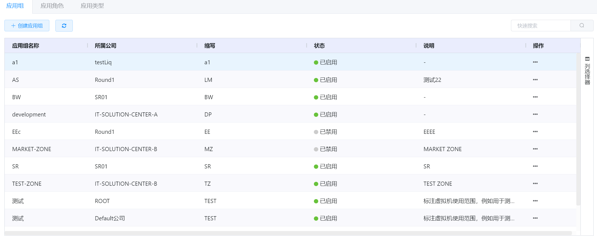

资源标签的管理界面分为应用组、应用角色和引用类型这三个界面，默认显示的是应用组界面。

## 相关操作

HYPERX云管理平台支持用户对应用组、应用角色和应用类型进行管理，支持的功能如下：

- 快速搜索：根据应用组/应用角色/应用类型的名称、缩写、说明等字段全局快速搜索应用组/应用角色/应用类型；
- 高级筛选：用户可以从表头右侧根据应用组名称/应用角色名称/应用类型名称、所属公司、缩写等字段筛选出符合条件的资源标签；
- 创建应用组：创建一个新的应用组，并填写应用组所属公司、名称、缩写等信息；
- 编辑应用组：编辑应用组的名称、缩写和说明信息；
- 禁用/启用应用组：禁用选中的应用组/将禁用的应用组恢复使用；
- 删除应用组：删除选中的应用组；
- 创建应用角色：创建一个新的应用角色，并填写应用角色所属公司、角色名称、缩写等信息；
- 编辑应用角色：编辑应用角色的名称、缩写和说明信息；
- 禁用/启用应用角色：禁用选中的应用角色/将禁用的应用角色恢复使用；
- 删除应用角色：删除选中的应用角色；
- 创建应用类型：创建一个新的应用类型，并填写应用类型所属公司、应用类型、缩写等信息；
- 编辑应用类型：编辑应用类型的类型、缩写和说明信息；
- 禁用/启用应用类型：禁用选中的应用类型/将禁用的应用类型恢复使用；
- 删除应用类型：删除选中的应用类型。

操作入口如下：

- 企业管理→资源标签→应用组

- 企业管理→资源标签→应用角色

- 企业管理→资源标签→应用类型

## 操作说明

### 创建应用组

① 在资源标签的管理界面的“应用组”选项卡中，点击“创建应用组”按钮：

② 将会弹出“创建应用组”的操作提示框，填写所属公司、应用组名称、缩写等信息后，点击“确定”按钮后，添加应用组：

### 编辑应用组

① 在资源标签的管理界面的“应用组”选项卡中，选择需要编辑的应用组后，点击操作列的“编辑”按钮：

② 将会弹出“编辑应用组”的操作提示框，修改应用组名称、说明等信息后，点击“确定”按钮，更新应用组信息：

> [!NOTE]
>
> - 应用组所属的公司和缩写不支持修改。
>

### 禁用/启用应用组

① 在资源标签的管理界面的“应用组”选项卡中，选择需要禁用的应用组后，点击操作列的“禁用”按钮：

② 将会弹出“禁用应用组”的操作提示框，点击“确定”按钮，禁用选中的应用组：

③ 在资源标签的管理界面的“应用组”选项卡中，选择需要启用的应用组后，点击操作列的“启用”按钮：

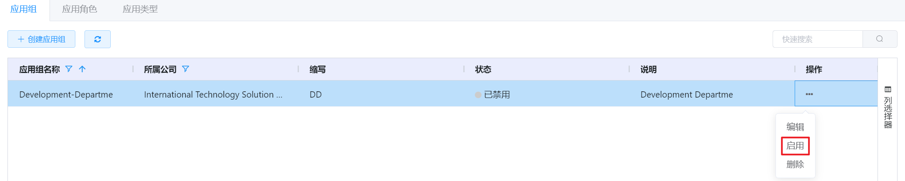

④ 将会弹出“启用应用组”的操作提示框，点击“确定”按钮，启用选中的应用组：

> [!NOTE]
>
> - 被禁用的应用组将不能在创建虚拟机时被选择。
>

### 删除应用组

① 在资源标签的管理界面的“应用组”选项卡中，选择需要删除的应用组后，点击操作列的“删除”按钮：

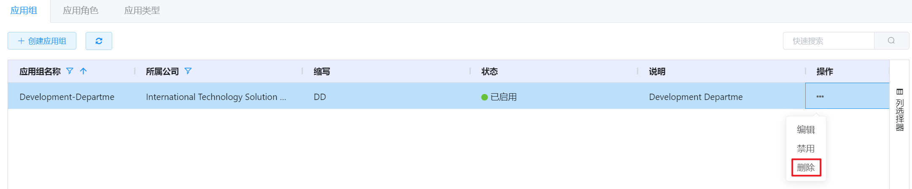

② 将会弹出“删除应用组”的操作提示框，点击“确定”按钮，删除选中的应用组：

> [!WARNING]
>
> - 如果该应用组被虚拟机所使用，则不支持被删除。

### 创建应用角色

① 在资源标签的管理界面的“应用角色”选项卡中，点击“创建应用角色”按钮：

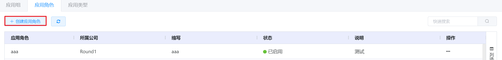

② 将会弹出“创建应用角色”的操作提示框，填写所属公司、角色名称、缩写等信息后，点击“确定”按钮后，添加应用角色：

> [!NOTE]
>
> - “Application”，“Database”，“Load Balancing”，“Middleware”和“Web Server”等五种应用角色是创建公司时自动创建的，且不支持编辑和删除功能。

### 编辑应用角色

① 在资源标签的管理界面的“应用角色”选项卡中，选择需要编辑的应用角色后，点击操作列的“编辑”按钮：

② 将会弹出“编辑应用角色”的操作提示框，修改应用角色名称、说明等信息后，点击“确定”按钮，更新应用角色信息：

> [!NOTE]
>
> - 应用角色所属的公司和缩写不支持修改。
>

### 禁用/启用应用角色

① 在资源标签的管理界面的“应用角色”选项卡中，选择需要禁用的应用角色后，点击操作列的“禁用”按钮：

② 将会弹出“禁用应用角色”的操作提示框，点击“确定”按钮，禁用选中的应用角色：

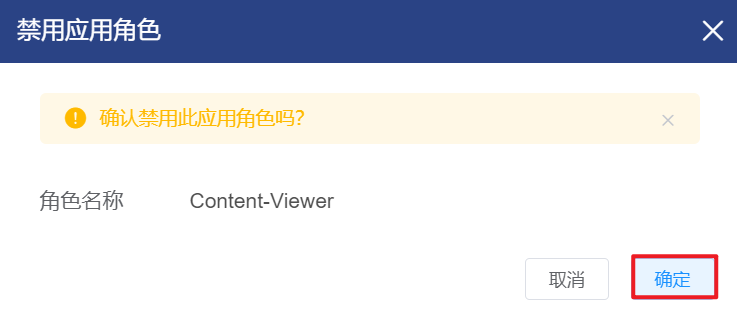

③ 在资源标签的管理界面的“应用角色”选项卡中，选择需要启用的应用角色后，点击操作列的“启用”按钮：

④ 将会弹出“启用应用角色”的操作提示框，点击“确定”按钮，启用选中的应用角色：

> [!NOTE]
>
> - 被禁用的应用角色将不能在创建虚拟机时被选择。
>

### 删除应用角色

① 在资源标签的管理界面的“应用角色”选项卡中，选择需要删除的应用角色后，点击操作列的“删除”按钮：

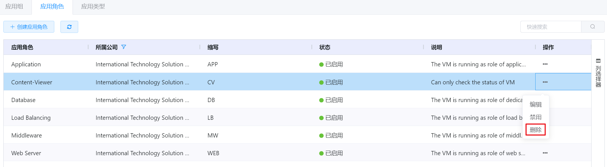

② 将会弹出“删除应用角色”的操作提示框，点击“确定”按钮，删除选中的应用角色：

> [!WARNING]
>
> - 如果该应用角色被虚拟机所使用，则不支持被删除。

### 创建应用类型

① 在资源标签的管理界面的“应用类型”选项卡中，点击“创建应用类型”按钮：

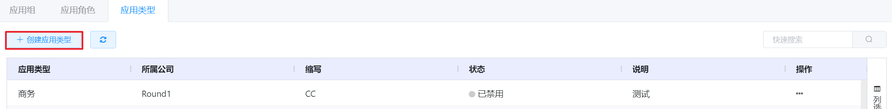

② 将会弹出“创建应用类型”的操作提示框，填写所属公司、应用类型、缩写等信息后，点击“确定”按钮后，添加应用类型：

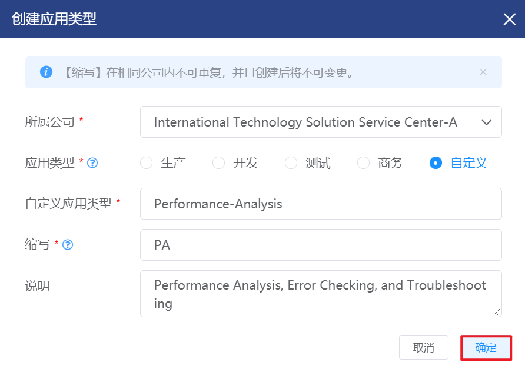

> [!NOTE]
>
> - 支持选择默认应用类型，也支持自定义应用类型。
>

### 编辑应用类型

① 在资源标签的管理界面的“应用类型”选项卡中，选择需要编辑的应用类型后，点击操作列的“编辑”按钮：

② 将会弹出“编辑应用类型”的操作提示框，修改应用类型的类型、说明等信息后，点击“确定”按钮，更新应用类型信息：

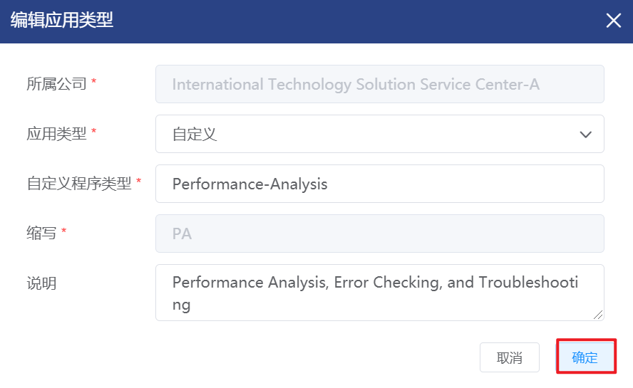

> [!NOTE]
>
> - 默认应用类型，不支持修改应用类型和说明信息；
> - 应用类型所属的公司和缩写不支持修改。

### 禁用/启用应用类型

① 在资源标签的管理界面的“应用类型”选项卡中，选择需要禁用的应用类型后，点击操作列的“禁用”按钮：

② 将会弹出“禁用应用类型”的操作提示框，点击“确定”按钮，禁用选中的应用类型：

③ 在资源标签的管理界面的“应用类型”选项卡中，选择需要启用的应用类型后，点击操作列的“启用”按钮：

④ 将会弹出“启用应用类型”的操作提示框，点击“确定”按钮，启用选中的应用类型：

> [!NOTE]
>
> - 被禁用的应用类型将不能在创建虚拟机时被选择。
>

### 删除应用类型

① 在资源标签的管理界面的“应用类型”选项卡中，选择需要删除的应用类型后，点击操作列的“删除”按钮：

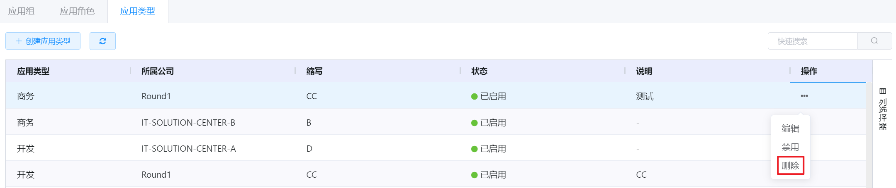

② 将会弹出“删除应用类型”的操作提示框，点击“确定”按钮，删除选中的应用类型：

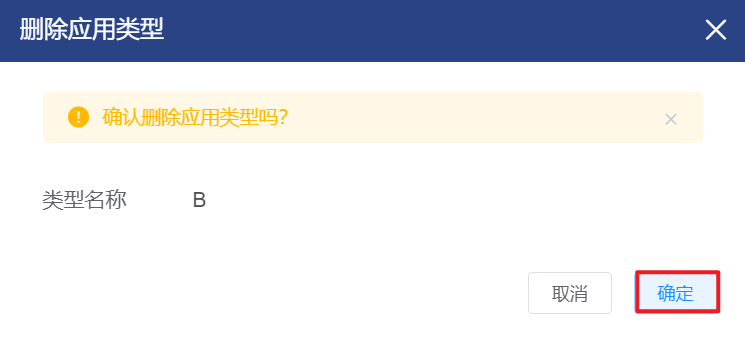

> [!WARNING]
>
> - 默认应用类型，不支持删除；
> - 如果该应用类型被虚拟机所使用，则不支持被删除。