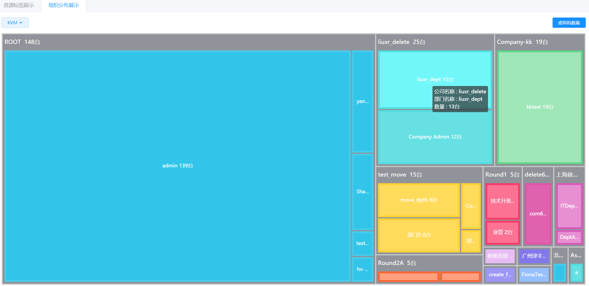

# 6.1.资源分布图

超级管理员和业务管理员在“运营中心”菜单下选择左侧“资源分布图”的导航菜单，即可进入“资源分布图”界面。

以矩阵图表方式，查看不同视角的统计维度上虚拟机分布的情况，目前支持“资源标签展示”和“组织分布展示”这两种查看方式。

## 相关操作

HYPERX云管理平台支持超级管理员和业务管理员查看不同维度统计下虚拟机的分布情况，支持的功能如下：

- 资源标签展示：以公司>应用组>应用角色层级关系，查看指定资源区域下，当前平台使用虚拟机数量的分布情况；

- 组织分布展示：按照当前平台的组织管理结构关系，查看在指定资源区域下，各组织使用虚拟机数量的分布情况。

操作入口如下：

- 运营中心→资源分布图

## 操作说明

### 资源标签查看

在资源分布图界面中，点击“资源标签展示”选项卡，即可看到指定资源区域下，当前平台使用虚拟机数量的分布情况：

> [!NOTE]
>
> - 当用户鼠标悬停资源区域时，会显示当前区域的公司名称、虚拟机所属的应用组、应用角色和该资源标签下占用的虚拟机数量；
>
> - 若用户点击资源区域，将会跳转到选定虚拟机管理界面，并筛选出选定公司，选定资源标签下的虚拟机。
>

### 组织分布查看

在资源分布图界面中，点击“组织分布展示”选项卡，即可看到指定资源区域下，各组织使用虚拟机数量的分布情况：

> [!NOTE]
>
> - 当用户鼠标悬停资源区域时，会显示当前区域的组织名称和该组织下占用的虚拟机数量；
>
> - 若用户点击资源区域，将会跳转到选定虚拟机管理界面，并筛选出选定组织下的虚拟机。