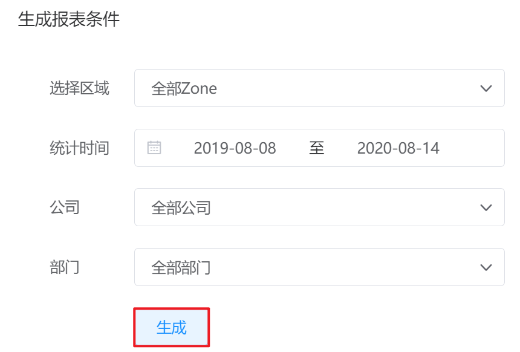

# 6.3.3.虚拟机数量趋势

超级管理员、部门管理员和公司管理员可以查看选定公司或部门一段时间内虚拟机使用数量走势图。

在“运营中心”菜单下选择左侧“资源统计”的导航菜单，之后点击”虚拟机数量趋势”的子菜单，即可看到“虚拟机数量趋势的管理界面”：

## 相关操作

HYPERX云管理平台支持超级管理员和业务管理员查看选定组织、选定时间区间内虚拟机数量的趋势图，支持的功能如下：

- 查看虚拟机数量趋势图：查看选定区域、选定组织、选定时间区间内虚拟机数量的趋势图。

## 操作说明

### 查看虚拟机数量趋势图

① 在虚拟机数量趋势的管理界面中，选择需要统计的区域、公司、部门和统计时间区间后，点击“生成”按钮：

② 即可生成选定条件下虚拟机数量的趋势图表：

> [!NOTE]
>
> - 鼠标悬停时，可以查看选定时间节点虚拟机的月初存量、当月新增和月末存量；
>
> - 管理员可以自定义统计时间的起止区间，同时也可以选择预置的选项，如最近查看一周、最近一个月、最近三个月、最近六个月或最近一年的数据。

