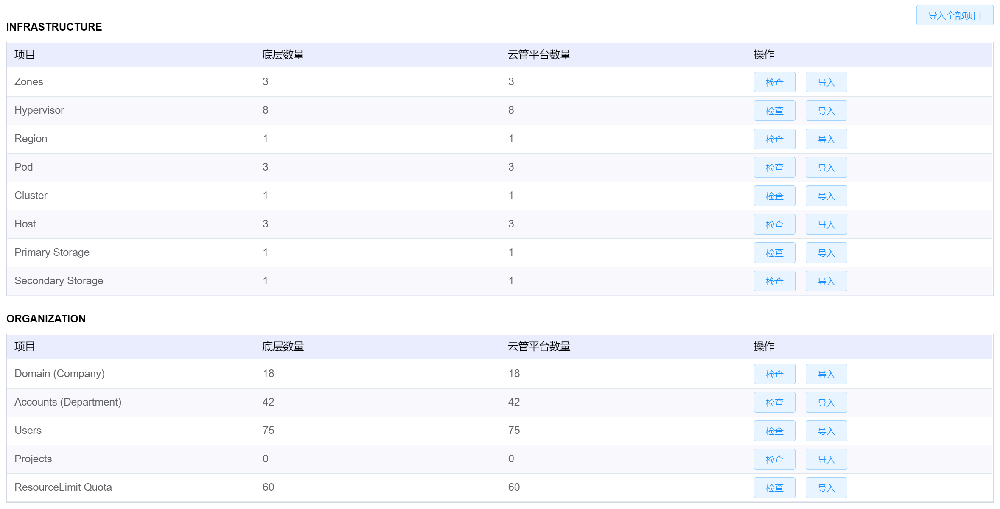
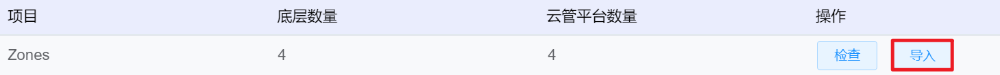

# 7.5.2底层数据导入管理

在“系统设置”菜单下选择左侧“数据同步管理”的导航菜单，之后点击“底层数据导入”的子菜单，即可看到底层数据导入的管理界面：

## 相关操作

HYPERX云管理平台支持超级管理员对底层数据进行管理，支持的功能如下：

- 检查底层数据：支持检查底层数据库的同步情况；
- 导入底层数据：支持同步底层数据库信息。

操作入口如下：

- 系统设置→数据同步管理→底层数据导入

## 操作说明

### 检查底层数据

① 在底层数据导入管理界面中，选择需要检查底层数据的项目，点击操作列的“检查”按钮：

> [!NOTE]
>
> - 云平台将会和底层数据库进行交互，如果底层数据和平台数据不一致，将会用红色显示两侧的数据。

### 导入底层数据

① 在底层数据导入管理界面中，选择需要同步数据的项目，点击操作列的“导入”按钮：

② 云平台将会和底层数据库进行交互，同步两侧的数据，直到两侧数据保持一致。

> [!NOTE]
>
> - 如果需要批量导入数据，点击右上角的“导入全部项目”按钮：
>
> 
