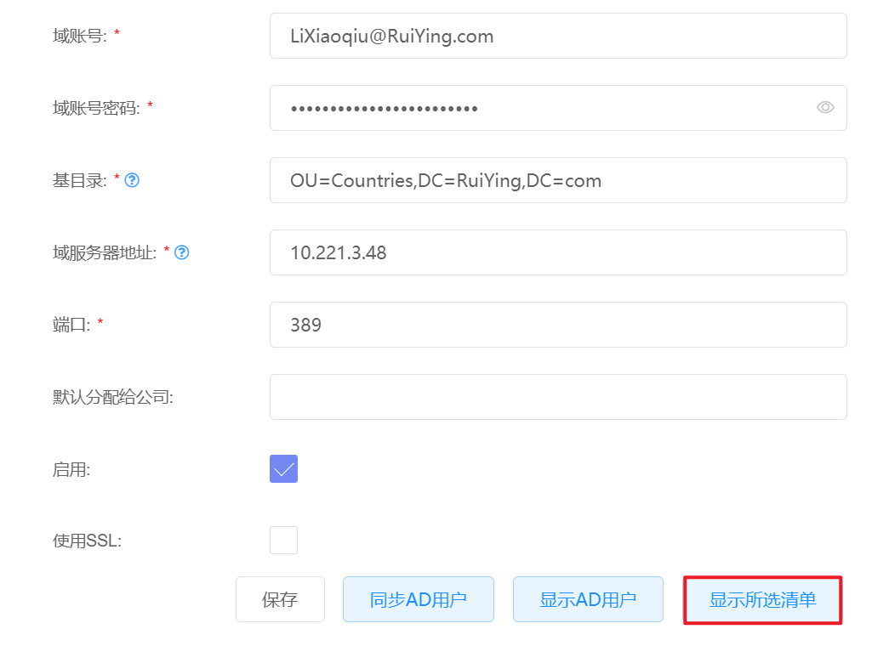

# 7.2.4.AD配置管理

在“系统设置”菜单下选择左侧“平台系统配置”的导航菜单，之后点击“AD配置”的子菜单，即可看到AD配置的管理界面：

## 相关操作

HYPERX云管理平台支持超级管理员对云平台的AD配置界面进行管理，支持的功能如下：

- 配置AD服务器：配置LDAP服务器，连通AD域和云平台；
- 同步AD用户：将AD域中的用户，同步到云平台中；
- 转换平台用户为AD用户：将云平台中邮箱和AD相同的本地用户转化为AD用户；
- 同步AD域中用户到平台：为AD域中的用户配置平台权限信息并同步到平台；
- 更新未登录平台用户相关信息：查看同步到平台但未登录平台的用户，编辑其在云平台中的组织、权限信息。

## 操作说明

### 配置AD服务器

① 在AD配置的管理界面中，配置AD服务信息后，点击“保存”按钮：

② 若AD服务器配置成功，且与平台连通时，会给出提示信息：

### 同步AD用户

① 在AD配置的管理界面中，配置AD服务信息后，点击“同步AD用户”按钮：

② 若同步成功，会给出提示信息：

### 转换平台用户为AD用户

① 在AD配置的管理界面中，配置AD服务信息后，点击“显示AD用户”按钮：

② 将会出现云平台中邮箱和AD服务器中邮箱相同的本地用户列表，点击“改用AD账号认证”按钮：

③ 即可将列表中的用户的登录模式由本地认证改为AD认证。

> [!NOTE]
>
> - 如果需要对某个用户执行操作，可以点击操作列的“同步”按钮，将选定用户的登录模式由本地认证改为AD认证。

### 同步AD域中用户到平台

① 在AD配置的管理界面中，配置AD服务信息后，点击“显示AD用户”按钮：

② 将会出现云平台中“尚未分配部门和角色的AD账号”列表，勾选需要同步到云平台的用户，并为之配置相关信息后，点击“更新选定的AD用户”按钮，即可将选定用户及相关信息配置到云平台：

### 更新未登录平台用户相关信息

① 在AD配置的管理界面中，配置AD服务信息后，点击“显示所选清单”按钮：

② 将会显示已配置相关系信息但未登录云平台的用户列表，可以在此配置相关用户在云平台中的组织、权限信息，配置后点击“更新”按钮，即可更新未登录平台用户的相关信息：

