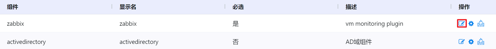
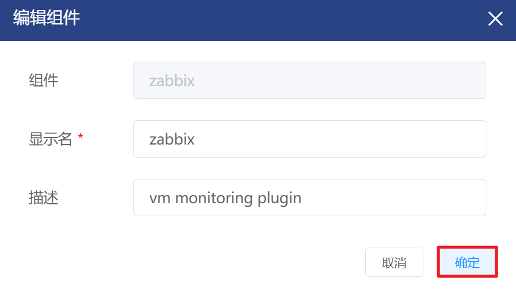
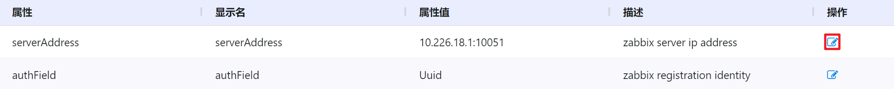
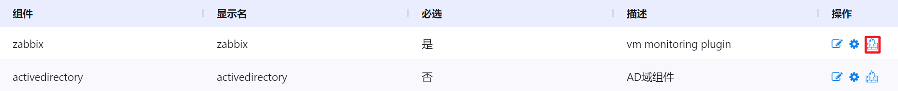
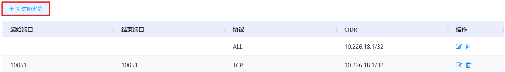
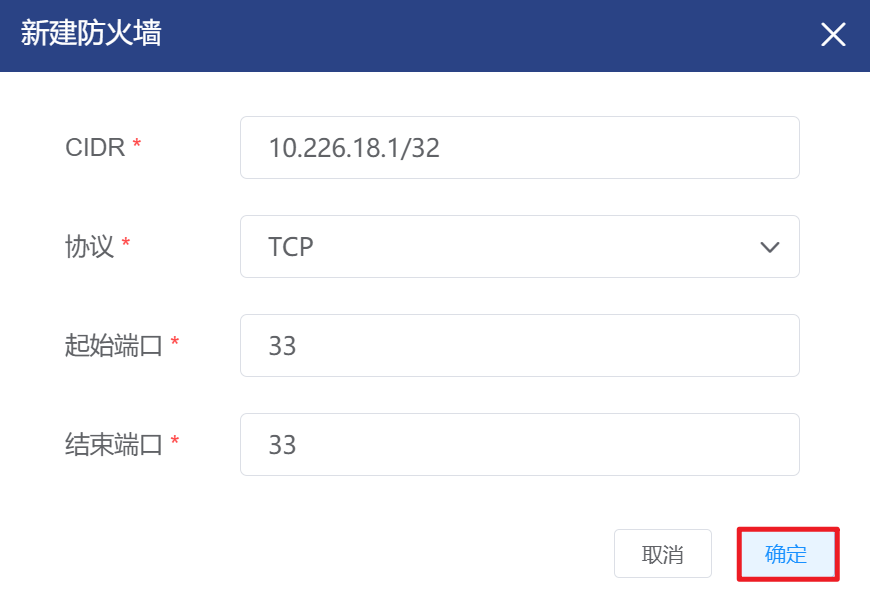

# 7.4.2.全局组件设置

超级管理员可以对平台应用插件的服务信息进行配置。当虚拟机启动后，插件的参数(服务IP，端口，其它参数等)会通过UserData的方式传递给虚拟机。

如果为组件配置了防火墙规则，用户创建隔离网络后，会自动依据配置的防火墙规则配置出口规则；用户创建VPC网络的ACL后，会自动依据配置的防火墙规则配置ACL的流出规则。

在“系统设置”菜单下选择左侧“系统参数管理”的导航菜单，之后点击“全局组件设置”的子菜单，即可看到全局组件设置的管理页面：

## 相关操作

HYPERX云管理平台支持超级管理员对全局组件进行管理，支持的功能如下：

- 编辑组件：编辑选定的组件；
- 编辑组件属性：编辑选定的组件属性；
- 添加防火墙：为选定组件添加一条防火墙规则；
- 编辑防火墙：编辑选定的防火墙规则；
- 删除防火墙：删除选定的防火墙规则。

操作入口如下：

- 系统设置→系统参数管理→全局组件设置

## 操作说明

### 编辑组件

① 在全局组件设置管理页面中，选择需要编辑的组件，在操作列中点击“编辑”按钮：

② 将会弹出“编辑组件”的操作提示框，修改组件的显示名和描述后，点击“确定”按钮即可更新组件信息：

### 编辑组件属性

① 在全局组件设置管理页面中，选择需要编辑属性的组件，在操作列中点击“设置属性”按钮：

②  将会进入“ 属性设置”的页面，选择需要编辑的属性，在操作列中点击“编辑”按钮：

③ 将会弹出“编辑属性”的操作提示框，修改属性、属性值和描述后，点击“确定”按钮即可更新组件属性：

> [!NOTE]
>
> - 编辑组件属性后，需要重启当前环境下的虚拟机，新属性才会生效。

### 防火墙规则的添加

① 在全局组件设置管理页面中，选择需要添加防火墙规则的组件，在操作列中点击“设置防火墙”按钮：

② 将会进入“ zabbix防火墙设置”的页面，点击“创建防火墙”按钮：

③ 将会弹出“ 新建防火墙”的操作提示框，填写CIDR、协议和起止端口后，点击“确定”按钮即可添加防火墙规则：

### 防火墙规则的编辑

① 在全局组件设置管理页面中，选择需要编辑防火墙规则的组件，在操作列中点击“设置防火墙”按钮：

② 将会进入“ zabbix防火墙设置”的页面，选择需要编辑的防火墙规则，点击操作列的“编辑”按钮：

③ 将会弹出“编辑防火墙”的操作提示框，修改防火墙的CIDR、协议和起止端口后，点击“确定”按钮即可更新防火墙规则信息：

### 防火墙规则的删除

① 在全局组件设置管理页面中，选择需要删除防火墙规则的组件，在操作列中点击“设置防火墙”按钮：

② 将会进入“ zabbix防火墙设置”的页面，选择需要删除的防火墙规则，点击操作列的“删除”按钮：

③ 将会弹出“删除防火墙”的操作提示框，点击“确定”按钮即可删除选定的防火墙规则：

