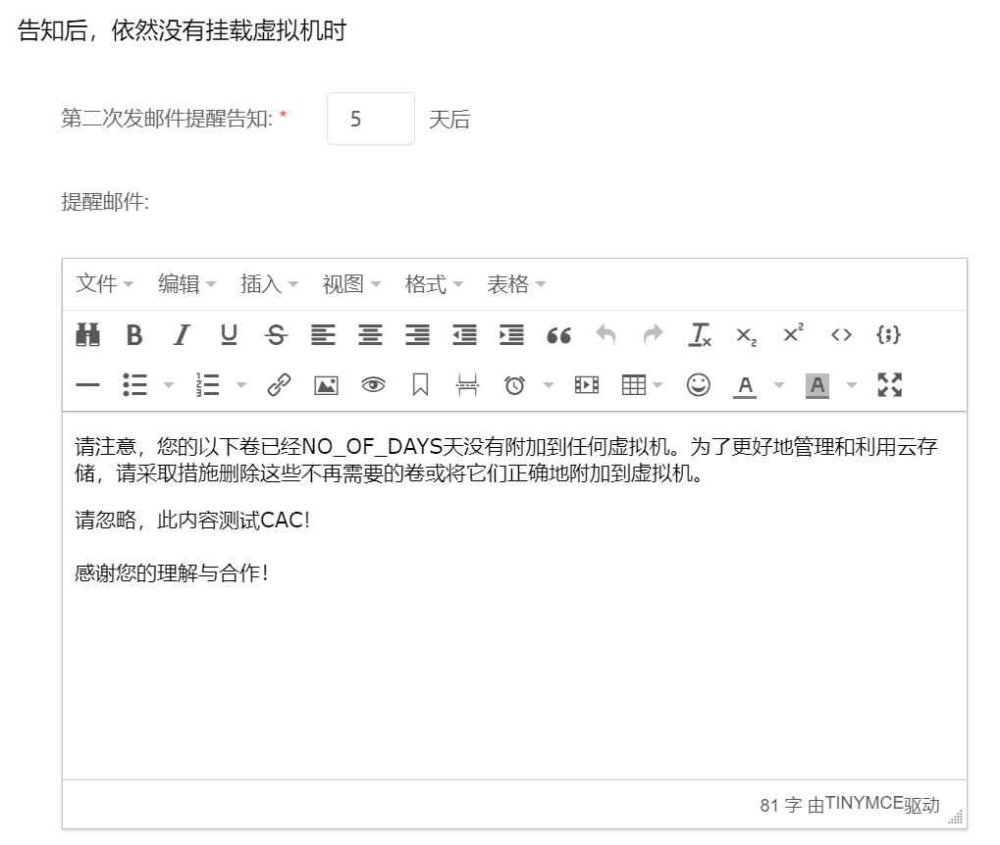

# 7.3.2.闲置虚拟磁盘提醒管理

在“系统设置”菜单下选择左侧“系统管理”的导航菜单，之后点击“闲置虚拟磁盘提醒”的子菜单，即可看到闲置虚拟磁盘提醒的管理界面：

## 相关操作

HYPERX云管理平台支持超级管理员对闲置的虚拟磁盘进行管理，支持的功能如下：

- 配置闲置虚拟磁盘提醒策略：对于未挂载虚拟机的虚拟磁盘，支持用户自定义通知策略向磁盘所有者或管理员发送邮件提醒，通知用户即使对闲置的磁盘资源进行处理。

操作入口如下：

- 系统设置→资源提醒&回收→闲置虚拟磁盘提醒

## 操作说明

### 配置闲置虚拟磁盘提醒策略

当用户的虚拟磁盘未挂载到虚拟机上时，可以选择用户配置两次邮件通知提醒。

① 当虚拟磁盘没有挂载虚拟机时，配置首次发送邮件提醒的时间和内容：

② 一段时间后，用户或管理员仍然没有对虚拟磁盘进行操作，可以配置第二次发送邮件提醒的时间和内容：

③ 该邮件通知默认发送给虚拟磁盘所有者，如需抄送给公司管理员或部门管理员，请勾选相应的复选框：

④ 当虚拟磁盘在设定天数后未挂载在虚拟机上时，相应的用户将会收到邮件提醒如下：

