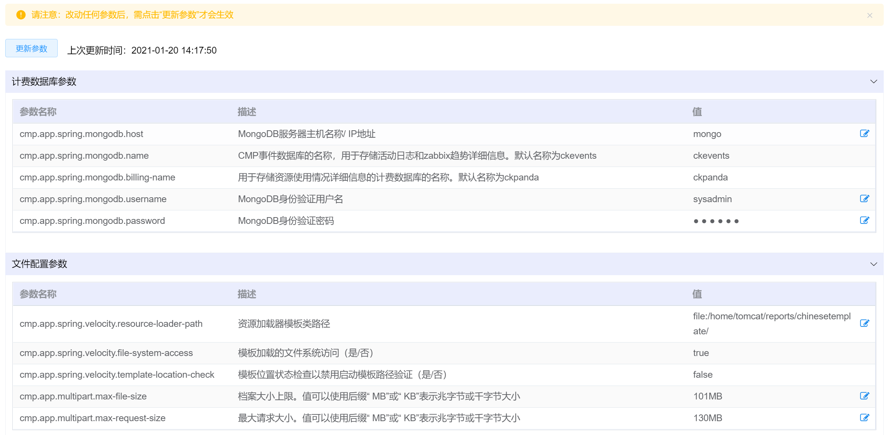
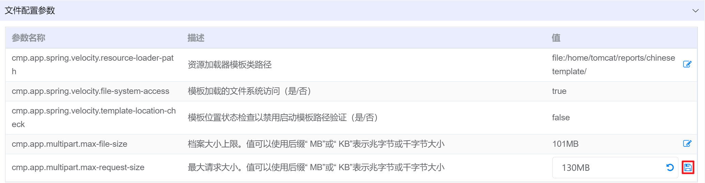
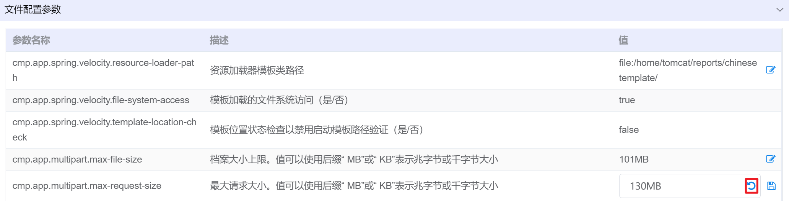
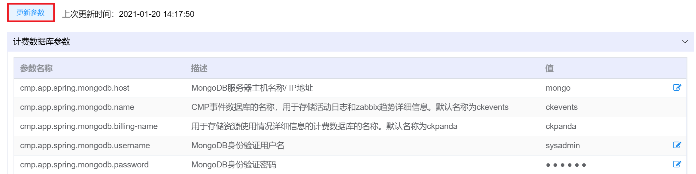

# 7.4.1.全局参数配置

超级管理员可以对平台的参数进行配置和更新，配置后云平台会重新启动，将新的参数写入底层。

在“系统设置”菜单下选择左侧“系统参数管理”的导航菜单，之后点击“全局参数配置”的子菜单，即可看到全局参数配置的管理界面：

用户可以对以下几个类型的参数进行编辑配置：

- 计费数据库参数
- 文件配置参数
- 消息队列参数
- CMP服务配置参数
- CEPH存储参数
- CMP日志级别参数
- 任务调度器
- CMP URL路径参数
- CMP文件路
- zabbix监控配置
- Kong API网关
- CMP常规配置

## 相关操作

HYPERX云管理平台支持超级管理员对全局参数进行管理，支持的功能如下：

- 编辑参数：编辑云平台的全局参数；
- 更新参数：对云平台的全局参数进行配置更新。

操作入口如下：

- 系统设置→系统参数管理→全局参数配置

## 操作说明

### 编辑参数

① 在全局参数配置管理界面中，选择需要配置的全局参数，点击操作列的“编辑”按钮：

② 可以在输入框中进行参数的修改：

- 如果保存修改，可以点击操作列的“保存”按钮，即可进行全局参数的修改：

- 如果放弃修改，可以点击操作列的“取消”按钮，即可取消对全局参数的修改：

> [!NOTE]
>
> - 执行任何改动参数的操作后，需要执行“更新参数”的操作改动才能生效；
> - 支持一次性配置好所有需要改动的全局参数后，统一进行参数的更新。

### 更新参数

① 在全局参数配置管理界面中，执行任何编辑参数的操作后，可以点击“更新参数”的按钮：

② 将会弹出“更新确认”的操作提示框，点击“确定”按钮，即可进行全局参数的更新：

> [!NOTE]
>
> - 执行更新参数的操作时，需要一定时间对相关平台服务进行重启，会强制将所有用户登出平台。