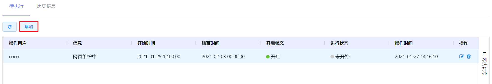
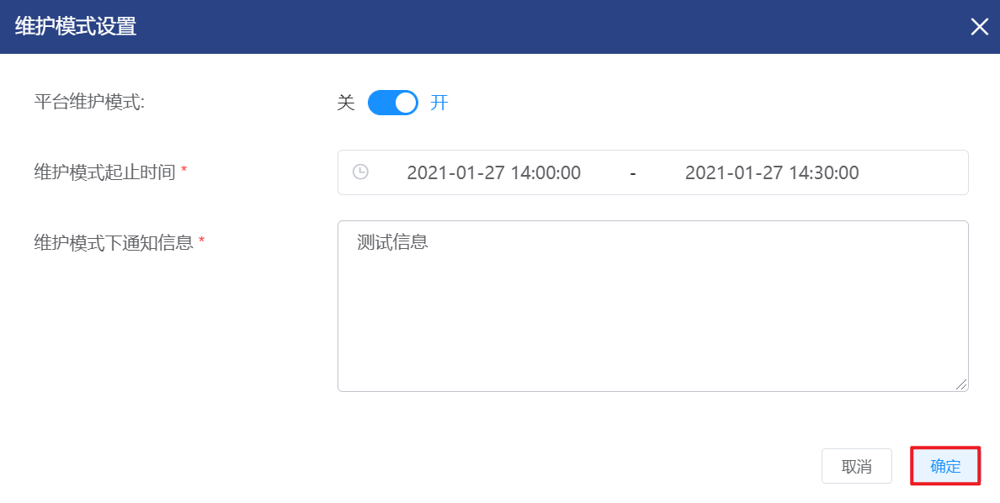
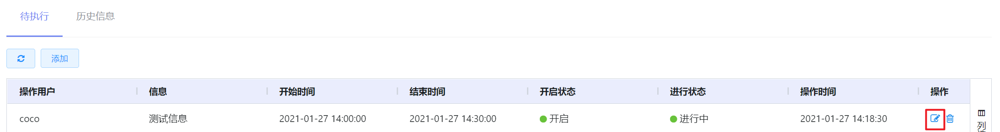
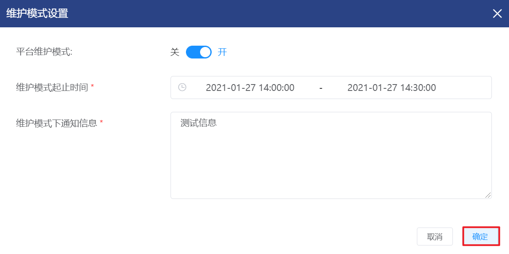
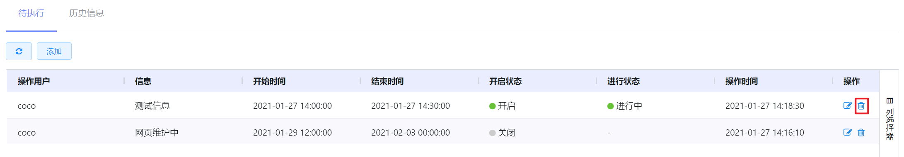

# 7.2.6.维护模式设置

云平台支持管理员维护信息通知，当维护条件时平台将进入维护模式，系统将维护信息在登录页面顶部高亮展示，非超管用户将不能正常登录平台。

在“系统设置”菜单下选择左侧“平台系统配置”的导航菜单，之后点击“维护模式设置”的子菜单，即可看到维护模式设置的管理界面：

当满足以下条件时，平台将进入维护模式：

- 平台维护模式状态为“开启“；
- 当前时间在维护信息的开始时间和结束时间区间内。

## 相关操作

HYPERX云管理平台支持超级管理员对维护信息进行配置和管理，支持的功能如下：

- 创建维护模式信息：创建维护模式信息，支持配置维护模式状态、起止时间和通知内容等信息；
- 编辑维护模式信息：编辑维护模式的状态、起止时间和通知内容等信息；
- 删除维护模式信息：删除选定的维护模式信息。

操作入口如下：

- 系统设置→平台系统配置→维护模式设置

 ## 操作说明

### 创建维护模式信息

① 在维护模式设置的管理界面中，点击“添加”按钮：

② 将会弹出”维护模式设置“的操作提示框，填写维护模式状态、起止时间和通知信息等信息后，点击“确定”按钮即可添加维护模式信息：

③当满足条件时， 系统会将维护信息在登录页面顶部高亮展示的效果如下：

④ 非超管用户访问平台时显示的告警如下：

### 编辑维护模式信息

① 在维护模式设置的管理界面中，选择需要编辑的维护模式信息，点击操作列的“编辑”按钮：

② 将会弹出“维护模式设置”的操作提示框，编辑维护模式的状态、起止时间和通知内容等信息后，点击“确定”按钮更新维护模式信息：

### 删除维护模式信息

① 在在维护模式设置的管理界面中，选择需要删除的维护模式信息，点击操作列的“删除”按钮：

② 将会弹出“删除”的操作提示框，点击“确定”按钮，删除选定的维护模式信息：

