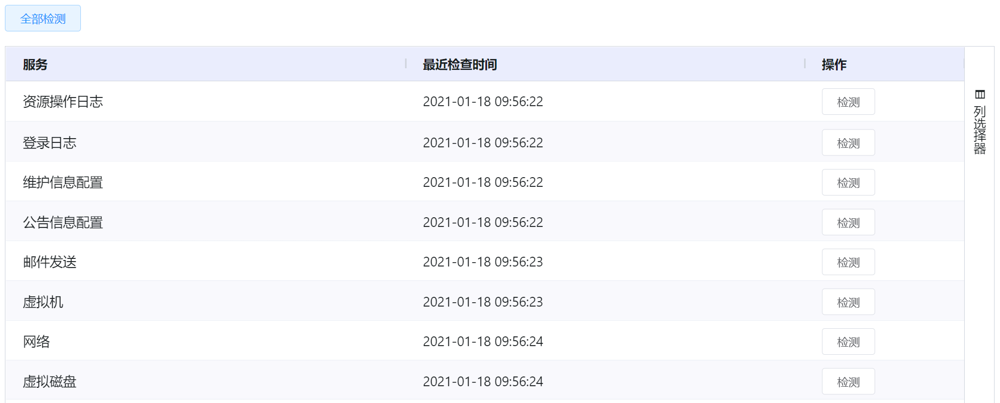
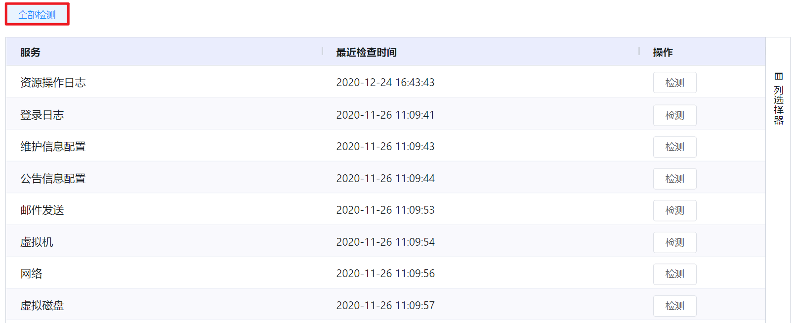

# 7.4.4.平台服务健康检测

在“系统设置”菜单下选择左侧“系统参数管理”的导航菜单，之后点击“平台服务健康检测”的子菜单，即可看到平台服务健康检测的管理界面：

用户可以平台中以下服务的健康状态进行检测，按需修复：

- 资源操作日志
- 登录日志
- 维护信息配置
- 公告信息配置
- 邮件发送
- 虚拟机
- 网络
- 虚拟磁盘 

## 相关操作

HYPERX云管理平台支持超级管理员对平台服务的健康状态进行管理，支持的功能如下：

- 逐条检测：检查选定平台服务的健康状态；
- 批量检测：批量检查平台中所有服务的健康状态。

操作入口如下：

- 系统设置→系统参数管理→平台服务健康检测

## 操作说明

### 逐条检测

① 在平台服务的健康状态管理界面中，选择需要检测的平台服务，点击操作列的“检测”按钮：

② 即可对选中的平台服务进行健康检测，在操作列显示该平台服务的健康状态：

### 批量检测

① 在平台服务的健康状态管理界面中，点击“全部检测”按钮：

② 将会批量对列表中的平台服务进行检测，并在操作列中显示所有服务的健康状态：

> [!NOTE]
>
> - 当平台服务出现异常时，对该服务执行平台健康检测，将会在操作列中显示该服务的状态为“异常”。
>

