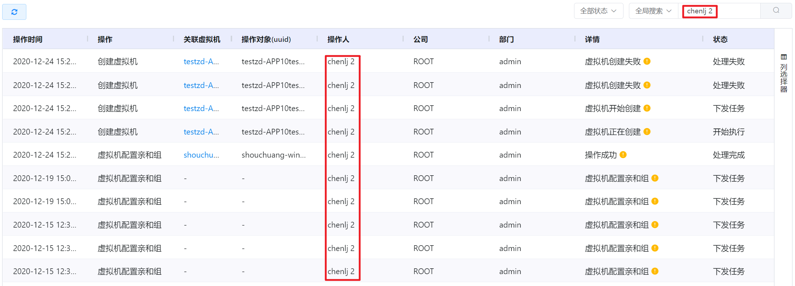
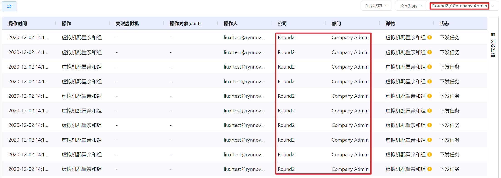
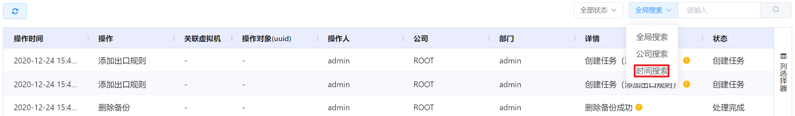
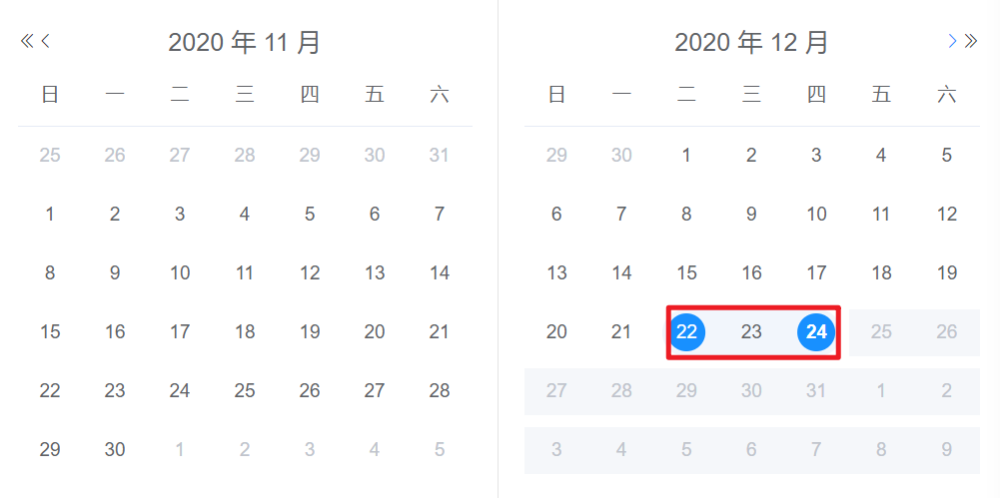
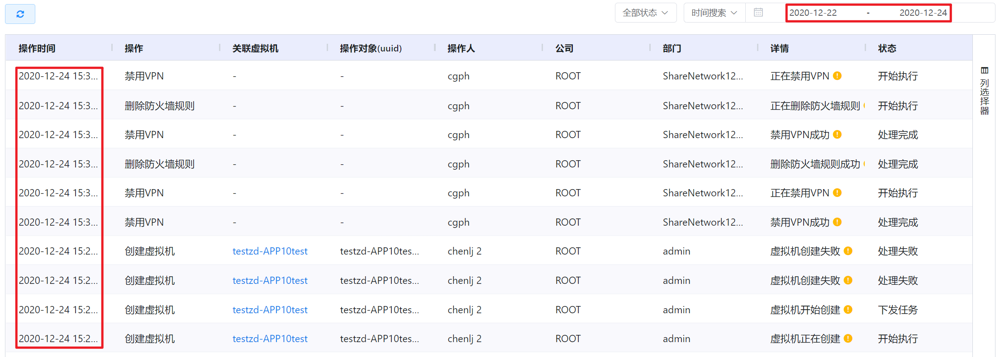

# 7.1.2.资源操作日志管理

云平台支持管理员查看所辖用户在平台内对虚拟资源执行操作的日志信息。

在“系统设置”菜单下选择左侧“平台日志管理”的导航菜单，之后点击“资源操作日志”的子菜单，即可看到资源操作日志的管理界面：

云平台中，资源操作日志的状态一般有五种：

- 创建任务：显示成功创建任务所生成的通知日志，如“创建任务（创建备份）”日志；
- 下发任务：显示成功下发操作所生成的通知日志，如“虚拟机开始创建”日志；
- 开始执行：显示正在进行操作所生成的通知日志，如“ 虚拟机正在创建”日志；
- 处理完成：显示操作已经处理完成所生成的通知日志，如“ 虚拟机创建成功”日志；
- 处理失败：显示未成功执行操作所生成的通知日志，如“虚拟机创建失败”日志。

> [!NOTE]
>
> - 超级管理员可以看到平台中全部用户的的资源操作日志；
> - 公司管理员可以看到公司内全部用户的的资源操作日志；
> - 部门管理员可以看到部门内全部用户的的资源操作日志；
> - 普通用户可以看到自己的资源操作日志。

## 相关操作

HYPERX云管理平台支持管理员查看用户的资源操作日志，支持的功能如下：

- 状态筛选：根据日志的状态筛选需要查看的资源操作日志；
- 全局搜索：根据日志记录的操作人全局搜索资源操作日志；
- 公司搜索：根据所在的组织搜索该组织下的资源操作日志；
- 时间搜索：根据选定的时间区间筛选需要查看的资源操作日志。

操作入口如下：

- 系统设置→平台日志管理→资源操作日志

## 操作说明

### 全局搜索

① 在资源操作日志管理界面中，选择“全局搜索”筛选器：

② 在搜索框中输入操作人、关联虚拟机、操作对象(uuid)的关键字，点击“搜索”按钮，即可筛选出搜索结果：

> [!NOTE]
>
> - 如需清除筛选项，可以点击搜索条件右侧的清除按钮。

### 公司搜索

① 在资源操作日志管理界面中，选择“公司搜索”筛选器：

② 在搜索框中选择组织后，即可筛选出搜索结果：

### 时间搜索

① 在资源操作日志管理界面中，选择“时间搜索”筛选器：

② 在日期选择器中选择需要搜索资源操作日志的时间区间：

③ 即可筛选出所选时间区间的搜索结果：

> [!NOTE]
>
> - 如果时间选择器中的起始时间和终止时间选择的同一天，筛选出的即为当天的资源操作日志；
> - 如需清除筛选项，可以点击终止时间右侧的清除按钮。