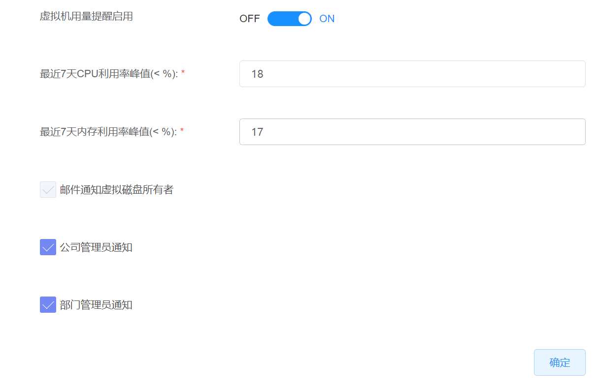
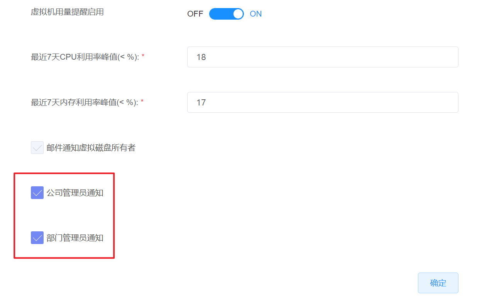
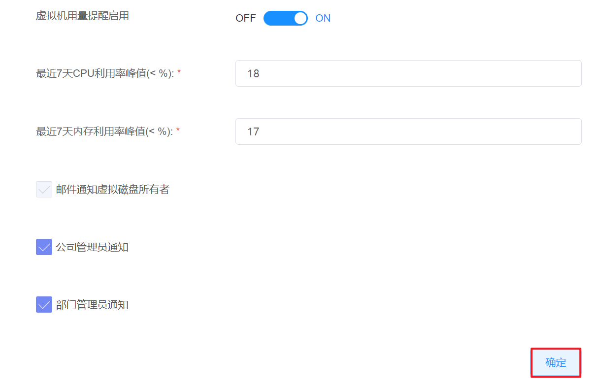
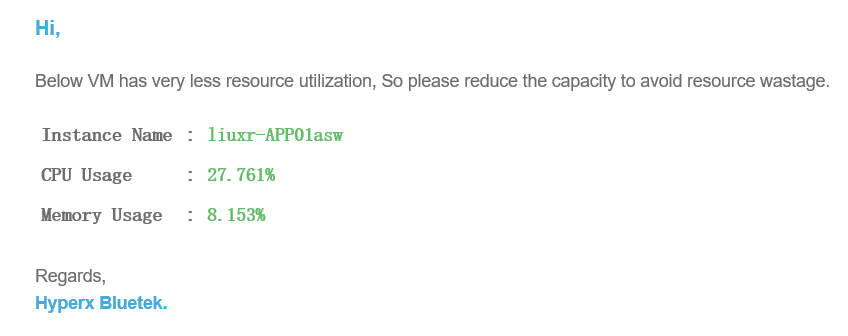
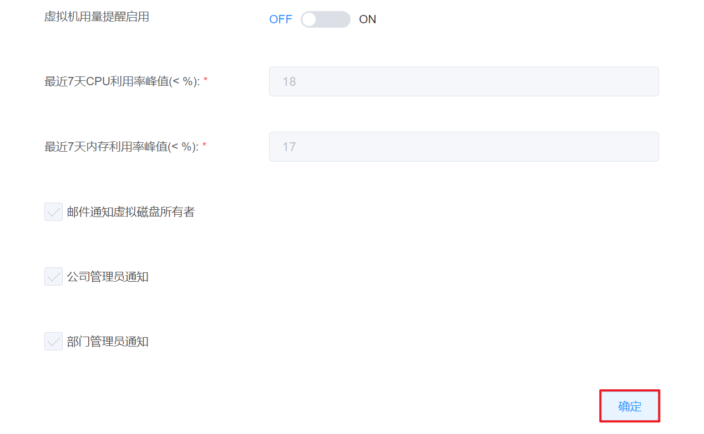

# 7.3.3.虚拟机用量提醒管理

在“系统设置”菜单下选择左侧“资源提醒回收”的导航菜单，之后点击“虚拟机用量提醒”的子菜单，即可看到虚拟机用量提醒的管理界面：

## 相关操作

HYPERX云管理平台支持超级管理员对虚拟机用量提醒进行管理，支持的功能如下：

- 配置虚拟机用量提醒：支持为用量过低的虚拟机配置通知提醒；
- 关闭虚拟机用量提醒：关闭对低用量虚拟机的通知提醒。

操作入口如下：

- 系统设置→资源提醒&回收→虚拟机用量提醒

## 操作说明

### 配置虚拟机用量提醒

① 在虚拟机用量提醒的管理界面中，点击“虚拟机用量提醒启用”的启用按钮，开启虚拟机用量提醒：

② 配置虚拟机CPU和内存利用率的提醒阈值，每天0:30分平台对所有的虚拟机用量进行检查。当虚拟机用量不足设置的阈值时，将会发送邮件通知指定的用户：

③ 本邮件通知默认发送给虚拟机所有者，如果需要抄送给管理员，需要勾选“公司管理员通知”或“部门管理员通知”按钮：

④ 配置相关信息后，点击“确定”按钮，即可启用虚拟机用量提醒策略：

⑤ 当虚拟机用量不足所设置的阈值后，相关用户将会收到邮件提醒：

### 关闭虚拟机用量提醒

① 在虚拟机用量提醒的管理界面中，点击“虚拟机用量提醒启用”的关闭按钮，关闭虚拟机用量提醒：

② 配置相关信息后，点击“确定”按钮，即可关闭虚拟机用量提醒策略：

