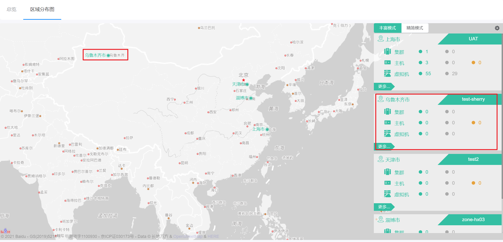

# 7.2.8.区域地理位置管理

在“系统设置”菜单下选择左侧“平台系统配置”的导航菜单，之后点击“区域地理位置”的子菜单，即可看到区域地理位置的管理界面：

## 相关操作

HYPERX云管理平台支持超级管理员对区域所在的地理位置进行管理，支持的功能如下：

- 配置资源所在区域：配置各个区域所在的地理位置，在区域分布图中查看各个区域的地理分布情况。

操作入口如下：

- 系统设置→平台系统配置→区域地理位置

## 操作说明

### 配置资源所在区域

① 在区域地理位置的管理界面中，选择需要配置地理位置的区域，点击操作列的“修改”按钮：

② 在弹出的操作提示框中选择当前区域所在的地理位置后，点击“确定”按钮：

③ 在总览界面的区域分布图菜单中，可查看区域的地理分布情况：

