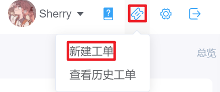
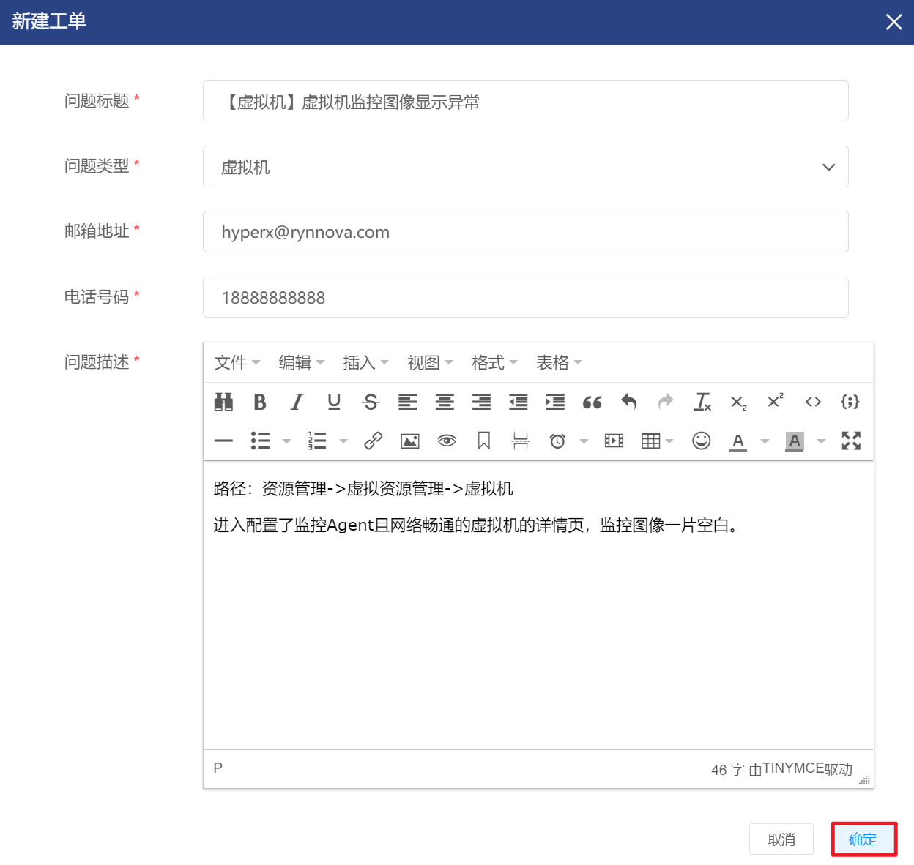
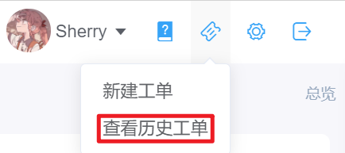

# 8.2.工单

当超级管理员和公司管理员在HCM平台中遇到问题，支持以工单的形式将问题提交给HCM运维工单接口处理。

## 相关操作

HYPERX云管理平台支持用户提交和查看工单，支持的功能如下：

- 新建工单：支持超级管理员和公司管理员在平台中提交工单；
- 查看历史工单：支持超级管理员和公司管理员查看平台或公司的历史工单内容。

## 操作说明

### 新建工单

① 点击云平台右上角的“工单支持”菜单，选择“新建工单”菜单：

② 将会弹出“新建工单”的操作提示框，填写相关信息后点击“确定”按钮，即可向HCM的工单系统递交工单：

### 查看历史工单

① 点击云平台右上角的“工单支持”菜单，选择“查看历史工单”菜单：

② 将会进入历史工单的管理界面：

③ 选择需要查看详细信息的工单，点击操作列的“查看详情”按钮：

④ 即可查看选定历史工单的详情信息：

> [!NOTE]
>
> - 超级管理员可以查看整个平台的历史工单，公司管理员只能查看本公司的历史工单。