# 快速入门手册

## 用户登录

1.用户使用谷歌或火狐浏览器访问平台，可以看到登录界面：

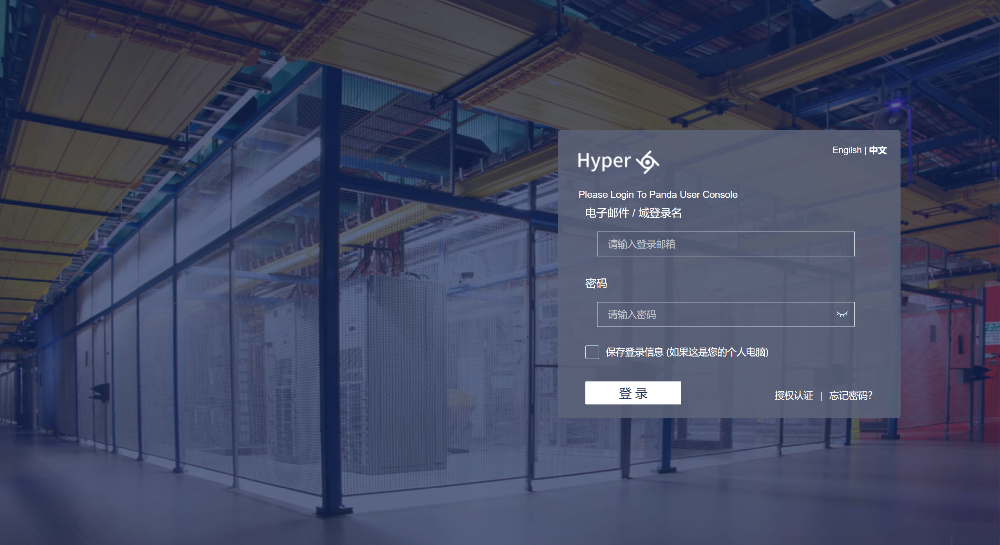

2.输入用户名和密码后即可登录云平台。

> *注：
>
> - 如果用户不知道平台的URL、管理员用户名密码，请联系管理员获取；
> - 如果平台没有通过授权认证，请联系管理员获取平台license文件；
> - 推荐使用Chrome（谷歌）或FireFox（火狐）浏览器访问平台。

## 上传镜像

镜像是可用于启动虚拟机的操作系统映像，ISO是包含操作系统数据可启动介质的磁盘映像。

用户在创建虚拟机前，需要上传镜像或ISO镜像至云平台用于安装虚拟机的操作系统。

用户可以通过文件上传或URL上传的方式在云平台中创建镜像或ISO镜像，在本手册中，以通过URL创建镜像为例。

路径：资源管理->区域管理->镜像

1.点击“创建公共镜像”按钮，选择“创建镜像”按钮；

2.写镜像的相关信息，确认选择框后，即可实现镜像的创建。

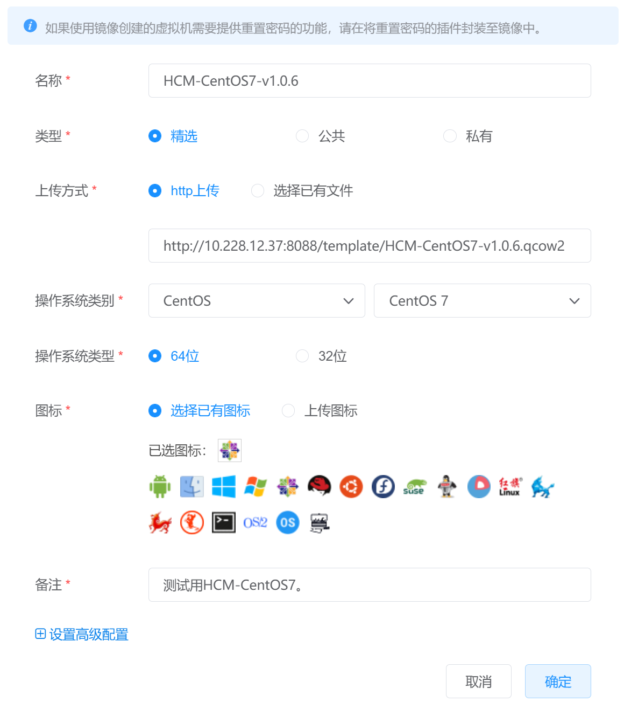

> *注：
>
> - 镜像类型选项即为该镜像的适用范围：
>   - 如果选择有“精选”或“公共”选项，则该镜像可供全平台用户使用；
>   - 如果选择“私有选项”，则该镜像仅自己可用(非超管用户只支持上传私有镜像)；
> - 如果选择URL方式上传，需要将计划上传的镜像或ISO文件存储在支持HTTP协议的服务器上，需要在URL处填写镜像存放的URL，其URL的命名标准为“http://服务器的IP地址/镜像文件名”；如果选择文件上传，请查阅用户手册的“镜像管理”章节；
> - 操作系统类别即为该镜像关联的操作系统版本；
> - 操作系统类型即为该镜像操作系统的架构，可选择32位或64位，默认为64位；
> - 如果需要配置镜像的“虚拟化技术”和“格式”，可以点击“设置高级配置”按钮对之进行配置：
>
> 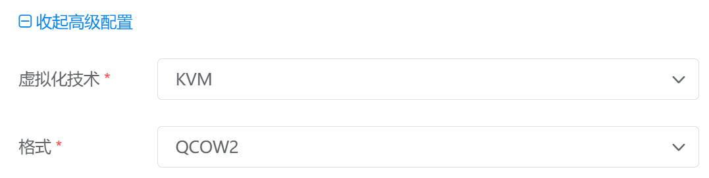

## 创建网络

云平台的中的网络类型分为共享、隔离、VPC三种；

共享网络：属于相同VLAN，由虚拟路由提供DHCP、DNS服务，该网络下的虚拟机网关直指物理网关。

隔离网络：属于不同的VLAN，彼此之间通过VLAN进行隔离，通过对虚拟路由实现与外结通信；

VPC网络：VPC是多层子网的容器，子网见通过虚拟机路由器互通，每个子网之前通过VLAN进行隔离。

路径：资源管理->网络->基础网络

1.点击“创建网络”按钮，选择“创建共享网络”按钮；

2.填写网络的相关信息，确认选择框后，即可实现共享网络的创建。

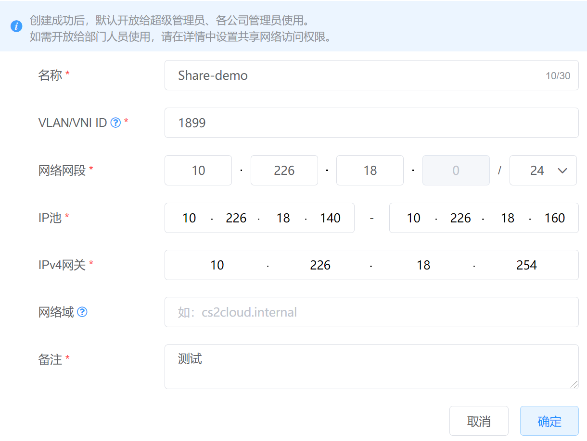

> *注：
>
> - 创建网络时，以用户规划的真实网络情况为基础或部署人员给出的建议填写；
> - 如果想要创建其他类型的网络，请查阅用户手册的“网络管理-创建共享网络”章节。

## 创建规格

### 资源规格组

资源规格组是用户创建虚拟机、虚拟磁盘时选择的规格的集合，用于进行规格的分类归集。

虚拟机规格和磁盘规格只有归集到规格组中才能被使用，所以在创建规格前，需要创建对应的资源规格组。

#### 创建虚拟机规格组

一级虚拟机规格组可以关联多个二级虚拟机规格组，二级虚拟机规格组可以关联多个虚拟机规格。

路径：资源管理->区域管理->资源规格->资源规格组

1.点击“创建资源规格组”按钮；

2.选择规格类型为“虚拟机规格”，层级为“虚拟机规格二级”，填写相关信息，确认选择框后，即可实现“二级虚拟机规格”的创建。

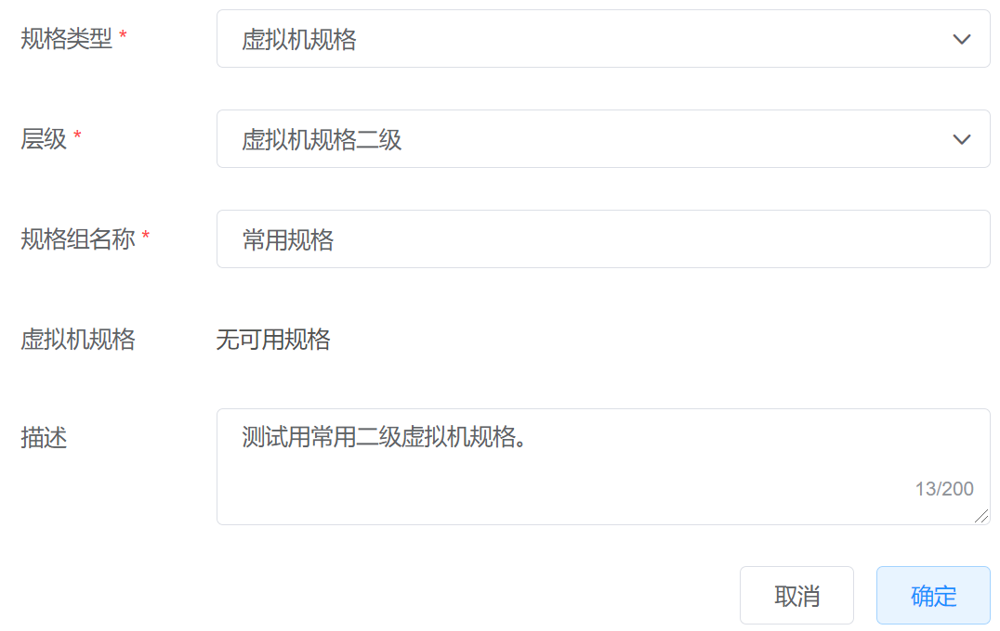

3.创建二级规格后，再次点击“创建资源规格组”按钮；

4.选择规格类型为“虚拟机规格”，层级为“虚拟机规格一级”，勾选关联刚刚创建的二级规格组，填写相关信息，确认选择框后，即可实现一级虚拟机规格的创建。

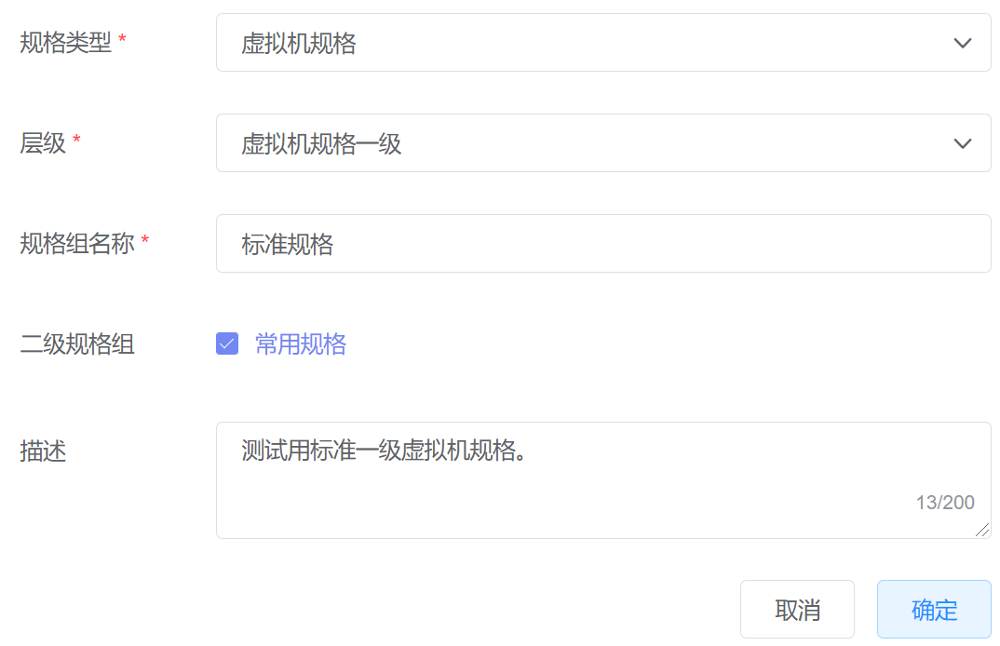

#### 创建磁盘规格组

磁盘规格组可以关联多个磁盘规格。

路径：资源管理->区域管理->资源规格->资源规格组

1.点击“创建资源规格组”按钮；

2.选择规格类型为“磁盘规格”，填写相关信息，确认选择框后，即可实现磁盘规格的创建。

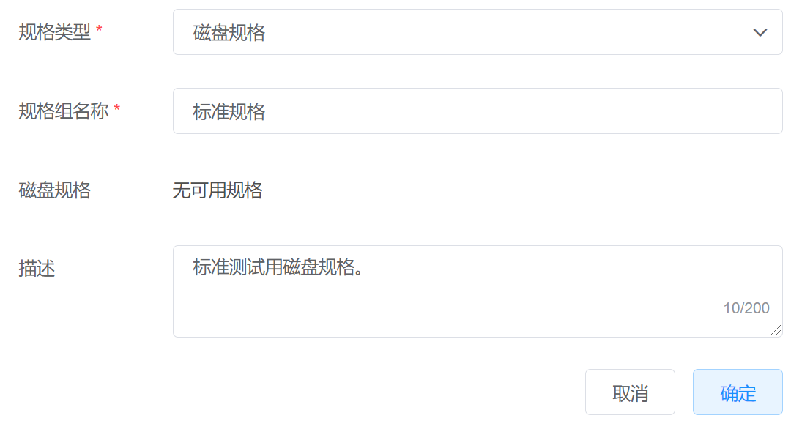

### 虚拟机规格

虚拟机规格是用户创建虚拟机和虚拟机调整配置所需要的规格方案，管理员可以创建多个虚拟机规格供用户选择。

路径：资源管理->区域管理->资源规格->虚拟机规格

1.点击“创建虚拟机规格”按钮；

2.在“创建虚拟机规格”的界面中，需要依次执行创建虚拟机规格、虚拟机规格定价这2个操作。

① 创建虚拟机规格——配置虚拟机规格的名称、资源域、使用范围等信息。设置界面如下：

> *注：
>
> - 如果选择“使用范围”为“全局”，则该虚拟机规格支持整个平台使用，如果选择“使用范围”为“指定公司”，则该虚拟机规格只支持选定的公司使用；
> - 虚拟机规格加入规格组后，才能被使用，支持在创建虚拟机规格时指定资源规格组；
> - 如果选择规格类型为“自定义范围”，支持自定义虚拟机规格的内存、vCPU、速度的大小区间；
> - 如需设置高级配置，请查阅用户手册的“虚拟机规格管理-创建虚拟机规格”章节。

② 虚拟机规格定价——配置各个域中虚拟机的价格。设置界面如下：

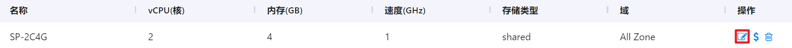

3.填写相关信息，确认选择框后，即可实现虚拟机规格的创建。

### 磁盘规格

磁盘是用户创建虚拟磁盘所需要的规格方案，管理员可以创建多个磁盘规格供用户选择。

路径：资源管理->区域管理->资源规格->磁盘规格

1.点击“创建磁盘规格”按钮；

2.在“创建磁盘规格”的界面中，需要依次执行创建磁盘规格、磁盘规格定价这2个操作。

① 创建磁盘规格——配置磁盘规格的名称、存储类型、存储标识等信息。设置界面如下：

> *注：
>
> - 如果选择“使用范围”为“全局”，则该磁盘规格支持整个平台使用，如果选择“使用范围”为“指定公司”，则该磁盘规格只支持选定的公司使用；
> - 磁盘规格加入规格组后，才能被使用，支持在创建磁盘规格时指定磁盘规格组；
> - 如果选择规格类型为“自定义范围”，支持自定义磁盘规格的容量的大小区间，目前支持自定的容量区间为10GB-32TB；
> - 如需设置高级配置，请查阅用户手册的“虚拟机磁盘管理-创建磁盘规格”章节。

② 磁盘规格定价——配置各个域中磁盘的价格。设置界面如下：

3.填写相关信息，确认选择框后，即可实现磁盘规格的创建。

## 虚拟机操作

### 创建虚拟机

在本手册中，以创建4C4G，Ubuntu操作系统，使用密码登录、共享网络配置的虚拟机为例。

路径：资源管理->虚拟资源管理->虚拟机

1.点击“创建虚拟机”按钮；

2.将会进入创建虚拟机的界面，在虚拟机创建界面中包含基本信息、镜像、配置、网络配置、创建这5个步骤。

① 基本信息——设置虚拟机所有者、数量、资源标签、名称、回收时间和相关备注信息，设置界面如下：

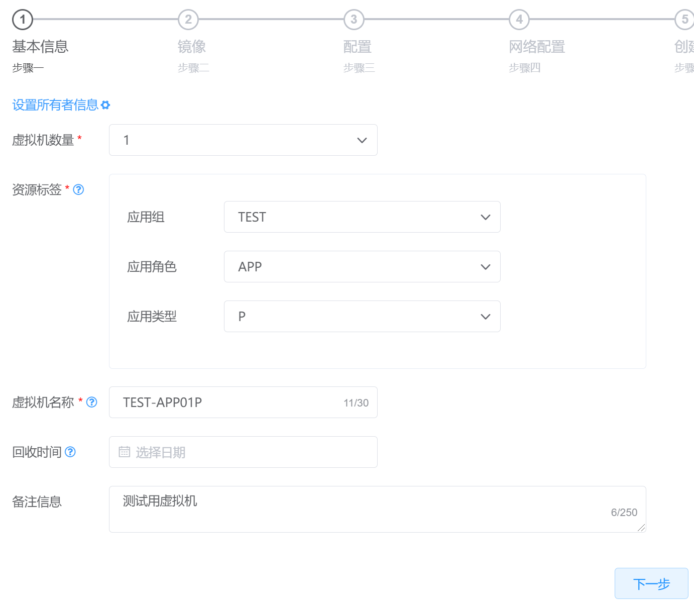

> *注：
>
> - 批量创建虚拟机支持的最大创建数量为10台；
> - 单台虚拟机时，虚拟机名称支持自定义；批量创建虚拟机时，虚拟机名称根据资源标签自动生成。
>   - 自动生成：默认为“应用组-应用角色”+“顺序编号”+“应用类型”+“-公司序号”。若创建单台虚拟机支持自定义名称，若创建多台虚拟机将自动命名；
>   - 自定义：由用户自主命名，支持英文大小写、数字、中文以及下划线，虚拟机名称应控制在2-20个字符内；
> - 用户可以自定义虚拟机的回收时间，平台将会在虚拟机到期前后依据虚拟机所在部门配置的虚拟机回收策略处理。

② 镜像——选择虚拟机加载的镜像，设置界面如下：

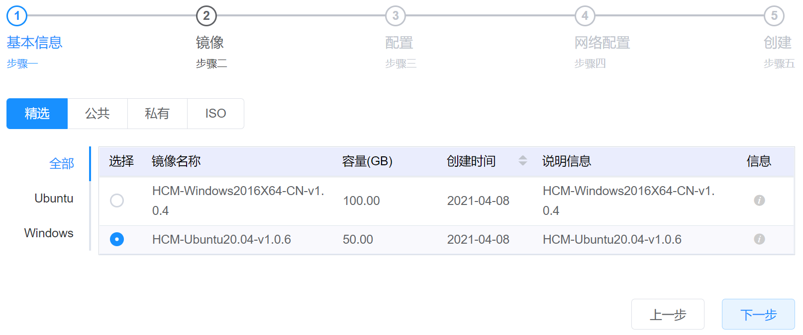

③ 配置——选择虚拟机的配置规格，挂载虚拟磁盘，配置亲和组或启用专用主机功能，设置界面如下：

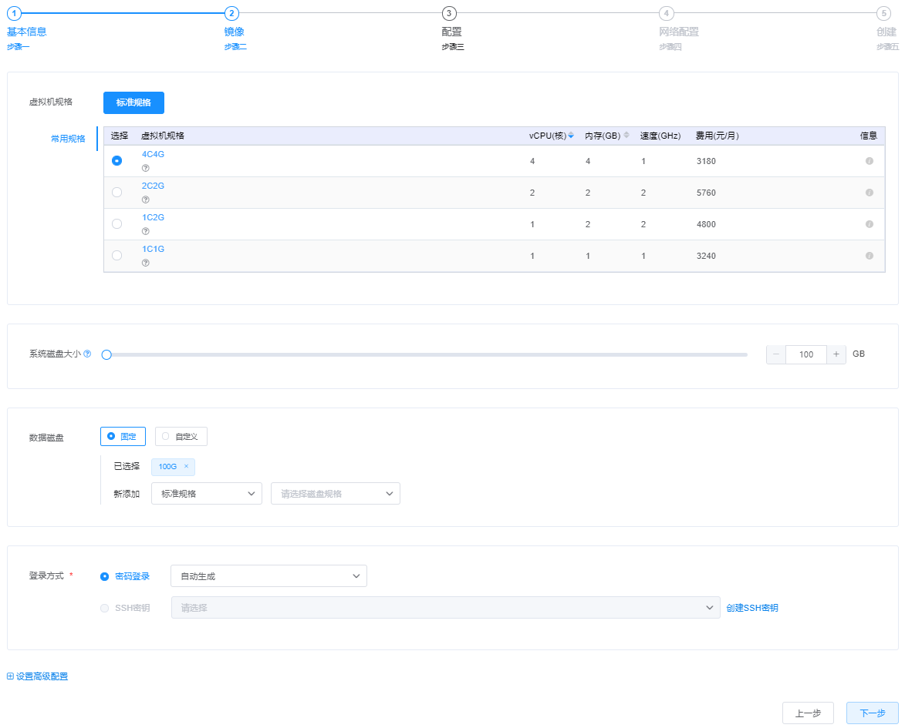

> *注：
>
> - 如果用户选择Linux操作系统的镜像，则支持选择虚拟机的登录方式，密码登录或密钥对登录；
> - 如需配置高级配置内容，请查阅用户手册的“虚拟机管理-创建虚拟机”章节。

④ 网络配置——配置虚拟机的网络信息，支持自动分配或手动设定，设置界面如下：

> *注：
>
> - 若对网络无特殊要求，选择“自动分配”即可，平台会自动使用合适的网络创建虚拟机；
> - 如果需要执行指定IP地址或MAC地址等高阶操作，请查阅用户手册的“虚拟机管理-穿件Gina虚拟机”章节。

⑤ 创建——显示配置详情如下，点击“创建虚拟机”按钮，即可完成虚拟机的创建。

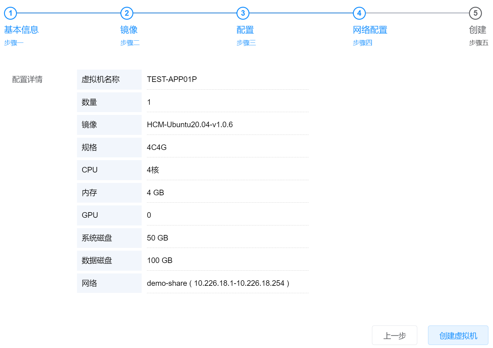

> *注：
>
> - 在创建虚拟机的过程中，右侧有当前部门可用配额和创建虚拟机的费用统计悬浮框，用户可以据此调整虚拟机的配置：
>
> 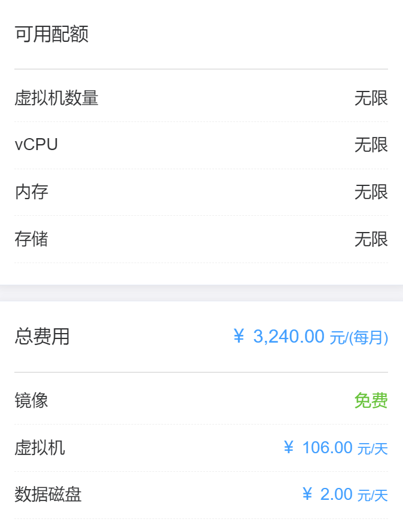

### 登录虚拟机

在本手册中，以登录方式为“密码登录”的虚拟机为例。

路径：资源管理->虚拟资源管理->虚拟机

1.点击虚拟机操作列的“显示密码”按钮，查看虚拟机密码：

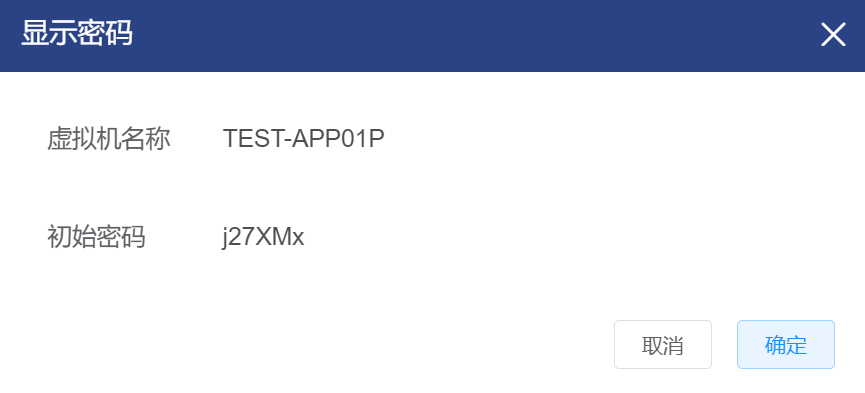

2.点击虚拟机操作列的“控制台”按钮，查看虚拟机控制台，可以输入平台提供的密码登入操作系统：

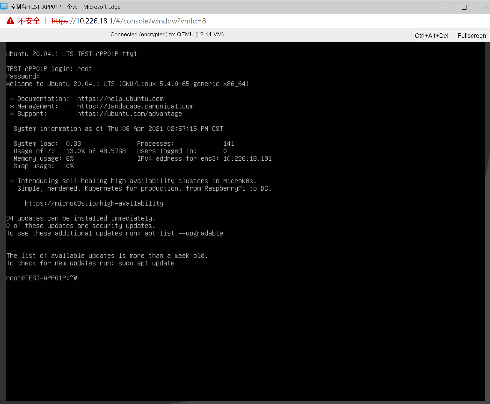

> *注：
>
> - 云平台只支持管理使用镜像创建的虚拟机的密码，不支持管理使用ISO镜像创建的虚拟机的密码。

### 快照管理

虚拟机快照用于数据日常备份、误操作恢复、系统崩溃还原等场景。在修改系统关键文件、重装操作系统前，您可以创建虚拟机快照，以提高操作容错率。

#### 创建快照

路径：资源管理->虚拟资源管理->虚拟机->详情页“快照”选项卡

1.点击“创建快照”按钮；

2.填写快照的名称和备注信息后，点击“确定”按钮，即可实现快照的创建。

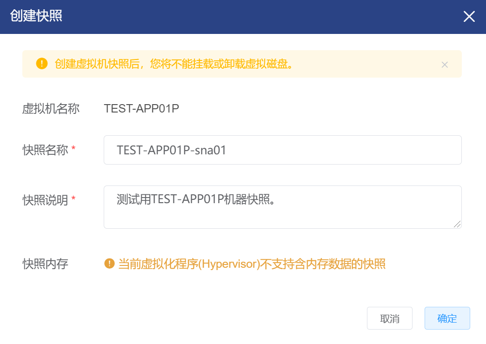

#### 回滚快照

路径：资源管理->虚拟资源管理->虚拟机->详情页“快照”选项卡

1.选择需要回滚的快照，点击操作列的“回滚”按钮；

2.确认选择框后，即可实现快照的回滚。

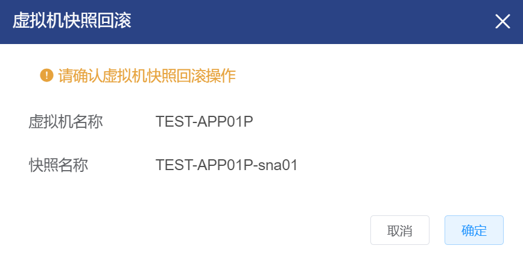

#### 删除快照

路径：资源管理->虚拟资源管理->虚拟机->详情页“快照”选项卡

1.选择需要删除的快照，点击操作列的“删除”按钮；

2.确认选择框后，即可实现快照的删除。

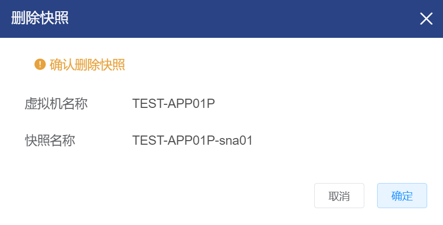

> *注：
>
> - 如需回滚快照数据，需要保证虚拟机处于关闭状态；
> - 若虚拟机所在主机使用KVM虚拟化时，不支持使用快照内存；如果勾选了快照内存，则可能消耗较长时间；
> - 如果您需要设置定时快照，由系统自动在您预设的时间内创建快照，依据预置的最大保留数量清理旧的定时快照，请查阅用户手册的“虚拟机管理-删除虚拟机快照”章节。

###  磁盘管理

云平台支持对虚拟机的数据磁盘进行热挂载、热卸载和热扩容，即在虚拟机开状态对虚拟磁盘执行相关操作。

#### 创建并挂载磁盘

路径：资源管理->虚拟资源管理->虚拟机->详情页“虚拟磁盘”选项卡

1.点击“创建虚拟磁盘”按钮；

2.填写磁盘名称并选择磁盘规格后，点击“确定”按钮，即可实现虚拟磁盘的创建和挂载。

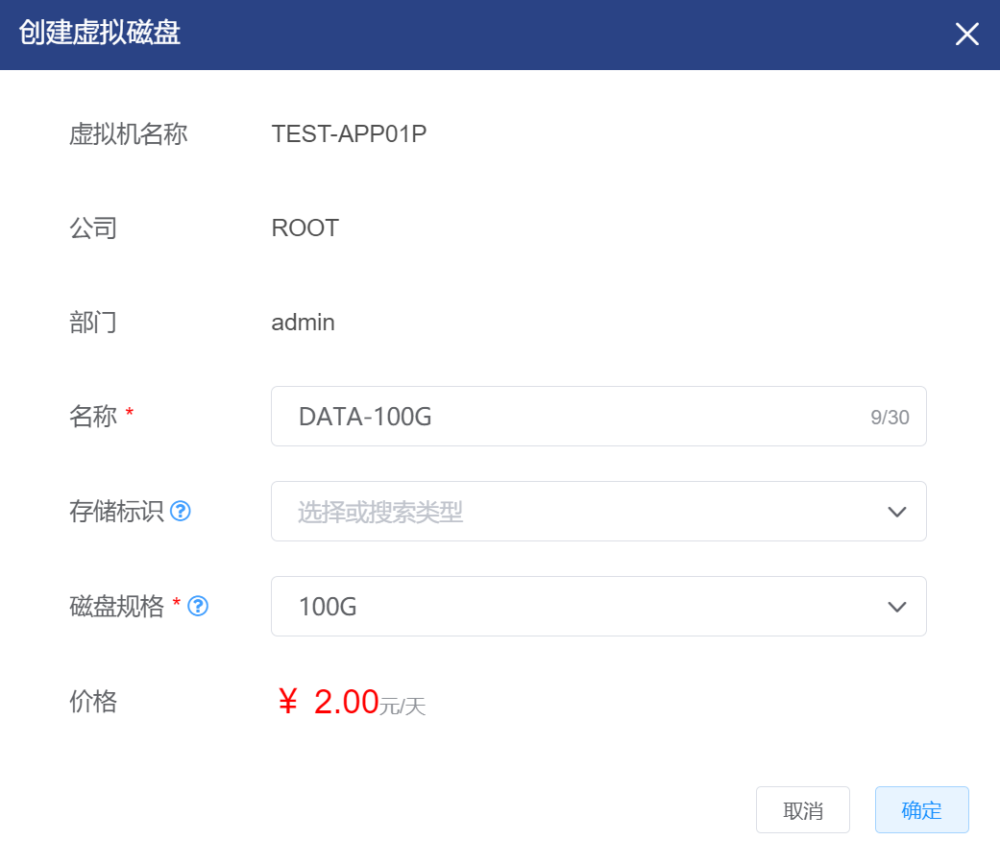

#### 卸载磁盘

路径：资源管理->虚拟资源管理->虚拟机->详情页“虚拟磁盘”选项卡

1.选择需要卸载的虚拟磁盘，点击操作列的“卸载”按钮；

2.确认选择框后，即可实现虚拟磁盘的卸载。

#### 备份磁盘

路径：资源管理->虚拟资源管理->虚拟机->详情页“虚拟磁盘”选项卡

1.选择需要备份的虚拟磁盘，点击操作列的“单次备份”按钮；

2.填写磁盘备份的名称和备注后，点击“确定”按钮，即可实现虚拟磁盘备份的创建。

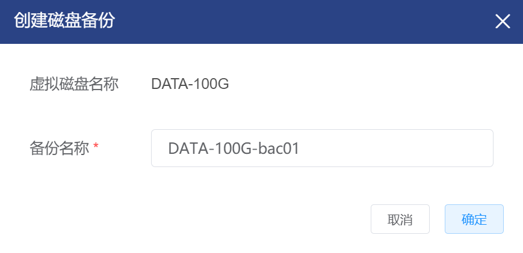

#### 调整磁盘容量

路径：资源管理->虚拟资源管理->虚拟磁盘

1.选择需要调整容量的虚拟磁盘，点击操作列的“调整磁盘容量”按钮；

2.选择新磁盘规格后，点击“确定”按钮，即可实现虚拟磁盘的扩容。

> *注：
>
> - 如果需要挂载平台现有的虚拟磁盘，请查阅用户手册的“虚拟机管理-挂载虚拟磁盘”章节；
> - 如果虚拟机有快照或定时快照，则不支持挂载或卸载虚拟磁盘；
> - 虚拟机的系统磁盘用于安装操作系统，若卸载系统磁盘虚拟机将无法正常运行，所以平台不支持卸载系统磁盘；
> - 如果您需要设置定时备份，由系统自动在您预设的时间内创建备份，依据预置的最大保留数量清理旧的定时备份，请查阅用户手册的”虚拟机管理-磁盘定时备份“章节。

###  封装镜像

云平台将现使用的操作系统打包封装成镜像文件，用以批量创建虚拟机，即使源虚拟机被删除，镜像也可持续使用。

路径：资源管理->虚拟资源管理->虚拟机->详情页

1.在详情页的配“配置”菜单中，点击操作列的“创建镜像”按钮；

2.将会弹出创建镜像的操作提示框，填写相关信息后，即可成功将当前虚拟机封装为镜像。

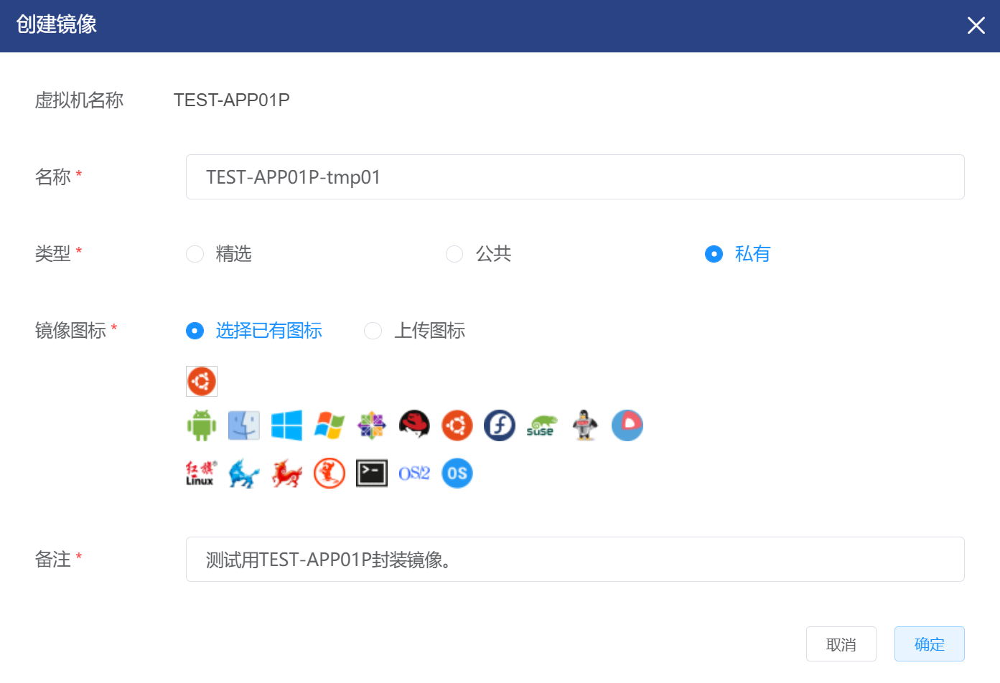

> *注：
>
> - 目前平台只支持将虚拟机的系统磁盘保存为镜像，不支持全量保存；
> - 如需了解封装镜像的相关参数，请查阅用户手册的“镜像管理”章节；
> - 如需将虚拟机创建为镜像，需要保证虚拟机处于关闭状态；
> - 如需查看新建的镜像，请前往”资源管理->区域管理->镜像“模块。

### 调整配置

云平台支持调整虚拟机的规格，如果您需要提升或降低虚拟机CPU、内存的大小，可以通过调整配置实现。

路径：资源管理->虚拟资源管理->虚拟机->详情页

1.在详情页的配“配置”菜单中，点击操作列的“调整配置”按钮；

2.选择新的虚拟机规格后，点击“确定”按钮，即可实现虚拟机的配置调整：

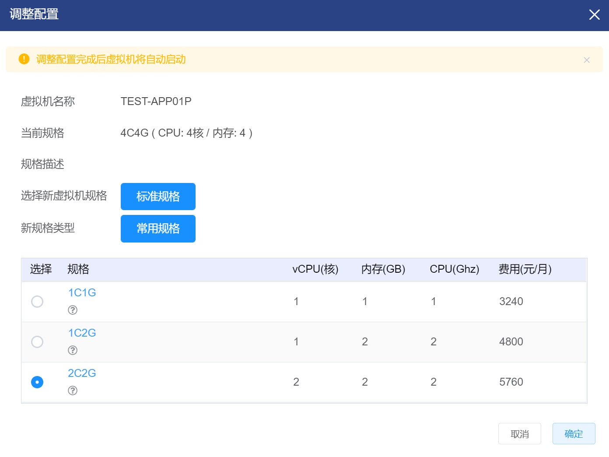

> *注：
>
> - 如需将为虚拟机调整配置，需要保证虚拟机处于关闭状态；
> - 虚拟机调整配置后，平台会自动重新启动该虚拟机。

###  删除虚拟机

路径：资源管理->虚拟资源管理->虚拟机

1.选择需要删除的虚拟机，点击操作列的“删除”按钮；

2.确认选择框后，即可将虚拟机移入回收站：

3.如需彻底删除虚拟机，进入“资源管理->虚拟资源管理->回收站”；

4.选择需要彻底删除的虚拟机，点击操作列的“彻底销毁”按钮；

5.确认选择框后，即可彻底销毁选定的虚拟机。

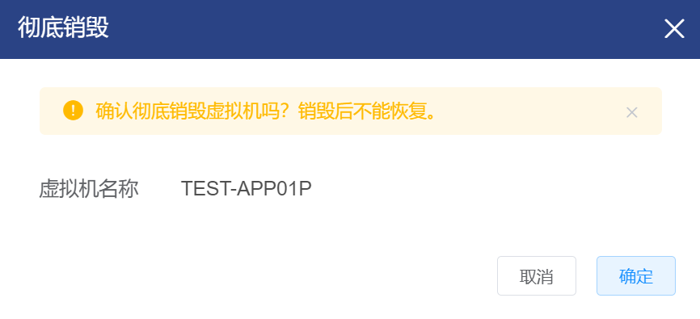

> *注：
>
> - 如果虚拟机挂载有数据磁盘，则会将数据磁盘一同删除。

