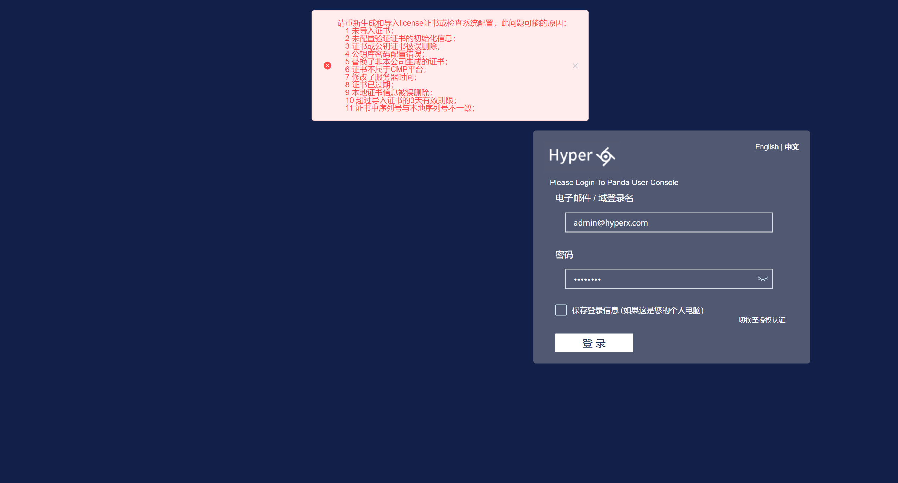
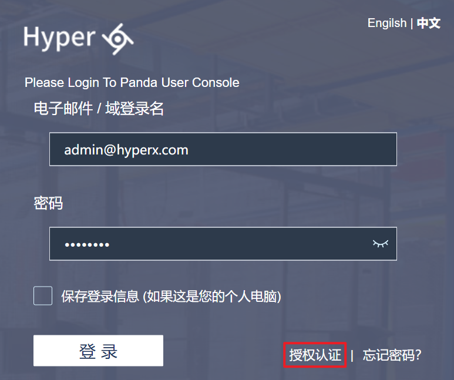
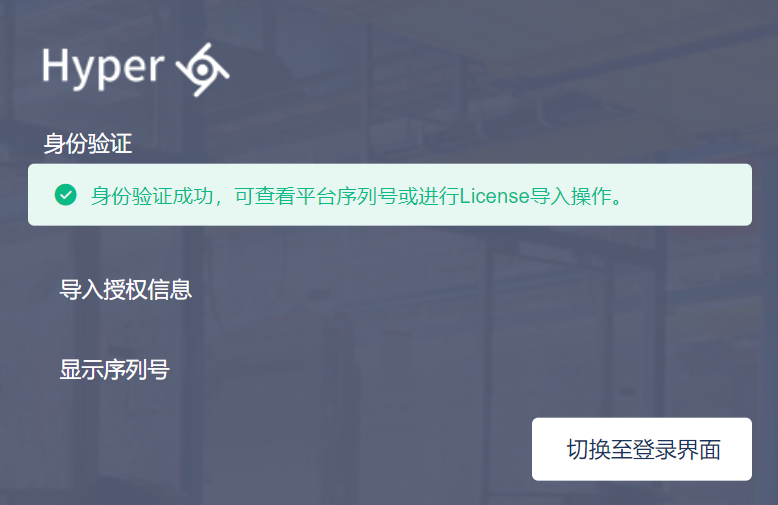
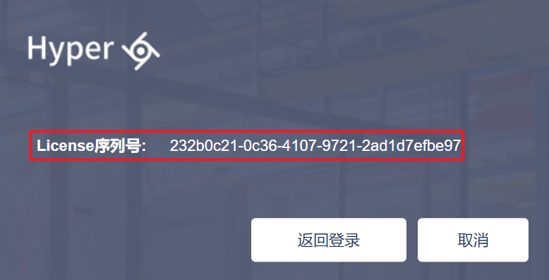
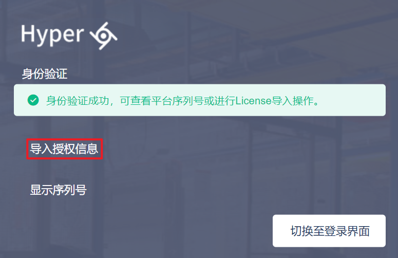
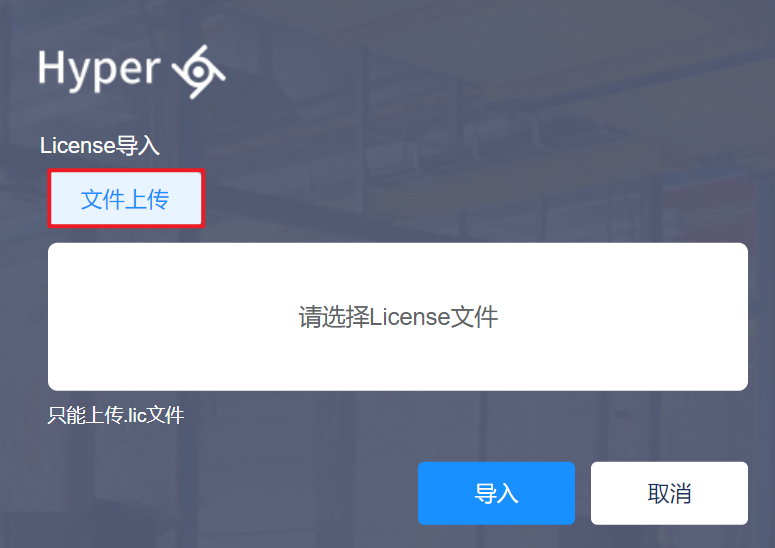
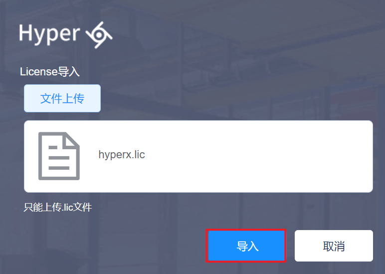

## 0.1.平台导入License

成功部署HCM平台后，需要超级管理员将License导入平台后，才能正常登入云平台。

1.输入HCM平台的地址，即可看到平台登录页面：

>[!NOTE]
>
> - 如果给该平台未注册过license或license过期，使用超管账号登录平台时会给出告警，提示超管导入license：
>
> 

2.点击"授权认证"按钮，进入HCM平台导入License的页面：

3.输入超管的用户名和密码后，点击"验证"按钮：

4.HCM平台验证用户名和密码正确后，将会进入验证成功的页面：

5.点击"显示序列号"按钮，即可查看HCM平台的序列号：

6.HCM工作人员在license管理系统中根据序列号为客户配置license相关信息，从管理系统中下载license至本地。

7.再次进入切换至授权认证页面，点击"导入授权信息"按钮：

8.点击"文件上传"按钮，选择license上传：

9.点击"导入"按钮，将license导入HCM平台：

10.导入后，license验证成功显示license信息，核实信息后点击"返回登录"按钮：

11.输入用户名密码后，成功登入HCM平台：

