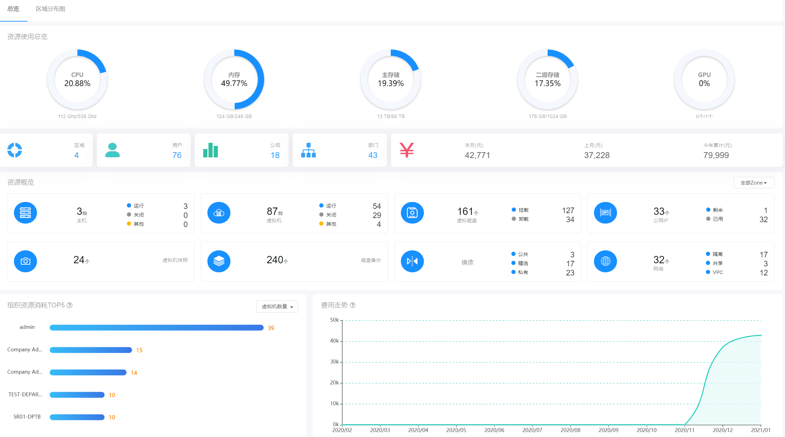
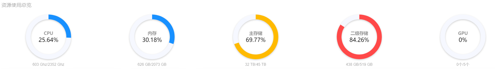
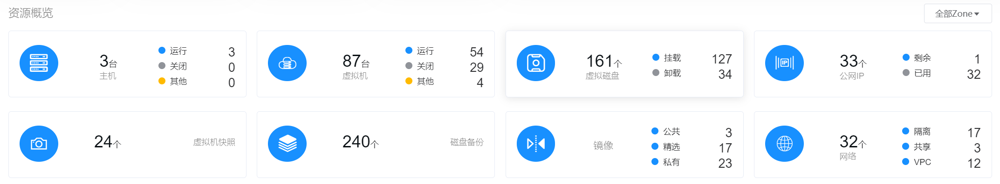
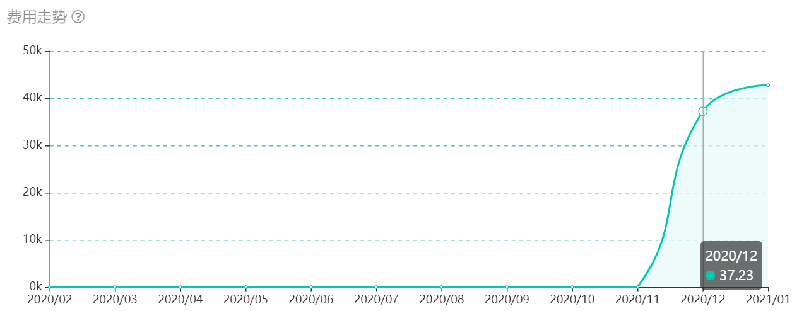

# 3.1.1.超级管理员总览界面

超级管理员点击“总览”导航菜单，即可进入总览主页，如下图所示：

主页主要对所有区域的数据中心资源实时状态进行直观的展示。

主页界面主要分为“资源使用总览”、“区域、用户、公司/部门、成本开销导览”、“资源概览”、“组织资源消耗TOP5”和“费用走势”五个部分。

## 资源使用总览

根据当前所纳管的所有资源区域的全部主机CPU、内存、磁盘、GPU资源的使用情况进行统计分析。

用环形图实时显示当前区域CPU、内存、主存储、二级存储、GPU资源已用量和可用量的占比情况。

其中用白色显示资源可用量，根据使用情况用蓝色、橙色、红色显示资源使用量：

- 蓝色：用量占比在0%-60%的状态下使用量显示为蓝色；
- 橙色：用量占比在60.01%-80%的状态下使用量显示为橙色；
- 红色：用量占比在80.01%-100%的状态下使用量显示为红色。

> [!NOTE]
>
> - 若所有区域下没有该资源，则显示灰色圆饼图，标记暂无资源。
>
>   

## 区域、用户、公司、部门、成本开销导览

实时显示整个平台的区域、用户、公司、部门的数量，以及整个平台全部区域本月、上月、今年累计的成本开销。

> [!NOTE]
>
> - 当用户点击“区域”右侧显示数值时，显示当前平台内所有区域的名称，选择具体区域后，将会跳转到对应区域的概览页；
> - 当用户点击“用户”右侧显示数值时，将会跳转到企业管理的用户子菜单；
> - 当用户点击“公司”右侧显示数值时，将会跳转到企业管理的组织管理子菜单下的公司管理页面；
> - 当用户点击“部门”右侧显示数值时，将会跳转到企业管理的组织管理子菜单下的部门管理页面。

## 资源概览

实时显示云平台中主机、虚拟机、虚拟磁盘等8大资源的概览情况，默认显示所有区域资源的统计数据，可以在右侧选择需要查看的区域，选择后显示该区域的资源统计数据。

- 主机：左侧显示当前平台内的主机总数，右侧分别显示运行中、关闭和其他（离线和报警）状态的主机数量；
- 虚拟机：左侧显示当前平台内的虚拟机总数，右侧分别显示运行中、关闭和待销毁状态的虚拟机数量；
- 虚拟磁盘：左侧显示当前平台内的虚拟磁盘总数，右侧分别显示已挂载和未挂载状态的虚拟磁盘数量；
- 公网IP：左侧显示当前平台内的公网IP总数，右侧分别显示剩余和已用状态的公网IP数量。
- 快照：右侧显示当前平台内的快照总数；
- 备份：右侧显示当前平台内的备份总数；
- 镜像：右侧分别显示当前平台内社区、精选和私有镜像的数量；
- 网络：左侧显示当前平台内的网络总数，右侧分别隔离、共享和专有网络（VPC）的数量。

## 组织资源消耗TOP5

显示上个月云平台内各个公司的各个部门资源消耗的TOP5，默认统计的是虚拟机资源消耗的排名，也可选择查看各个部门CPU、内存、存储消耗的TOP5排名。

> [!NOTE]
>
> - 此处统计以部门为维度进行统计，即根据所有公司下的所有部门进行数据对比排名；
> - 在部门名称后，显示该部门所在公司名称，若部门和公司名称总长超过10字符，超出部分通过鼠标经过悬浮框显示。

## 费用走势

实时显示平台近一年的费用走势图。

当鼠标悬浮在某一节点上，则会显示当前节点的总成本费用量。

> [!NOTE]
>
> - 总成本费用即为计算、存储、模板、备份、快照、服务和公网IP费用开销的总和。