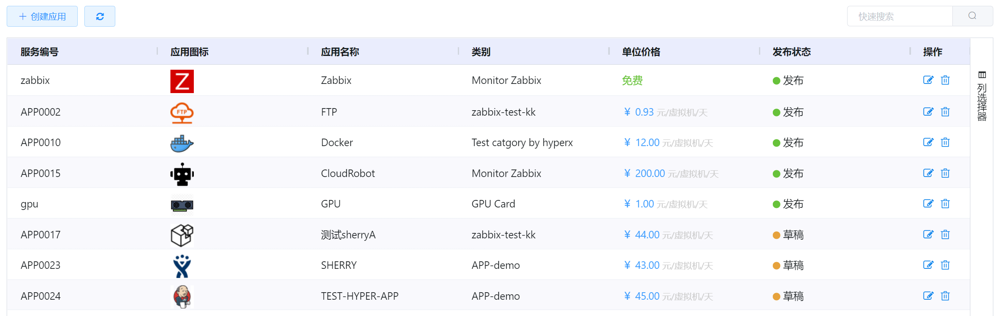
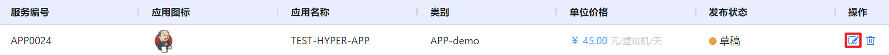
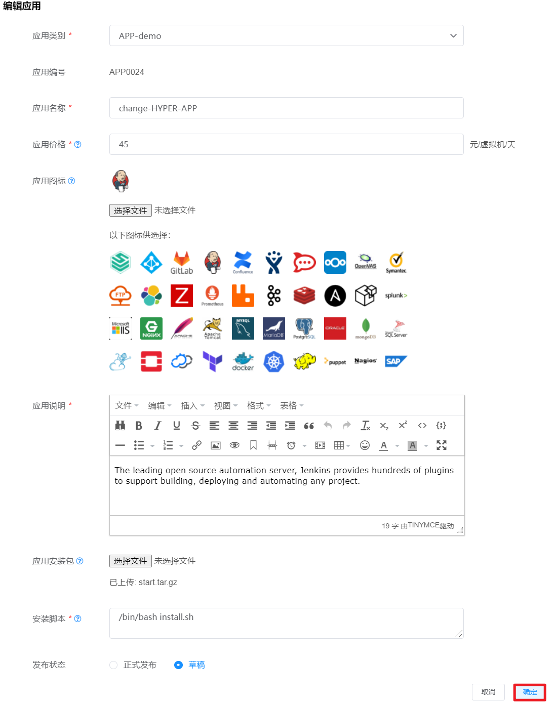
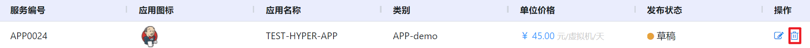
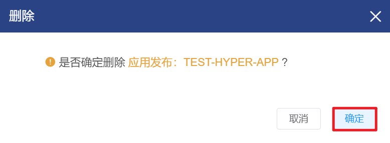

# 4.6.3.应用设定管理

在“资源管理”菜单下选择左侧“应用发布”的导航菜单，之后点击“应用发布”的子菜单，即可看到应用发布的管理界面：

在应用发布管理界面，可以查看当前已发布和草稿状态的全部应用信息，包括应用的服务编号、图标、名称、类别、单位价格和发布状态。

## 相关操作

HYPERX云管理平台支持用户对应用发布进行管理，支持的能力如下：

- 快速搜索：根据应用的服务编号、名称、类别等字段全局快速搜索应用；
- 创建应用：创建一个新的应用；
- 编辑应用：编辑应用的名称、类别、发布状态等信息；
- 删除应用： 删除选中的应用。

操作入口如下：

- 资源管理→应用服务→应用发布

## 操作说明

### 创建应用

① 在应用发布管理界面中，点击“创建应用”按钮：

② 将会进入“创建应用”的页面，填写应用的相关信息，上传安装包并选择发布状态后，点击“确定”按钮，应用创建成功：

> [!NOTE]
>
> - 草稿”状态的应用只能在“应用类别”菜单中可见，“正式发布”状态的应用可以在应用市场中使用；
> - 平台为用户提供了预置应用图标，如果需要自定义可以点击“选择文件“按钮上传，其中所上传图标的格式需要为.ico。

### 编辑应用

① 在应用发布管理界面中，选择需要编辑的应用，点击操作列的“编辑”按钮：

② 将会进入“编辑应用”的页面，修改应用的相关信息后，点击“确定”按钮，将更新应用的信息：

### 删除应用

① 在应用发布管理界面中，选择需要删除的应用，点击操作列的“删除”按钮：

② 将会弹出“删除确认”操作提示框，点击“确认”按钮后，将删除选中的应用：

