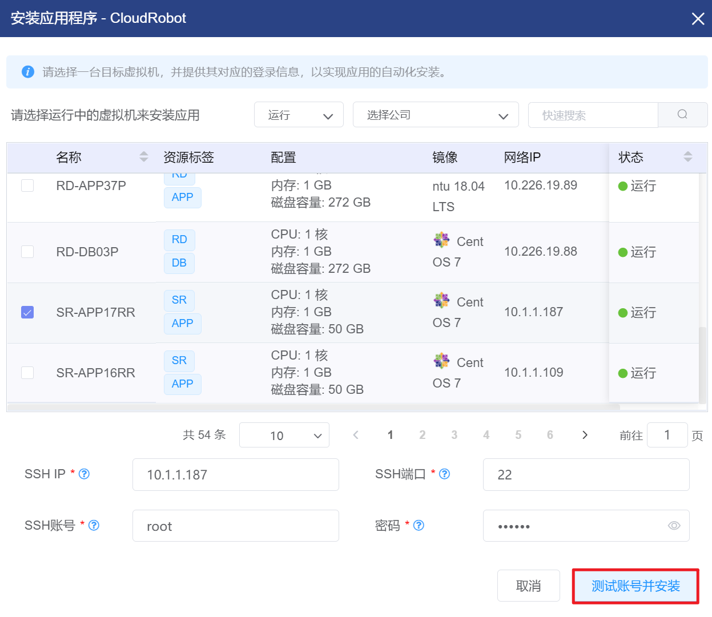

# 4.6.1.应用市场管理

应用市场显示的当前平台中已发布的应用，用户可以在此选择虚拟机为之安装选定的应用。

在“资源管理”菜单下选择左侧“应用服务”的导航菜单，之后点击“应用市场”的子菜单，即可看到应用市场的管理界面：

> [!NOTE]
>
> - 选项卡的菜单是根据应用类别分类的，如需配置应用类别种类，请查阅应用类别管理章节；
> - 应用市场仅显示应用发布中处于“正式发布”状态的应用，如需变更应用状态，请查阅应用发布管理章节。

## 相关操作

HYPERX云管理平台支持用户对应用市场进行管理，支持的功能如下：

- 快速搜索：根据应用的名称和描述字段全局快速搜索应用；

- 安装应用：将选定的应用安装到指定的虚拟机中。

操作入口如下：

- 资源管理→应用服务→应用市场

## 操作说明

### 应用的安装

① 在应用市场管理界面中，选择需要安装的应用，点击“安装”按钮：

② 将会弹出“安装应用程序”的操作提示框，选择需要安装的虚拟机，提那些SSH的IP，端口，账号和密码等信息后，点击“测试账号并安装”按钮：

> [!NOTE]
>
> - 待安装应用的虚拟机需要处于运行状态；
> - 虚拟机所在的网络防火墙需要处于开启状态，能够连通外网；
> - SSH IP是虚拟机的IP地址，若虚拟机使用的是非共享网络，则该地址为虚拟机默认网络的公网IP地址；
> - SSH端口是虚拟机的公网IP端口，若虚拟机配置了端口转发规则，SSH端口与端口转发规则的端口保持一致；
> - SSH账号和密码是待安装应用虚拟机的登录用户名和密码。
