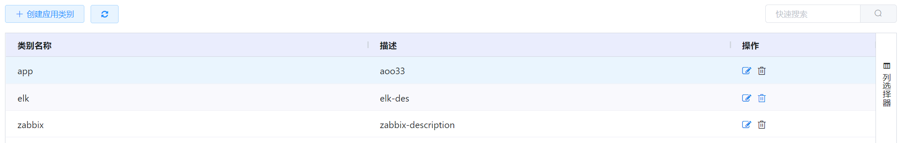
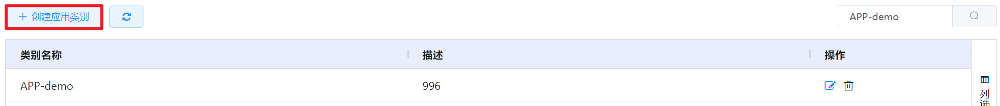
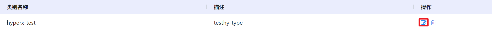

# 4.6.2.应用类别管理

应用类别是用户在应用市场中可选择的应用分类，用户可以根据应用类别筛选出需要管理的应用。

在“资源管理”菜单下选择左侧“应用服务”的导航菜单，之后点击“应用类别”的子菜单，即可看到应用类别的管理界面：

## 相关操作

HYPERX云管理平台支持用户对应用类别进行管理，支持的功能如下：

- 快速搜索：根据应用类别的名称和描述字段全局快速搜索应用类别；

- 创建应用类别：在当前区域中创建一个新的应用类别；

- 编辑应用类别：编辑应用类别的名称和描述；

- 删除应用类别： 删除选中的应用类别。

操作入口如下：

- 资源管理→应用服务→应用类别

## 操作说明

### 创建应用类别

① 在应用类别管理界面中，点击“创建应用类别”按钮：

② 将会弹出“创建应用类别”的操作提示框，填写应用类别的名称和描述后，点击“确定”按钮，应用类别创建成功：

### 编辑应用类别

① 在应用类别管理界面中，选择需要编辑的应用类别，点击操作列的“编辑”按钮：

② 将会弹出“编辑应用类别”的操作提示框，修改应用类别的名称和描述后，点击“确定”按钮，将更新应用类别的信息：

### 删除应用类别

① 在应用类别管理界面中，选择需要删除的应用类别，点击操作列的“删除”按钮：

② 将会弹出“删除”操作提示框，点击“确定”按钮后，将删除选中的应用类别：

> [!WARNING]
>
> - 当应用类别中有应用存在时，该应用类别不支持删除。