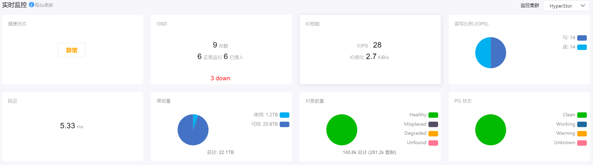

# 4.1.3.存储监控

超级管理员在“资源管理”菜单下选择左侧“概览”的导航菜单，再点击“存储监控”选项卡，即可看到存储监控界面：

在此页面中，对当前平台的分布式存储监控信息进行了展示。

## 实时监控

实时显示当前集群的健康状态、OSD、IO性能、IOPS、延迟、裸容量、对象数量和PG状态的情况。

## 历史监控

显示当前集群最近1小时、1天、1周、1个月的存储使用量、IOPS和读写带宽监控图表。

