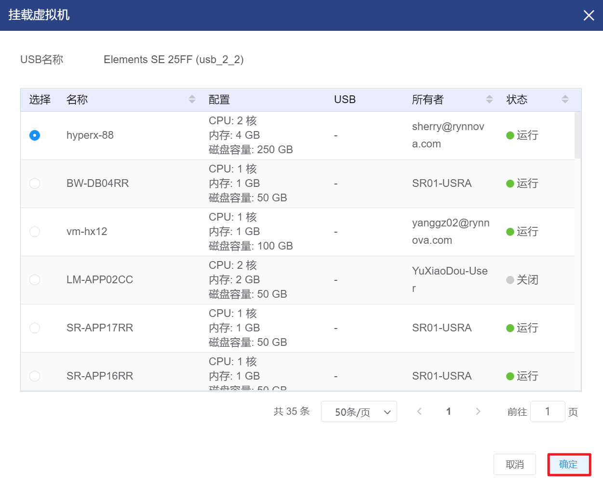
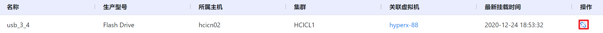
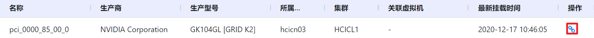
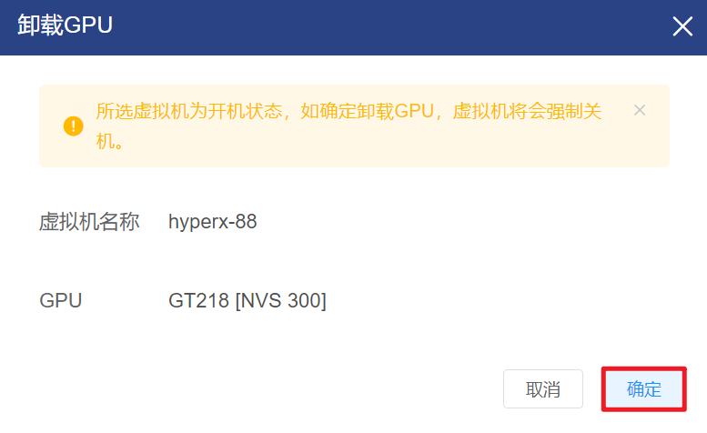

# 4.5.2.外部设备管理

云平台支持对USB和GPU等外部设备进行统一的管理，可以查看平台内各个外设所属主机、集群、关联虚拟机的情况等，也可以对外部设备的进行挂载和卸载。

在“资源管理”菜单下选择左侧“设备管理”的导航菜单，之后点击“外部设备”的子菜单，即可看到外部设备的管理界面：

外部设备的管理界USB和GPU两个管理界面，默认显示的是USB管理界面：

- USB：显示平台内所有的USB设备的详情信息，并支持对之进行挂载和卸载的操作；
- GPU：显示平台内所有的GPU设备，并支持对之进行挂载和卸载的操作。

## 相关操作

HYPERX云管理平台支持管理员对外部设备进行管理，支持的功能如下：

- 快速搜索：根据外设的名称、生产型号、所属主机等字段全局快速搜索外部设备；
- 高级筛选：用户可以从表头右侧根据外设的名称、生产型号、所属主机等字段筛选出符合条件的虚拟机；
- 挂载USB：将选定的USB挂载到指定虚拟机中；
- 卸载USB：将选定的USB从虚拟机上卸载；
- 挂载GPU：将选定的GPU挂载到指定虚拟机中；
- 卸载GPU：将选定的UGPU从虚拟机上卸载。

操作入口如下：

- 资源管理→设备管理→外部设备

## 操作说明

### 挂载USB

① 在外部设备管理界面的“USB”选项卡中，选择需要挂载USB的设备，点击操作列的“挂载”按钮：

② 将会弹出“挂载虚拟机”的操作提示框，选择需要挂载USB的虚拟机后，点击“确定“按钮，即可将USB挂载至虚拟机：

> [!NOTE]
>
> - 仅支持将USB挂载至USB所在主机的虚拟机中，所以在“挂载虚拟机”界面显示的虚拟机列表为USB所在主机上的虚拟机。

### 卸载USB

① 在外部设备管理界面的“USB”选项卡中，选择需要卸载USB的设备，点击操作列的“卸载”按钮：

② 将会弹出“卸载USB”的操作提示框，选择需要挂载USB的虚拟机后，点击“确定“按钮，即可将USB挂载至虚拟机：

### 挂载GPU 

① 在外部设备管理界面的“GPU”选项卡中，选择需要挂载GPU的设备，点击操作列的“挂载”按钮：

② 将会弹出“挂载虚拟机”的操作提示框，选择需要挂载GPU的虚拟机后，点击“确定“按钮，即可将GPU挂载至虚拟机：

> [!NOTE]
>
> - 在“挂载虚拟机”界面中仅显示选用了GPU虚拟机规格、且处于GPU所在主机中的虚拟机。

### 卸载GPU

① 在外部设备管理界面的“GPU”选项卡中，选择需要卸载GPU的设备，点击操作列的“卸载”按钮：

② 将会弹出“卸载GPU”的操作提示框，选择需要挂载USB的虚拟机后，点击“确定“按钮，即可将USB挂载至虚拟机：

> [!WARNING]
>
> - 当且仅当虚拟机处于“停止”状态时，支持将GPU从虚拟机上卸载。