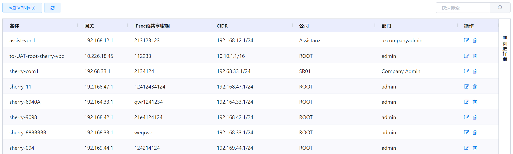
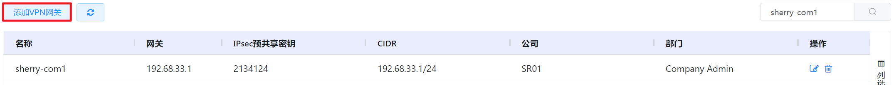
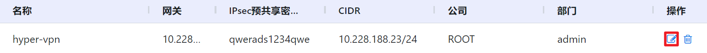

# 4.3.4.VPN网关管理

云平台可以通过虚拟路由为VPC网络提供基于L2TP-IPsec的远程访问VPN服务，用户可以通过创建VPN访问虚拟机。

在“资源管理”菜单下选择左侧“网络”的导航菜单，之后点击“VPN”的子菜单，即可看到VPN网关的管理界面：

## 相关操作

HYPERX云管理平台支持用户对VPN进行管理，支持的功能如下：

- 全局搜索：用户可以根据VPN网关的名称、网关、CIDR等字段全局搜索VPN网关；
- 自定义表头：用户可以从“列选择器”中自定义VPN网关管理界面列表显示的表头(如名称、网关、CIDR等)；
- 高级筛选：用户可以从表头右侧根据VPN网关的名称、网关、CIDR等字段筛选出符合条件的VPN网关；

- 创建VPN网关：填写名称、网关、IPsec预共享密钥等信息创建VPN客户网关；
- 编辑VPN网关：编辑VPN客户网关的名称、网关、IPsec预共享密钥等相关信息；
- 删除VPN网关：删除选定的VPN客户网关。

操作入口如下：

- 资源管理→网络→VPN网关

## 操作说明

### 创建VPN网关

① 在VPN管理界面中，点击“添加VPN网关”按钮：

② 将会进入”创建VPN网关“的页面，填写名称、网关、IPsec预共享密钥、所属组织、加密算方法等相关信息后，点击“创建”按钮即可添加VPN网关：

其中，关于VPN网关的信息概要如下：

- 名称：创建的VPN客户网关的唯一名称；
- 网关：远程网关的IP地址；
- CIDR列表：远程子网的CIDR列表，该列表不得与VPC的CIDR重叠；
- IPsec预共享密钥：VPN的端点共享密钥，用于验证客户网关和VPC的VPN网关，可在VPC的VPN网关中获取；
- IKE加密算法：第一阶段的Internet密钥交换(IKE)算法，支持的加密算法是AES128，AES192，AES256和3DES，通过预共享密钥完成验证；
- IKE哈希算法：第一阶段Internet密钥(IKE)哈希，支持的哈希算法为SHA1和MD5；
- IKE DH算法：公共密钥加密协议，该协议允许双方在不安全的通信通道上建立共享机密，IKE中使用1536位的Diffie-Hellman组来建立会话密钥；
- ESP加密算法：第二阶段封装安全有效载荷(ESP)算法，支持的加密算法是AES128，AES192，AES256和3DES;
- ESP哈希算法：第二阶段封装安全有效载荷(ESP)哈希，支持的哈希算法为SHA1和MD5;
- IKE生存时间(秒)：默认值为86400秒(1天)，超时后会重新进行第一阶段交换；
- ESP生存时间(秒)：默认值为3600秒(1小时)，超时后提供新的IPsec加密和身份验证会话密钥；
-  完全正向保密：此属性将强制执行新的Diffie-Hellman密钥交换，能够可以更好地抵抗密码攻击；
- 失效对等体检测：一种检测不可用的IKE对等体的方法，如果希望虚拟路由器定期查询其IKE对等体的活动性，请选择此选项。

> *注：
>
> - VPN端点通过计算并发送包含预共享密钥的数据的密钥散列来相互认证，如果接收对等方能够使用其预共享密钥独立创建相同的哈希，可以对客户网关进行身份验证；
> - IKE流程的第一阶段是初始协商阶段，两个VPN端点通过基础IP流量提供安全性的方法达成共识，第一阶段通过确认远程网关具有匹配的预共享密钥来相互验证两个VPN网关；
> - IKE流程的第二阶段的目的是协商IPSec安全关联（SA）以建立IPSec隧道，在第二阶段中，从阶段一中的Diffie-Hellman密钥交换中提取了新的密钥资料，以提供用于保护VPN数据流的会话密钥；
> - 当打开完全转发保密(FPS)时，对于新的第二阶段，SA的每次协商，两个网关必须生成一组新的第一阶段密钥。为PFS添加了的额外保护层，如果第二阶段SA过期，不会从当前的第一阶段密钥材料中生成用于新的第二阶段SA的密钥。

### 编辑VPN网关

① 在VPN管理界面中，选择需要编辑的VPN，在操作列中点击“编辑”按钮：

② 即可进入编辑VPN的页面，修改基础网络的名称、网关、CIDR列表等信息后，点击“保存”按钮，将更新VPN的信息：

> *注：
>
> - 如果待编辑的VPN已经被配置到VPC路由器中的点到点VPN中，则不支持执行编辑操作。

### 删除VPN网关

① 在VPN管理界面中，选择需要删除的VPN，在操作列中点击“删除”按钮：

② 将会弹出”删除”的操作提示框，点击“确定”按钮删除选中的VPN：

> *注：
>
> - 如果待删除的VPN已经被配置到VPC路由器中的点到点VPN中，则不支持执行删除操作。

