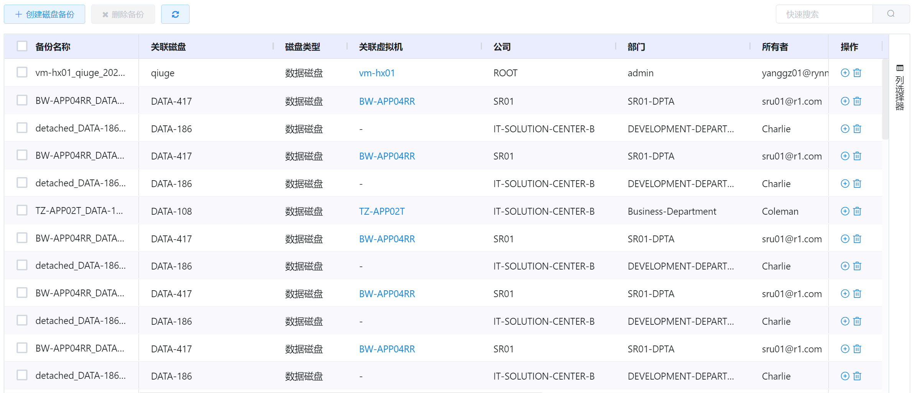
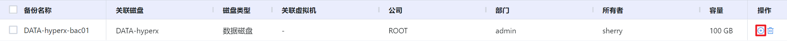
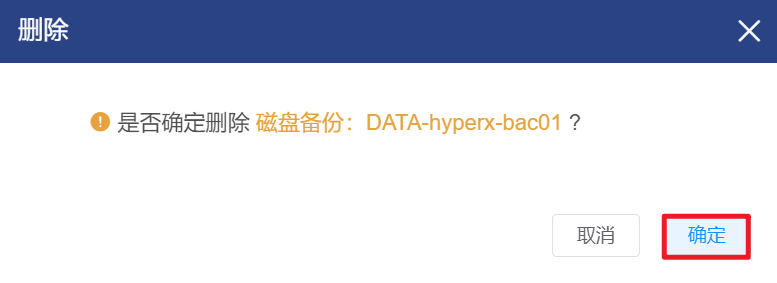
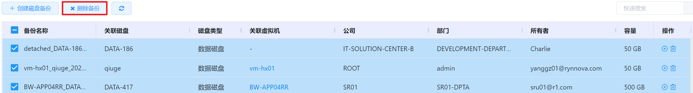

# 4.2.4.磁盘备份管理

为了防止磁盘中的文件数据丢失或损坏，支持用户在云平台中为现有的虚拟磁盘创建备份文件，需要时可通过备份文件将数据恢复到一块新的虚拟磁盘中。

在“资源管理”菜单下选择左侧“虚拟机资源管理”的导航菜单，之后点击”磁盘备份”的子菜单，即可看到磁盘备份的管理界面：

## 相关操作

HYPERX云管理平台支持用户对磁盘备份进行管理，支持的功能如下：

- 快速搜索：根据磁盘备份的备份名称、关联磁盘、关联虚拟机等字段全局快速搜索磁盘备份；
- 快速筛选：支持根据磁盘备份的备份名称、关联磁盘、磁盘类型等字段进行高级筛选；
- 创建磁盘备份：为选定的虚拟磁盘创建磁盘备份；
- 用磁盘备份创建新磁盘：使用选定的磁盘备份创建新的虚拟磁盘，并将备份中的数据全部恢复到新磁盘中；
- 删除磁盘备份：删除选定的磁盘备份；
- 批量删除磁盘备份：支持选择多个磁盘备份，批量执行删除操作。

操作入口如下：

- 资源管理→虚拟资源管理→磁盘备份

## 操作说明

### 创建磁盘备份

① 在磁盘备份管理界面中，点击"创建磁盘备份"按钮：

② 将会弹出“创建磁盘备份”的操作提示框，选择需要备份的磁盘并填写磁盘的名称后，点击“确定”按钮，即可为选定的磁盘创建备份：

> [!WARNING]
>
> - 若虚拟磁盘未初始化，无法进行磁盘备份，将会在磁盘列表中置灰显示；
> - 若虚拟磁盘所关联虚拟机有快照或定时快照，则不支持创建磁盘备份。

### 使用备份创建新的磁盘

① 在磁盘备份管理界面中，选择需要创建虚拟磁盘的备份，在操作列中点击“创建磁盘”按钮：

② 将会弹出“创建磁盘”的操作提示框，填写新虚拟磁盘的名称后，点击“确定”按钮，即可使用选定的备份创建一块新的虚拟磁盘，并将备份中的数据全部恢复到新磁盘中：

> [!NOTE]
>
> - 如需查看创建的虚拟磁盘，请进入“资源管理→虚拟资源管理→虚拟磁盘”操作入口；
> - 使用磁盘备份创建的虚拟磁盘处于未被初始化的状态，需要挂载到虚拟机上才能实现初始化。

### 磁盘备份的删除

① 在磁盘备份管理界面中，选择需要删除的磁盘备份，在操作列中点击“删除备份”按钮：

② 将会弹出“确认删除”的操作提示框，点击“确定”按钮，即可删除选定的磁盘备份：

> [!NOTE]
>
> - 若使用磁盘备份创建了新的虚拟磁盘，删除磁盘备份并不会将新建的虚拟磁盘一并删除。

### 批量删除磁盘备份

① 在磁盘备份管理界面中，勾选需要删除磁盘备份的复选框，点击“删除备份”按钮：

② 将会弹出“删除备份”的操作提示框，点击“确定”按钮，即可删除选定的磁盘备份：

