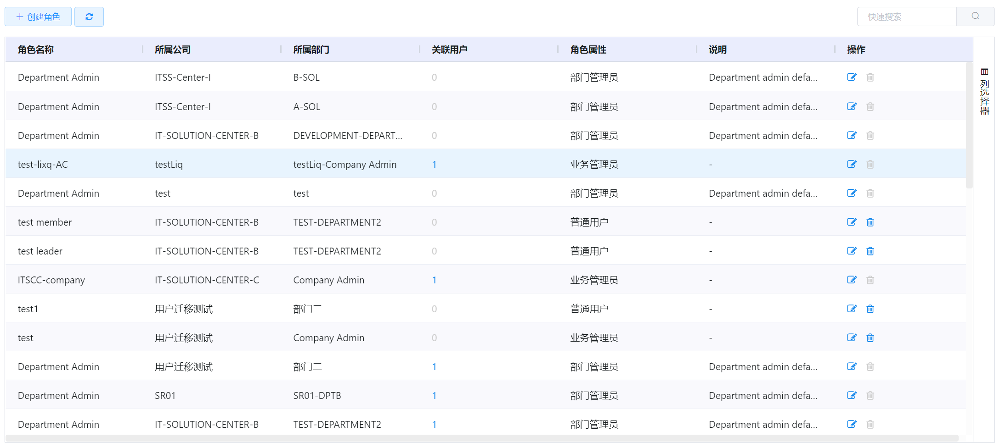
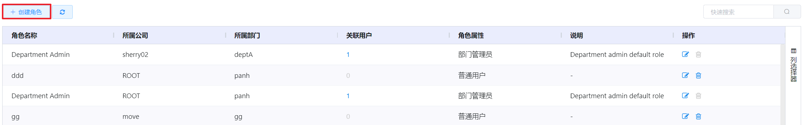
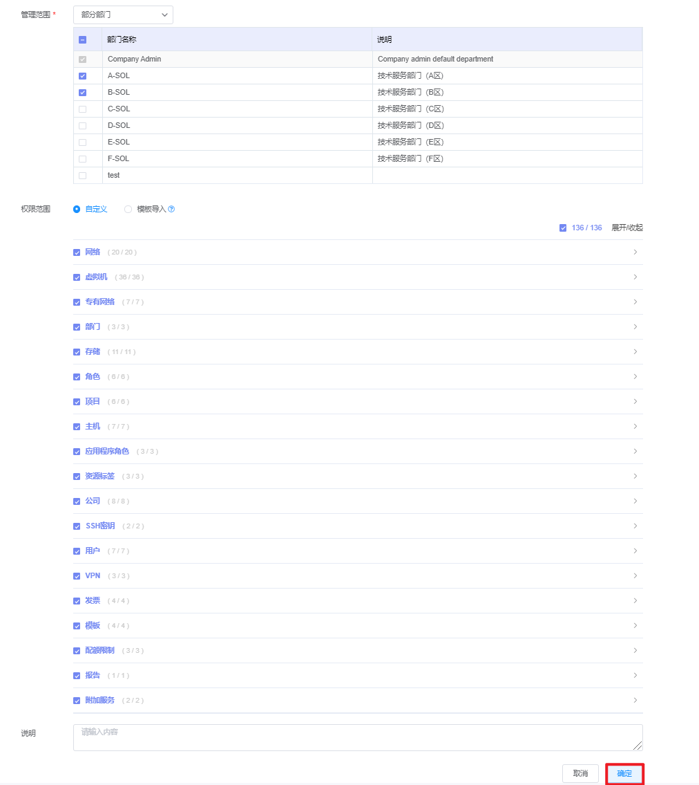

# 5.2.1.角色管理

角色是用户自定义的在云平台上操作的权限模板，不同的角色属性可配置权限的范围不同。

管理员可以为选定角色配置网络、虚拟机、专有网络等权限。

在“企业管理”菜单下选择左侧“角色”的导航菜单，之后点击“角色管理”的子菜单，即可看到角色的管理界面：

在角色管理界面，可以查看当前平台已有全部角色信息，包括角色的名称、所属公司、所属部门等信息。

## 相关操作

HYPERX云管理平台支持用户对角色进行管理，支持的功能如下：

- 快速搜索：根据角色的名称、属性、说明等字段全局快速搜索角色；
- 高级筛选：用户可以从表头右侧根据角色名称、所属公司、所属部门等字段筛选出符合条件的角色；
- 角色的创建：创建一个新的角色，并填写角色的名称、所属组织、管理范围等信息；
- 角色的编辑：编辑角色的名称、所属组织、管理范围等信息；
- 角色的删除：将选定的角色从云平台中删除。

操作入口如下：

- 企业管理→角色→角色管理

## 操作说明

### 创建角色

① 在角色的管理界面中，点击“创建角色”按钮：

② 将会进入创建角色的页面，填写角色的名称、所属组织、管理范围等信息后，点击“确定”按钮，创建新角色：

> [!NOTE]
>
> - 管理范围选择“部分部门”时，只管理被勾选的部门；
>
> 
>
> - 权限范围选择”模板导入“时，在右侧下拉框中选择已创建的角色模板，可给当前角色赋予该角色模板的权限范围，关于角色模板的创建，请查阅“角色模板”章节。
>
>   

### 编辑角色

① 在角色的管理界面中，选择需要编辑的角色后，点击操作列的“编辑”按钮：

② 将会进入编辑角色的页面，可以编辑角色的名称、所属组织、管理范围等信息。

> [!NOTE]
>
> - 编辑界面与创建角色界面相同，请查阅“创建角色”章节。

### 删除角色

① 在角色的管理界面中，选择需要删除的角色后，点击操作列的“删除”按钮：

② 将会弹出“删除”的操作提示框，点击“确定”按钮，删除选中的角色：

> [!WARNING]
>
> - 关联用户的角色不支持被删除。