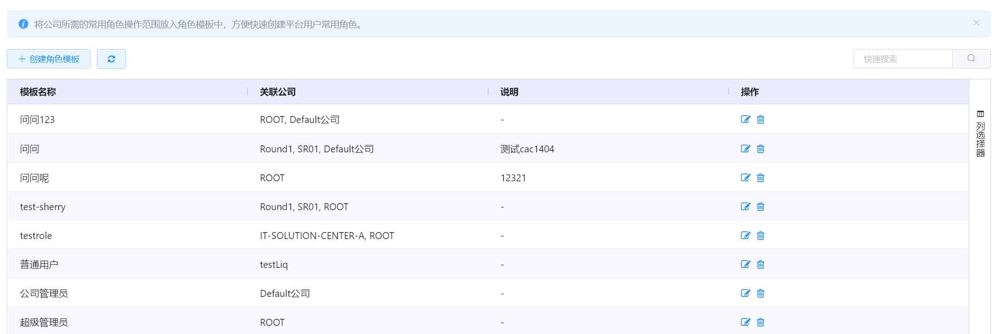
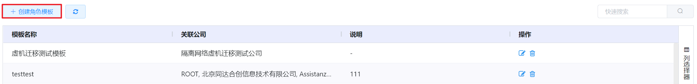
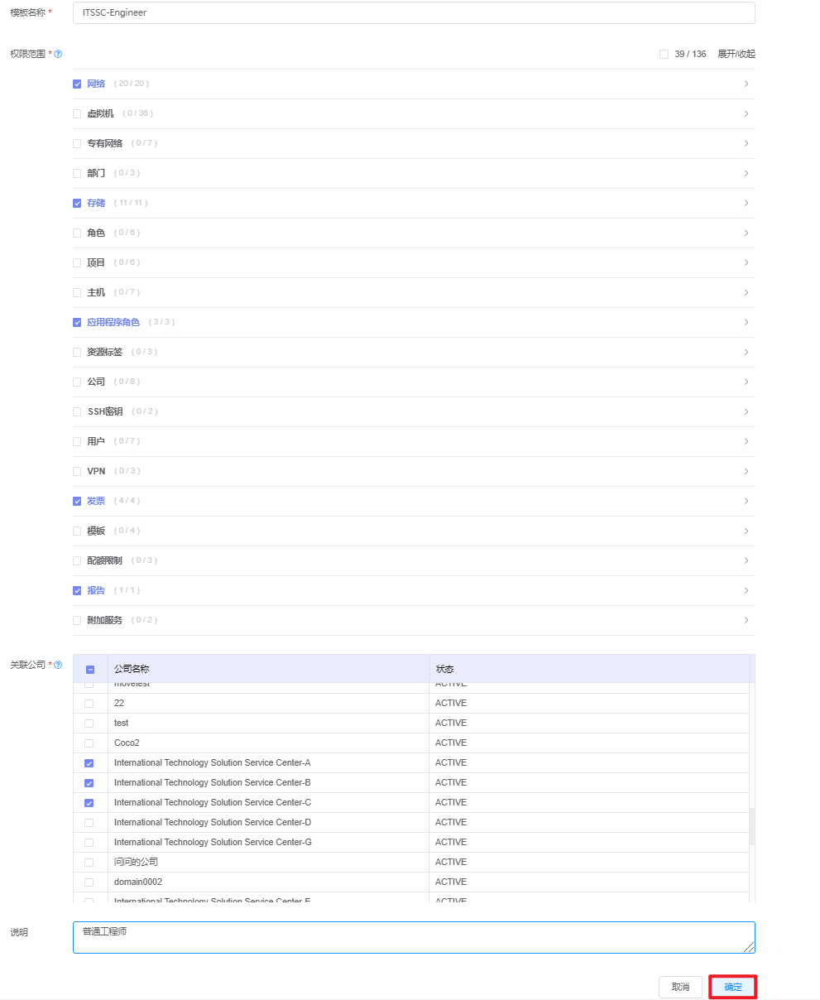
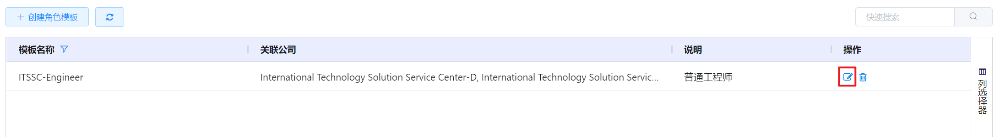
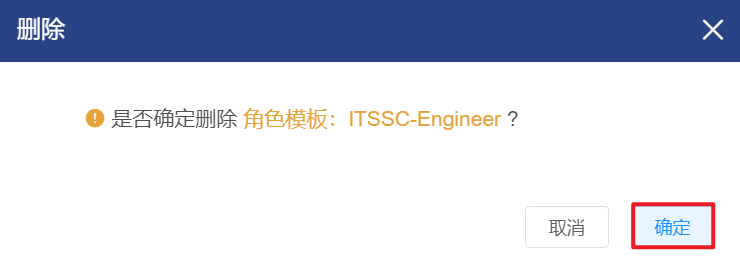

# 5.2.2.角色模板管理

管理员可以将公司所需的常用角色操作范围放入角色模板中，方便快速创建平台用户常用角色。

在“企业管理”菜单下选择左侧“角色”的导航菜单，之后点击“角色模板”的子菜单，即可看到角色模板的管理界面：

在角色模板管理界面，可以查看当前平台已有全部角色模板信息，包括角色模板的名称、关联公司、相关说明等信息。

## 相关操作

HYPERX云管理平台支持用户对角色模板进行管理，支持的功能如下：

- 快速搜索：根据角色模板的名称、关联公司、说明等字段全局快速搜索角色；
- 高级筛选：用户可以从表头右侧根据模板名称、说明等字段筛选出符合条件的角色模板；
- 角色模板的创建：创建一个新的角色模板，并填写填写角色模板的名称，选择权限范围和关联的公司，填写相关说明的信息；
- 角色模板的编辑：编辑角色模板的名称、权限范围、关联公司等信息；
- 角色模板的删除：将选定的角色模板从云平台中删除。

操作入口如下：

- 企业管理→角色→角色模板

## 操作说明

### 创建角色模板

① 在角色模板的管理界面中，点击“创建角色模板”按钮：

② 将会进入创建角色模板的页面，填写角色模板的名称，选择权限范围和关联的公司，填写相关说明的信息后，点击“确定”按钮，创建新的角色模板：

### 编辑角色模板

① 在角色模板的管理界面中，选择需要编辑的角色模板后，点击操作列的“编辑”按钮：

② 将会进入编辑角色模板的页面，可以编辑角色模板的名称、权限范围、关联公司等信息。

> [!WARNING]
>
> - 编辑界面与创建角色模板界面相同，请查阅“创建角色模板”章节。

### 删除角色模板

① 在角色模板的管理界面中，选择需要删除的角色模板后，点击操作列的“删除”按钮：

② 将会弹出“删除”的操作提示框，点击“确定”按钮，删除选中的角色模板：

