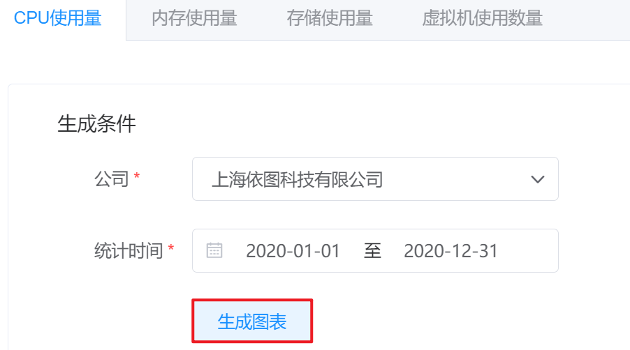
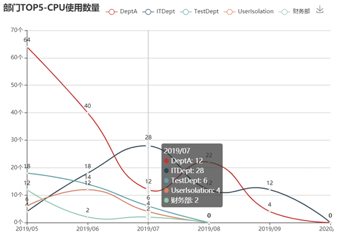
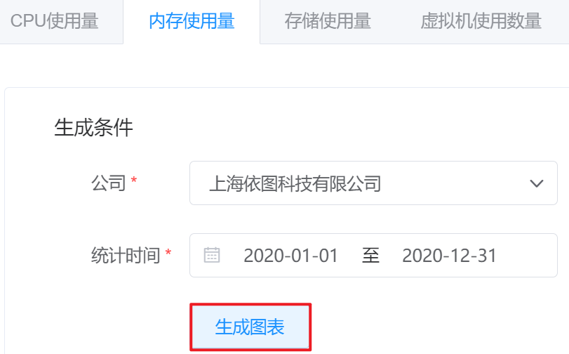
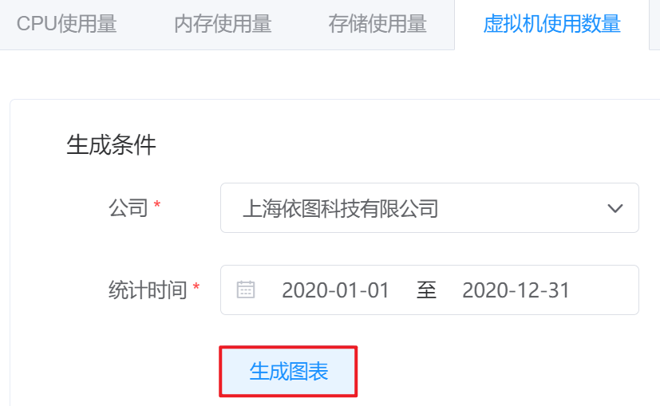

# 6.3.2.部门资源TOP5

超级管理员和业务管理员可以查看选定公司(业务管理员只能查看本公司)、选定时间区间内CPU、内存、存储和虚拟机用量排行前五名部门的统计图表。

在“运营中心”菜单下选择左侧“资源统计”的导航菜单，之后点击”部门资源TOP5”的子菜单，即可看到“部门资源TOP5的管理界面”：

## 相关操作

HYPERX云管理平台支持超级管理员和业务管理员查看条件下部门资源统计的TOP5趋势图，支持的功能如下：

- 查看CPU使用量：全部公司或指定公司的部门为统计范围，根据自定义统计时间，生成CPU用量排名前五的部门资源使用趋势图；

- 查看内存使用量：全部公司或指定公司的部门为统计范围，根据自定义统计时间，生成内存用量排名前五的部门资源使用趋势图；

- 查看存储使用量：全部公司或指定公司的部门为统计范围，根据自定义统计时间，生成存储用量排名前五的部门资源使用趋势图；

- 查看虚拟机使用数量：全部公司或指定公司的部门为统计范围，根据自定义统计时间，生成虚拟机用量排名前五的部门资源使用趋势图；

- 导出图表：将生成的图表导出为PNG图片保存在本地。

操作入口如下：

- 运营中心→资源统计→部门资源TOP5

## 操作说明

### 查看CPU使用量

① 在部门资源TOP5管理界面中，点击“CPU使用量”选项卡，选择统计的公司和统计时间区间后，点击“生成图表”按钮：

② 即可生成选定条件下CPU用量排名前五的部门资源使用趋势图：

> [!NOTE]
>
> - 鼠标悬停时，可以查看选定时间节点排名前五部门的CPU用量数据；
>
> - 若该公司部门不足五个，则会显示现有部门的CPU用量数据；
>
> - 管理员可以自定义统计时间的起止区间，同时也可以选择预置的选项，如最近查看一周、最近一个月、最近三个月、最近六个月或最近一年的数据。
>

### 查看内存使用量

① 在部门资源TOP5管理界面中，点击“内存使用量”选项卡，选择统计的公司和统计时间区间后，点击“生成图表”按钮：

② 即可生成选定条件下用量排名前五的部门资源使用趋势图：

> [!NOTE]
>
> - 鼠标悬停时，可以查看选定时间节点排名前五部门的内存用量数据；
>
> - 若该公司部门不足五个，则会显示现有部门内存用量数据；
>
> - 管理员可以自定义统计时间的起止区间，同时也可以选择预置的选项，如最近查看一周、最近一个月、最近三个月、最近六个月或最近一年的数据。
>

### 查看存储使用量

① 在部门资源TOP5管理界面中，点击“存储使用量”选项卡，选择统计的公司和统计时间区间后，点击“生成图表”按钮：

② 即可生成选定条件下用量排名前五的部门资源使用趋势图：

> [!NOTE]
>
> - 鼠标悬停时，可以查看选定时间节点排名前五部门的存储用量数据；
>
> - 若该公司部门不足五个，则会显示现有部门存储用量数据；
>
> - 管理员可以自定义统计时间的起止区间，同时也可以选择预置的选项，如最近查看一周、最近一个月、最近三个月、最近六个月或最近一年的数据。
>

### 查看虚拟机使用量

① 在部门资源TOP5管理界面中，点击“虚拟机使用量”选项卡，选择统计的公司和统计时间区间后，点击“生成图表”按钮：

② 即可生成选定条件下用量排名前五的部门资源使用趋势图：

> [!NOTE]
>
> - 鼠标悬停时，可以查看选定时间节点排名前五部门的虚拟机用量数据；
>
> - 若该公司部门不足五个，则会显示现有部门虚拟机用量数据；
>
> - 管理员可以自定义统计时间的起止区间，同时也可以选择预置的选项，如最近查看一周、最近一个月、最近三个月、最近六个月或最近一年的数据。

