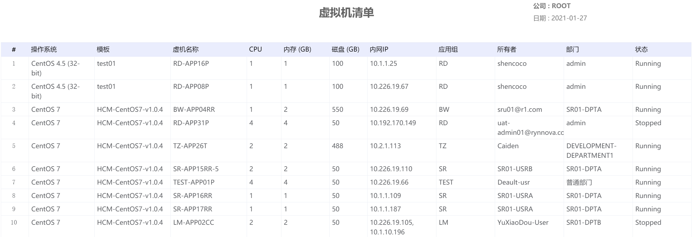
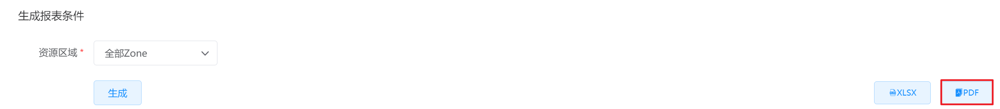

# 6.3.1.虚拟机清单

超级管理员可以导出当前云平台选定资源区间内的虚拟机清单，其中包括虚拟机所使用的操作系统、模板、虚拟机名称等信息。

在“运营中心”菜单下选择左侧“资源统计”的导航菜单，之后点击”虚拟机清单”的子菜单，即可看到“虚拟机清单的管理界面”：

## 相关操作

HYPERX云管理平台支持超级管理员查看选定资源区域的虚拟机清单，支持的功能如下：

- 生成报表：选择需要查看资源区域，生成选定资源区域下的虚拟机清单；

- 导出XLSX：将生成的虚拟机清单以XLSX的格式导出保存到本地；

- 导出PDF：将生成的虚拟机清单以PDF的格式导出保存到本地。

操作入口如下：

- 运营中心→资源统计→虚拟机清单

## 操作说明

### 生成报表

① 在虚拟机清单管理界面中，选择统计的资源区域后，点击“生成”按钮：

② 可以查看生成选定条件下的费用统计报表：

### 导出XLSX

① 选定条件并生成报表后，点击“导出XLSX”按钮：

② 即可将报表以XLSX的格式保存在本地，打开XLSX文件，效果如下：

### 导出PDF

① 选定条件并生成报表后，点击“导出PDF”按钮：

② 即可将报表以PDF的格式保存在本地，打开PDF文件，效果如下：

