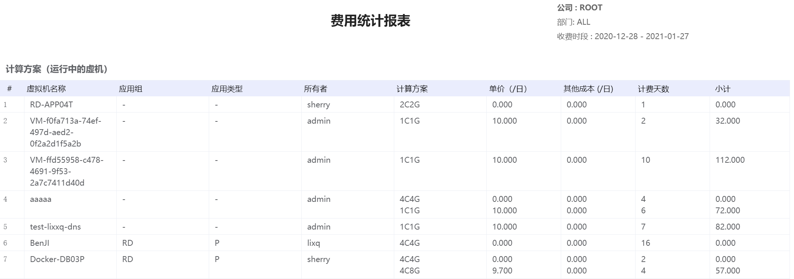
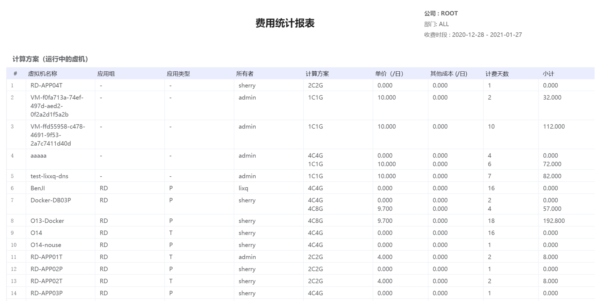

# 6.2.费用统计

超级管理员、业务管理员和部门管理员可以选择所需统计的范围、资源区域和时间，生成资源消耗费用的统计报表。

统计对象包括虚拟机、虚拟磁盘等资源，对其名称、所有者、所使用的规格、每天成本单价以及使用天数。

在“运营中心”菜单下选择左侧“费用统计”的导航菜单，即可看到费用统计管理界面：

## 相关操作

- HYPERX云管理平台支持超级管理员、业务管理员和部门管理员查看所管辖组织的费用用量，支持的功能如下：

- 生成报表：选择需要查看的组织、资源区域和时间区间，生成选定条件下的费用报表；

- 导出XLSX：将生成的费用报表以XLSX的格式导出保存到本地；

- 导出PDF：将生成的费用报表以PDF的格式导出保存到本地。

操作入口如下：

- 运营中心→费用统计

## 操作说明

### 生成报表

① 在费用统计管理界面中，选择统计范围、资源区域和统计时间后，点击“生成报表”按钮：

② 可以查看生成选定条件下的费用统计报表：

> [!NOTE]
>
> - 超级管理员可以选择指定公司或指定部门查看费用统计报表，公司管理员只能指定本公司的部门，部门管理员只能查看本部门的统计报表；
>
> - 管理员可以自定义统计时间的起止区间，同时也可以选择预置的选项，如最近查看一周、最近一个月、最近三个月、最近六个月或最近一年的数据。
>

### 导出XLSX

① 选定条件并生成报表后，点击“导出XLSX”按钮：

② 即可将报表以XLSX的格式保存在本地，打开XLSX文件，效果如下：

### 导出PDF

① 选定条件并生成报表后，点击“导出PDF”按钮：

② 即可将报表以PDF的格式保存在本地，打开PDF文件，效果如下：

