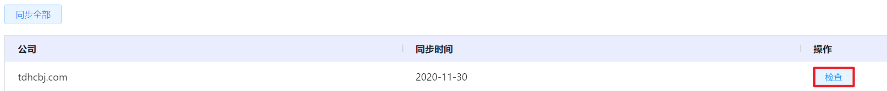
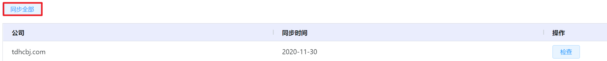

# 7.5.1.计费数据同步管理

在“系统设置”菜单下选择左侧“数据同步管理”的导航菜单，之后点击“计费数据同步”的子菜单，即可看到计费数据同步的管理界面：

## 相关操作

HYPERX云管理平台支持超级管理员对顶层数据进行管理，支持的功能如下：

- 检查计费数据：支持管理员在云平台上检查底层计费数据的同步情况；
- 同步计费数据：支持管理员在云平台上同步底层计费数据的信息。

操作入口如下：

- 系统设置→数据同步管理→计费数据同步

## 操作说明

### 检查计费数据

① 在计费数据同步管理界面中，选择需要检查计费数据的组织，点击操作列的“检查”按钮：

② 云平台将会检查计费数据的同步情况。

### 同步计费数据

① 在计费数据同步管理界面中，点击操作列的“同步全部”按钮：

② 云平台将会同步所有组织的计费数据。