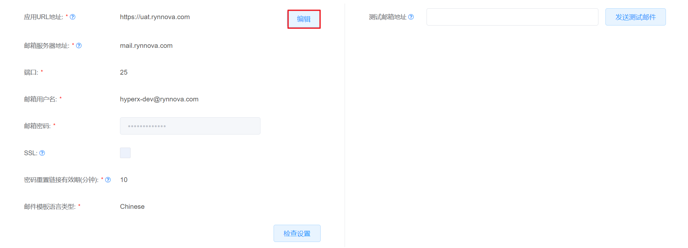
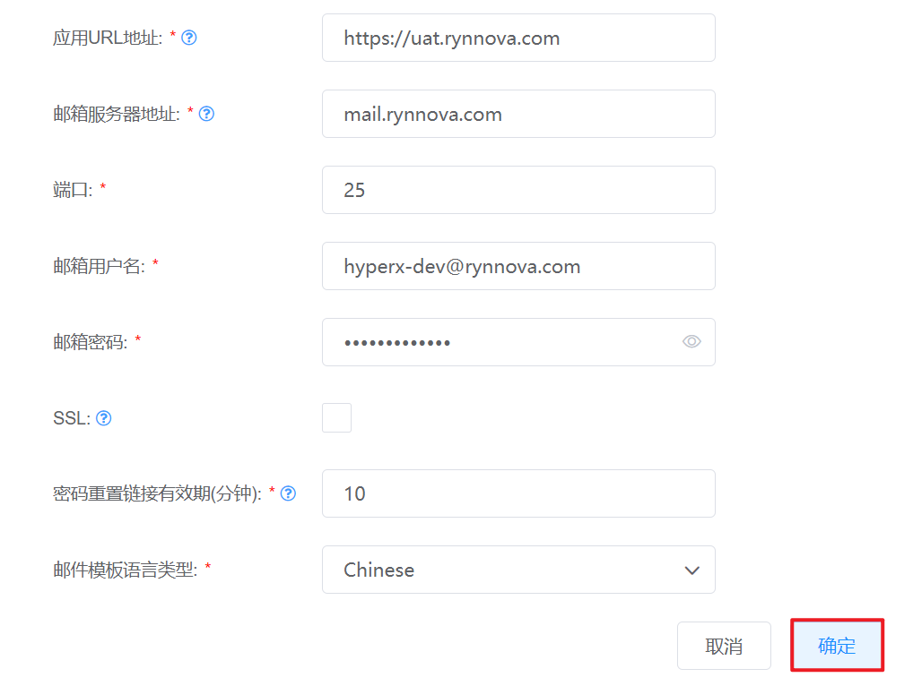

# 7.2.2邮箱配置管理

在“系统设置”菜单下选择左侧“平台系统配置”的导航菜单，之后点击“邮箱配置”的子菜单，即可看到邮箱配置的管理界面：

## 相关操作

HYPERX云管理平台支持超级管理员对邮箱进行配置和管理，支持的功能如下：

- 编辑邮箱信息：配置发件服务器的地址、端口、用户名等信息；
- 检查邮箱连通性：检查发件服务器与云平台的连通性；
- 发送测试邮件：向指定的邮箱发送测试邮件，进一步验证连通性。

操作入口如下：

- 系统设置→平台系统配置→邮箱配置

## 操作说明

### 编辑邮箱信息

① 在邮箱配置的管理界面中，点击“编辑”按钮，编辑邮箱的相关信息：

② 填写应用地址、服务器地址、用户名等信息后，点击“确定”按钮，保存当前配置信息：

> [!NOTE]
>
> - 应用URL地址是访问云平台的URL地址；
> - 邮箱服务器地址是用来负责电子邮件收发管理的邮件服务器的IP地址；
> - 若都选SSL选项，则为客户端和服务器端之间建立“SSL加密通道”，加密传输数据，验证数据完整性；
> - 密码重置链接有效期是本地账号登录密码重置链接的有效时间；
> - 用户收到的邮件通知的语言类型由“邮件模板语言类型”字段配置决定。

### 检查邮箱连通性

① 在邮箱配置的管理界面中，点击“检查设置”按钮，即可测试邮箱连通性：

### 发送测试邮件

① 在邮箱配置的管理界面中，填写测试邮箱地址后，点击“发送测试邮件”按钮，即可测试发件服务器的连通性：

② 成功发送邮件后，用户可以在测试邮箱中查收到测试邮件，表明邮件服务器与云平台已连通：

