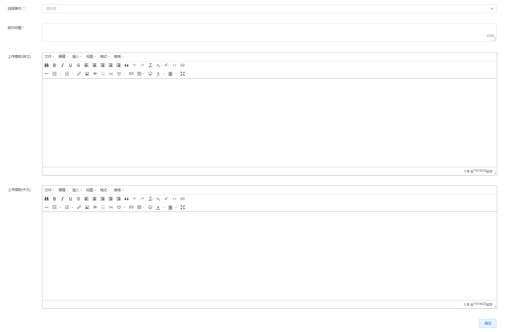
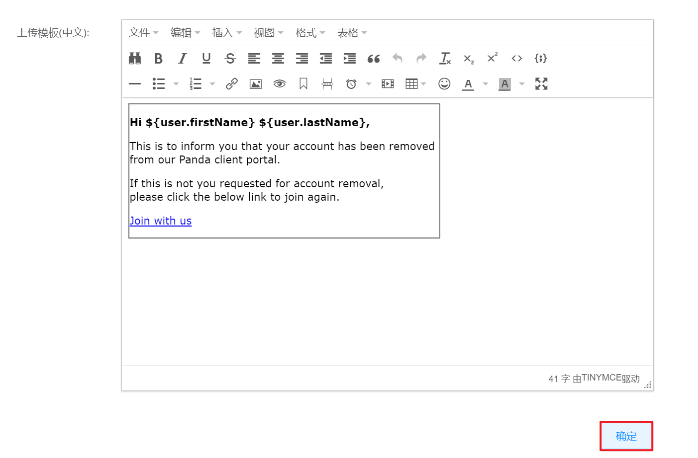

# 7.2.5.Email模板管理

在“系统设置”菜单下选择左侧“平台系统配置”的导航菜单，之后点击“Email模板”的子菜单，即可看到Email模板的管理界面：

## 相关操作

HYPERX云管理平台支持超级管理员对云平台的Email模板进行管理，支持的功能如下：

- 配置Email模板：选择指定的事件，配置触发事件中文和英文的Email标题和模板内容。

操作入口如下：

- 系统设置→平台系统配置→Email模板

## 操作说明

### 配置事件的Email模板

① 在Email模板配置的管理界面中，选择需要配置的事件，将会在右侧给出参考的邮件模板变量：

② 根据参考邮件模板变量，填写对应事件中文和英文的邮件标题和模板内容后，点击“保存”按钮：

③ 即可为选定的事件绑定Email模板，当触发事件时，云平台会给相关用户发送邮件。

> [!NOTE]
>
> - 如需配置当前平台内发送邮件的语言类型，请查阅邮箱配置章节，对邮件模板语言类型字段进行配置。