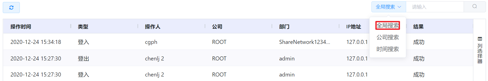
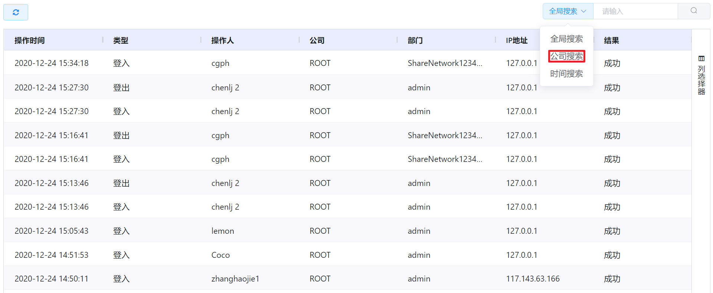

# 7.1.1.登录日志管理

云平台支持管理员查看所辖用户登入、登出平台的时间、IP地址、登录结果等信息。

在“系统设置”菜单下选择左侧“平台日志管理”的导航菜单，之后点击“登录日志”的子菜单，即可看到登录日志的管理界面：

其中，用户的登录类型分为登入和登出两种，登录结果分为成功和失败两种。

> [!NOTE]
>
> - 超级管理员可以看到平台中全部用户的的登录日志；
> - 公司管理员可以看到公司内全部用户的的登录日志；
> - 部门管理员可以看到部门内全部用户的的登录日志；
> - 普通用户可以看到自己的登录日志。

## 相关操作

HYPERX云管理平台支持管理员查看用户的登录日志，支持的功能如下：

- 全局搜索：根据日志记录的操作人、IP地址等字段全局搜索登录日志；
- 公司搜索：根据所在的组织搜索该组织下的登录日志；
- 时间搜索：根据选定的时间区间筛选需要查看的登录日志。

操作入口如下：

- 系统设置→平台日志管理→登录日志

## 操作说明

### 全局搜索

① 在登录日志管理界面中，选择“全局搜索”筛选器：

② 在搜索框中输入日志记录的操作人、IP地址等字段的关键字，点击“搜索”按钮，即可筛选出搜索结果：

> [!NOTE]
>
> - 如需清除筛选项，可以点击搜索条件右侧的清除按钮。

### 公司搜索

① 在登录日志管理界面中，选择“公司搜索”筛选器：

② 在搜索框中选择组织后，即可筛选出搜索结果：

### 时间搜索

① 在登录日志管理界面中，选择“时间搜索”筛选器：

② 在日期选择器中选择需要搜索登录日志的时间区间：

③ 即可筛选出所选时间区间的搜索结果：

> [!NOTE]
>
> - 如果时间选择器中的起始时间和终止时间选择的同一天，筛选出的即为当天的登录日志；
> - 如需清除筛选项，可以点击终止时间右侧的清除按钮。