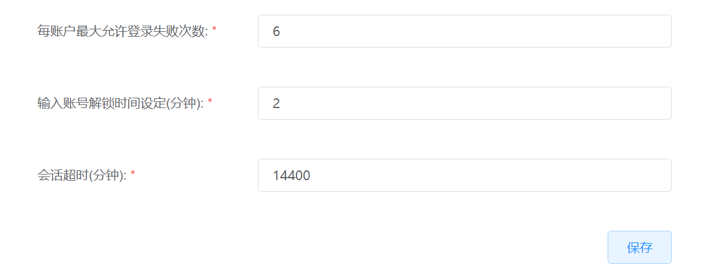

# 7.2.3.登录安全管理

云平台支持管理员配置云平台的登录安全信息，包括每个IP允许登录失败的次数、IP锁死后解锁时间、登录信息记忆失效和会话超时的时间。

在“系统设置”菜单下选择左侧“平台系统配置”的导航菜单，之后点击“登录安全”的子菜单，即可看到登录安全的管理界面：

## 相关操作

HYPERX云管理平台支持超级管理员对登录安全进行管理，支持的功能如下：

- 配置登录安全信息：支持配置云平台登录安全的相关信息。

操作入口如下：

- 系统设置→平台系统配置→登录安全

## 操作说明

### 配置登录安全信息

① 在登录安全管理界面中，配置登录安全信息后，点击“保存”按钮，即可实现云平台登录安全信息的配置：

② 配置成功后，将会在页面上方给出提示“设置项目保存成功”：

> [!NOTE]
>
> - 用户登录云平台，输密码错误次数超过“每IP最大允许登录失败次数”时，IP会被锁定；
> - 用户IP被锁定后，超过“输入账号解锁时间设定”的时间后，系统会为IP解除锁定；
> - 用户登录信息在浏览器中存留的时间超过“记住登录信息时效时限”后，系统会将用户的登录信息清除；
> - 用户在云平台中登录时间超过“会话超时”时间后，系统会强制将用户登出平台。