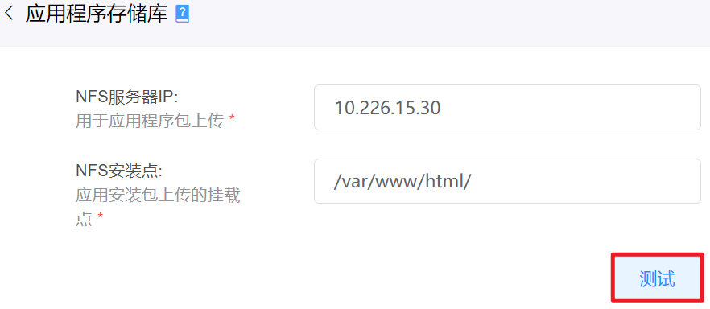
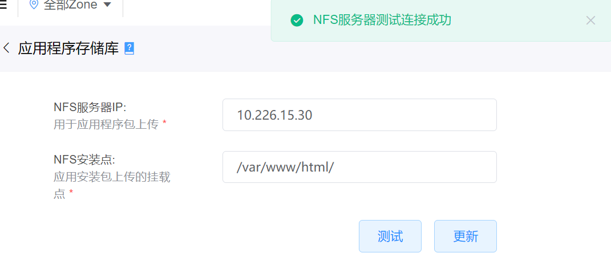
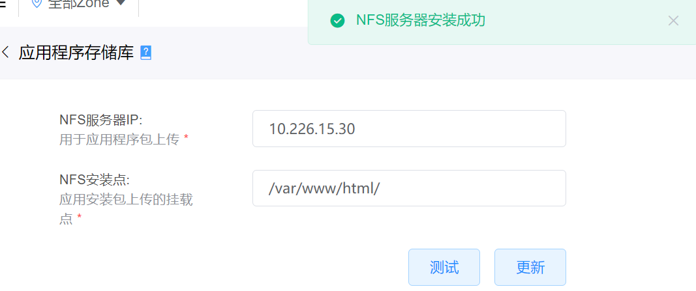

# 7.4.3.应用程序存储库管理

在“系统设置”菜单下选择左侧“系统参数管理”的导航菜单，之后点击“.应用程序存储库”的子菜单，即可看到.应用程序存储库的管理界面：

## 相关操作

HYPERX云管理平台支持超级管理员对应用程序存储库进行管理，支持的功能如下：

- 测试FNS连通性：测试NFS服务器和云平台的连通性；
- 更新NFS服务器信息：将NFS服务器的IP和安装点更新至云平台。

操作入口如下：

- 系统设置→系统参数管理→应用程序存储库

## 操作说明

### 测试NFS连通性

① 在应用程序存储库管理界面中，填写服务器IP和安装点后，点击“测试”按钮：

② 如果NFS服务器和云平台相互连通，将会弹出“NFS服务器测试连接成功”的通知消息，并加载出“更新”按钮：

> [!NOTE]
>
> - 在NFS服务器测试连接成功后，才支持更新NFS服务器的IP和安装点至云平台。

### 更新NFS服务器信息

① 在应用程序存储库管理界面中，当NFS和与平台测试连通后，点击“更新”按钮，即更新NFS服务器的信息：

② 更新NFS服务器IP和安装点信息后，将会弹出“NFS服务器安装成功”的通知消息：

